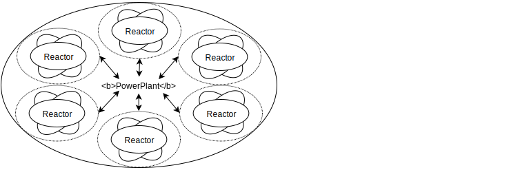

==========
Components
==========
The most significant components of a NUClear system are the `PowerPlant`_, `Reactors`_, `Reactions`_ and `Tasks`_.
It is the interaction between these components that ensures data and code are easily accessible throughout the system.

PowerPlant
**********
The PowerPlant can be thought of as the central message system through which :ref:`Reactors` (modules) communicate.

Whenever a reactor emits data into the system, the PowerPlant takes ownership of the data and executes any :ref:`Reactions` which are subscribed to the message.

The PowerPlant is also responsible for assigning the threads on which the :ref:`Reactions` will run.  NUClear is a multithreaded environment, with all threading logic centralised and handled by the PowerPlant.

The transparent multithreading uses a threadpool with enough threads to saturate every CPU core in the system, allowing :ref:`Tasks` to execute on a different thread.

By centralising the threading logic, NUClear provides developers the freedom to concentrate on their :ref:`Reactors` (modules) instead of threading problems.  The NUClear DSL provides :ref:`Execution Modifiers` should developers wish to execute control over how their threads will run.

Reactors
********
A reactor can be thought of as a module.  All modules in the NUClear system will be an extension of NUClear::Reactor.  During the :ref:`Startup Process`, the reactors for the system will be installed into the PowerPlant.

Reactors are primarily responsible for two functions; Defining the :ref:`Reactions` and conditions under which they will process, and in some cases, emitting data to the PowerPlant as required.

Reactions
*********
Reactions are the defined :ref:`Tasks` which need to run when the data and/or conditions required for the reaction become available/true.

To setup a reaction, a reactor can use the functions provided by NUClear::Reactor, which subscribe to the PowerPlant for any messages or conditions of interest.  Under the hood, these functions are bound by NUClear as callbacks, and it is the execution of these callbacks which will assign :ref:`Tasks` to a thread.

The most common subscriptions are made using DSL :ref:`On Statements`

//TODO:  <list> of the current possible reactions --- just a link to the DSL entry for the reaction should suffice. example  on,
then every and trigger.  etc etc.

//TODO:  Might need a link to instructions or tutorial on how to setup/subscribe to a message (question to self:  would this just be the anatomy of "on" - you might be able to do part of these with a decent description in the DSL there).

//TODO:  where will you include the reaction handle info:   will this be in a tutorial (I think yes), or should you put the info here;
Look at:  ReactionHandle.hpp
enable()
disable()
enabled()
unbind()

Tasks
*****
A task is the current execution of a defined reaction within the system.

For debugging purposes, all tasks will track the following information:

  identifier
  reactionId
  taskId
  causeReactionId
  causeTaskId
  emitted()
  started()
  finished()
  exception()

//TODO:  Update the above list so that it is trigged by Doxygen and brings in the comments
