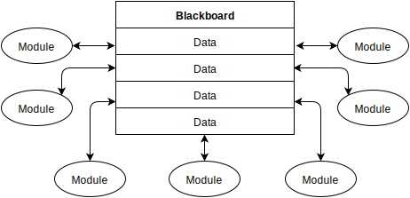
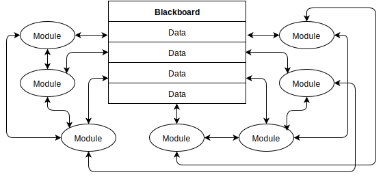
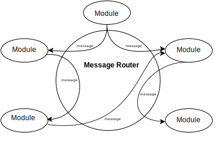

===========
Definitions
===========

blackboard robot systems
************************
Blackboard systems use a blackboard to store global data.  Modules within a blackboard system communicate with each other through the manipulation of the data elements stored on the balckboard.  For example, a module for vision may read images from the blackboard.  Once the module has analysed the images, it then writes the observed visual features to the blackboard for other modules to reference.

The blackboard systems used in AI typically provide a communial datastore, as well as the :ref:`control elements` required for developing a robotic system.

Blackboard systems are considered easy to implement and provide low computational overheads.  However, this architecture is only recommended for small systems.  When used as the underlying architecture for complex systems, issues with coupling, where modules need to interact and modify each others internal state can become apparent.

Issues are also apparent when used in a multi-threaded environment.  If individual components are not aware when new and relevant data becomes available, modules may miss data updates, read the same data twice, or even read a partially written data element.

C++ template metapgrograms
**************************
NUClear uses C++ template metaprogramming to establish message routes at compile time.

Template metaprogramming is a technique where templates are used by a compiler to generate temporary source code which will be used at the time of compilation.  That is, the generated source code is merged by the compiler with the rest source code and then compiled.

control elements
*****************
ToDo
see hayesroth1985.pdf

message-passing robot systems
*****************************
Message passing systems treat each module as a producer/consumer.  Data produced by a module is sent through a message routing system to modules which subscribe to that type.  Conceptually, these systems are a generalization of a pipeline system where the output from one system is used as the input into the next system.

*Note:  Get image from Trent - his generated image is better - this keeps rendering incorrectly.*

Many different message-passing robot systems exist in the field, with the most commonly used system being Robot Operation System (ROS).   ROS uses a centralised node, which establishes message routes within the system using IP networking protocols (TCP or UDP).

While message-passing systems keep data loosly coupled, there are several disadvantages that exist in these systems which are not present in :ref:`blackboard robot systems`.  For example, a message-passing system must either provide a copy of the dta for each subscriber of a message or make all access read only which results in a performance penalty in the system.  Messaging also means that there is no central data store that can be used; if a module requires information from more than one message, it must handle the storage of this data itself to access it.  This adds significant extra load on the modules, which makes development harder and reduces the systems performance.

