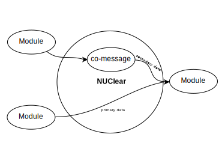

===========
Definitions
===========

blackboard systems
******************
Blackboard systems use a blackboard to store global data.  Modules within a blackboard system communicate with each other through the manipulation of the data elements stored on the blackboard.  For example, a module for vision may read images from the blackboard.  Once the module has analysed the images, it then writes the observed visual features to the blackboard for other modules to reference.

.. image:: images/blackboard_architecture.svg
    :width: 500px
    :align: center

Blackboard systems are considered easy to implement and provide low computational overheads.  However, this architecture is only recommended for small systems.  When used as the underlying architecture for complex systems, issues with coupling, where modules need to interact and modify each others internal state can become apparent.

.. image:: images/blackboard_architecture_coupled.svg
    :width: 500px
    :align: center

Issues are also apparent when used in a multi-threaded environment.  If individual components are not aware when new and relevant data becomes available, modules may miss data updates, read the same data twice, or read a partially written data element.

C++ template metapgrograms
**************************
Template metaprogramming is a technique where templates are used by a compiler to generate temporary source code which will be used at the time of compilation.  That is, the generated source code is merged by the compiler with the rest of the source code and then compiled.  NUClear uses C++ template metaprogramming to establish message routes at compile time.

co-messaging
************
NUClear uses co-messages to hybridize the features of :ref:`blackboard systems` and :ref:`message-passing systems`.

In modular systems, modules typically have a primary information type that they will perform their operations on.  However, the module may also require additional supplementary data, provided from other sources/modules.  When this occurs, the additional data must be available to the module when performing its operations.  Yet the secondary data may be created at a different rate to that of the primary data source.

In pure :ref:message-passing robot systems, accessing the data at any time is not possible, as data is only available transiently.  If a system requires information created by another module, it must subscribe and then store this information itself to ensure it is available.

In NUClear, modules can subscribe to both primary and secondary data.  As primary data is published, the most recent copy of secondary data will be packaged and sent to the subscribing module as a co-message.

control elements
*****************
//ToDo
see hayesroth1985.pdf

domain specific language
************************
A domain specific language (DSL) is programming language which has been specialised for a particular domain. The NUClear system incorporates an extensible DSL. see: :ref:`NUClear DSL`.

faster communication
--------------------
A simple test system was constructed in both NUClear and Robot Operating System (ROS) a message-passing system modular system.  The tests timed and transferred an empty message from end to end.  An empty message was chosen to eliminate any performance differences caused by serialisation and copying of information.  Tests were completed with and without full CPU load.  In all cases, NUClear proved faster at routing messages than ROS.

//check with Trent if he wants me to elaborate, include more info here

message-passing systems
***********************
Message passing systems treat each module as a producer/consumer.  Data produced by a module is sent through a message routing system to modules which subscribe to that type.  Conceptually, these systems are a generalization of a pipeline system where the output from one system is used as the input into the next system.

.. image:: images/message_passing_system.svg
    :width: 500px
    :align: center

Generally, message-passing systems will keep data loosly coupled, but there are several disadvantages in these systems which are not present in :ref:`blackboard systems`.  For example, a message-passing system must either provide a copy of the data for each subscriber of a message, or make all access read only which results in a performance penalty within the system.  Messaging also means that there is no central data store which can be used; if a module requires information from more than one message, it must handle the storage of this data itself to access it, which adds extra load on the modules, making development harder and reducing the systems performance.
