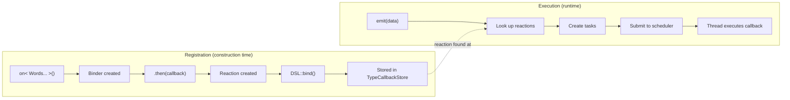
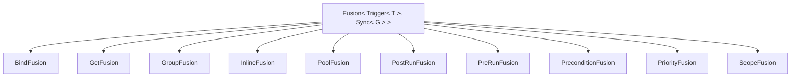
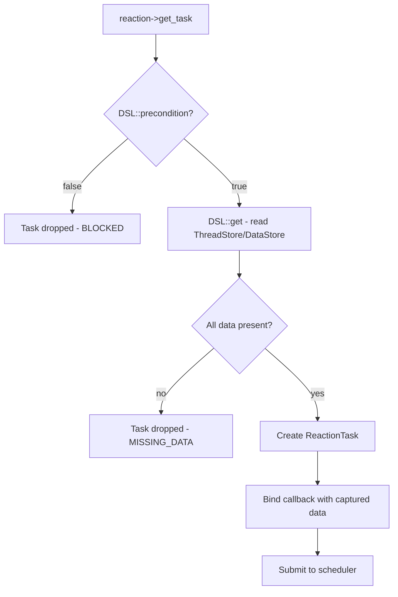
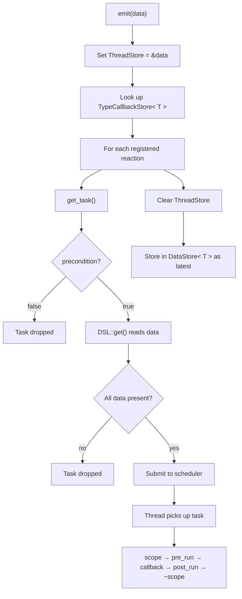
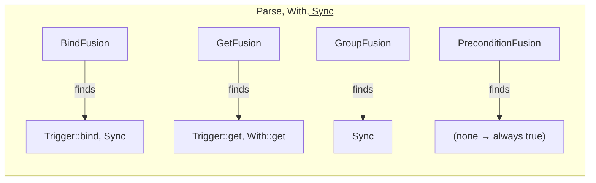

# The DSL System: From `on<>()` to Execution

NUClear's Domain Specific Language (DSL) is the user-facing API that makes reactive programming feel natural in C++. But behind that clean syntax lies a sophisticated pipeline of template metaprogramming, task generation, and scheduling. Let's trace the complete journey from writing a reaction to it executing.

## The Big Picture

The journey from writing `on<>().then()` to a reaction executing has two main phases: **registration** (at compile/construction time) and **execution** (at runtime when data arrives).



## Phase 1: Writing the Reaction

```cpp
on<Trigger<SensorData>, Sync<Processing>>().then([](const SensorData& data) {
    // process sensor data
});
```

This single statement does a lot. Let's break it apart.

## Phase 2: Template Instantiation — `on<>()`

When you call `on<`[`Trigger`](../reference/dsl/trigger.md)`<T>, `[`Sync`](../reference/dsl/sync.md)`<G>>()`, the Reactor base class constructs a `Binder`:

```cpp
template <typename... DSL, typename... Arguments>
Binder<dsl::Parse<DSL...>, Arguments...> on(Arguments&&... args) {
    return Binder<dsl::Parse<DSL...>, Arguments...>(*this, std::forward<Arguments>(args)...);
}
```

The `Binder` captures the reactor reference and any arguments (like port numbers for `IO`, or time durations for `Every`). At this point, nothing is registered — the `Binder` is just waiting for a callback.

The key type here is `dsl::Parse<Trigger<T>, Sync<G>>` — this is the "fused" DSL type that combines all the words.

## Phase 3: `.then(callback)` — Creating the Reaction

When `.then()` is called, several things happen in sequence:

1. **CallbackGenerator created** — wraps your lambda with the DSL's get/precondition/scope logic
2. **Reaction object created** — stores the generator, identifiers, and reactor reference
3. **`DSL::bind(reaction)` called** — each word registers itself (e.g., Trigger adds to TypeCallbackStore)
4. **ReactionHandle returned** — lets you enable/disable the reaction later

```cpp
auto reaction = std::make_shared<threading::Reaction>(
    reactor,
    std::move(identifiers),
    util::CallbackGenerator<DSL, Function>(std::forward<Function>(callback)));

auto tuple = DSL::bind(reaction, std::move(std::get<Index>(args))...);
```

## Phase 4: The Bind Phase — Fusion Engine

The `Parse<Words...>` type creates a [Fusion](../reference/extensions/fusion-engine.md)`<Words...>` which inherits from multiple fusion types:



Each fusion type discovers which words implement that extension point and calls them. For `bind`, `Trigger<T>` registers the reaction in `TypeCallbackStore<T>` so that when `T` is emitted, this reaction is found.

`Sync<G>` registers a group constraint so that only one task from group `G` executes at a time.

## Phase 5: Trigger Fires — Emit Happens

Now jump forward to runtime. Some other reactor emits sensor data:

```cpp
emit(std::make_unique<SensorData>(...));
```

This calls `Local::emit` which:

1. Stores the data in the global `DataStore<SensorData>`
2. Sets `ThreadStore<SensorData>` (thread-local pointer) to the new data
3. Looks up `TypeCallbackStore<SensorData>` for all registered reactions
4. For each reaction: calls `reaction->get_task()` to create a task

## Phase 6: Task Creation — CallbackGenerator

`get_task()` invokes the `CallbackGenerator` which does the heavy lifting:



The `CallbackGenerator` does this in order:

1. **Creates a ReactionTask** with priority, inline preference, pool, and group functions
1. **Checks precondition** — if false, task is dropped (e.g., [`Single`](../reference/dsl/single.md) blocks if already running)
3. **Calls `DSL::get()`** — reads the data from ThreadStore (freshest) or DataStore (latest)
4. **Checks data validity** — if any required data is null, task is dropped
5. **Captures the callback** — binds the data into a closure stored on the task

## Phase 7: Task Submitted

The task is submitted to the PowerPlant's scheduler via `powerplant.submit(task)`. The scheduler decides which thread pool queue to place it in, based on the `pool` function returned by the DSL fusion.

## Phase 8: Task Dispatched

The scheduler picks up tasks from queues respecting:

- **Priority** — higher priority tasks execute first
- **Group constraints** — only N tasks from a group run concurrently (Sync uses N=1)
- **Pool assignment** — task runs on the correct thread pool

## Phase 9: Task Executes

When a thread picks up the task, the captured callback runs:

```cpp
auto scope = DSL::scope(task);      // Acquire scope (e.g., TaskScope lock)
DSL::pre_run(task);                  // Pre-run hooks
util::apply_relevant(c, data);       // Call your lambda with the data
DSL::post_run(task);                 // Post-run hooks (e.g., emit transients)
std::ignore = scope;                 // Release scope on destruction
```

The scope RAII guard ensures cleanup happens even if the callback throws.

## The Complete Flow

Putting it all together, this is what happens at runtime when data is emitted:



## Template Metaprogramming: How the Fusion Works

The DSL uses several layers of compile-time machinery:

### Parse<Words...>

`Parse` is the entry point. It creates `Fusion<Words...>` and delegates each operation (bind, get, group, pool, priority, etc.) to the fusion, falling back to a `NoOp` if no word implements that operation.

### FindWords (inside each Fusion type)

Each fusion specialisation (e.g., `GetFusion`) filters the word list to find which words implement `get`. Only those words participate in that operation.

### FunctionFusion (calling and combining)

For operations that return values (like `get`), the fusion calls each word's method and concatenates the results into a tuple. For boolean operations (like `precondition`), results are ANDed together.



This design means you can create custom DSL words by simply implementing the right static methods — the fusion engine will automatically discover and invoke them at the right time.
