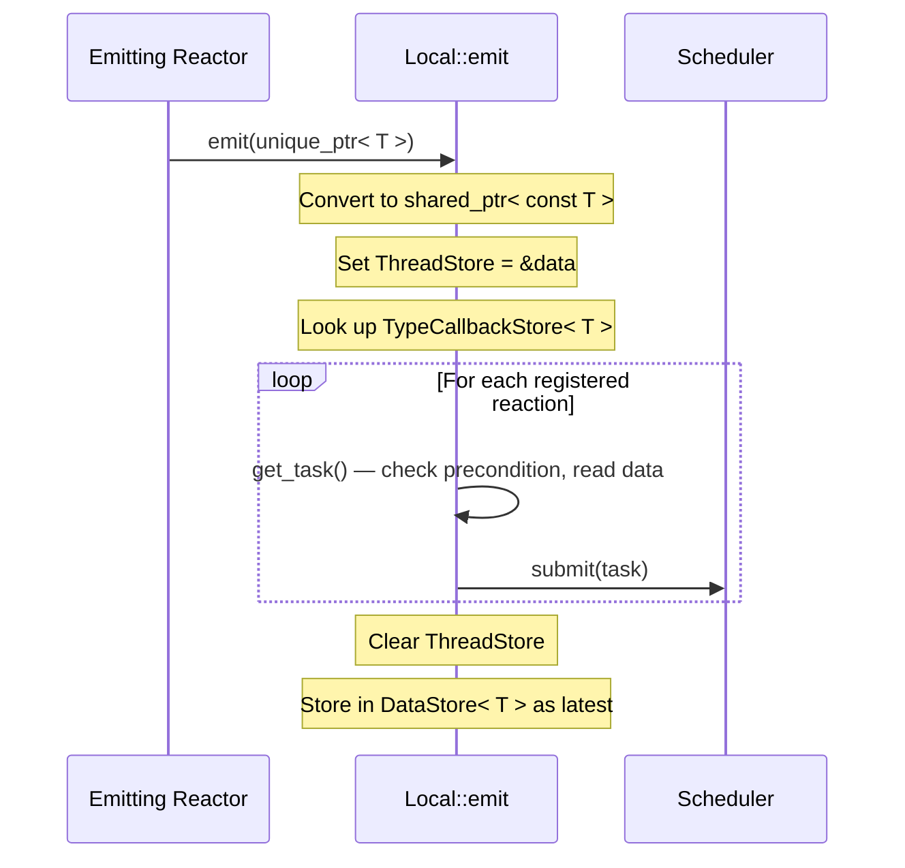
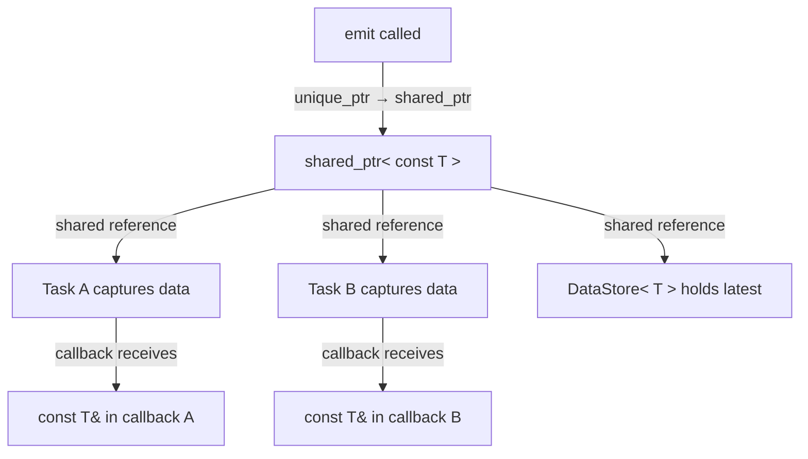
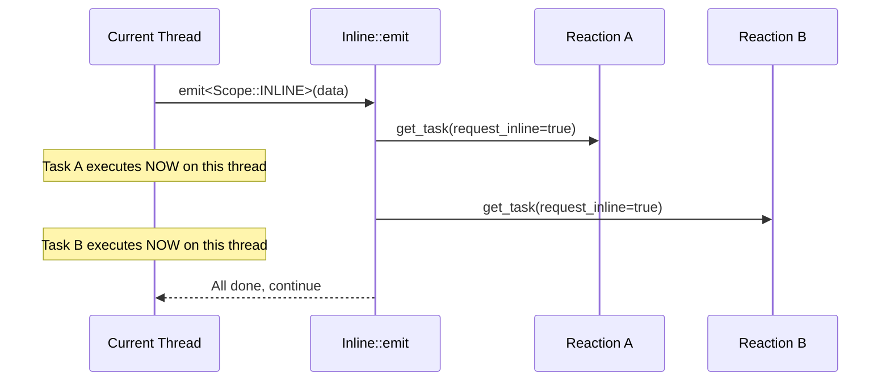
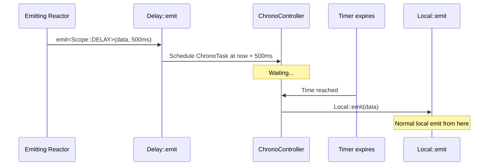
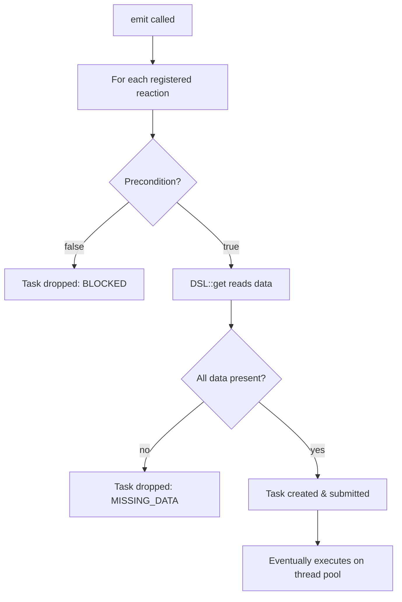

# Message Flow: What Happens When You Emit

Emitting data is the primary way reactors communicate in NUClear. When you call `emit(std::make_unique<T>(data))`, a carefully orchestrated sequence distributes that data to every interested reaction. Let's trace exactly what happens.

## The Emit Call

```cpp
emit(std::make_unique<SensorData>(42.0, 3.14));
```

This calls through to `PowerPlant::emit<Scope::LOCAL>`, which delegates to `dsl::word::emit::Local<SensorData>::emit()`. Local is the default scope — if you don't specify one, this is what you get.

## Local Emit: Step by Step



Here's what happens inside `Local::emit`:

### 1. Iterate Registered Reactions

```cpp
for (auto& reaction : store::TypeCallbackStore<DataType>::get()) {
```

The `TypeCallbackStore<T>` holds every reaction that was registered with [`Trigger`](../reference/dsl/trigger.md)`<T>` (or a related word). This lookup is O(1) — it's a static vector per type.

### 2. Set ThreadStore (Thread-Local Pointer)

```cpp
store::ThreadStore<std::shared_ptr<DataType>>::value = &data;
```

This is a thread-local pointer that `get()` reads during task creation. It points to the *exact* data from this emit — not whatever is in the global store. This ensures reactions triggered by an emit see the data that triggered them.

### 3. Create Task via `get_task()`

The reaction's `CallbackGenerator` runs:

- Checks the precondition (e.g., is the reaction enabled? Is the buffer full?)
- Calls `DSL::get()` which reads from ThreadStore (for Trigger data) or DataStore (for With data)
- Validates all required data is present
- Returns a `ReactionTask` with the callback bound to the captured data

### 4. Submit to Scheduler

```cpp
powerplant.submit(reaction->get_task());
```

The task enters the scheduler's queue, where it waits for dispatch based on priority and group constraints.

### 5. Clear ThreadStore

```cpp
store::ThreadStore<std::shared_ptr<DataType>>::value = nullptr;
```

After all reactions have had their tasks created, the thread-local pointer is cleared.

### 6. Update DataStore

```cpp
store::DataStore<DataType>::set(data);
```

The data is stored as the "latest value" in the global `DataStore<T>`. This is what forms NUClear's **virtual data store** — an emergent property of the co-messaging architecture. Future [`With`](../reference/dsl/with.md)`<T>` reads (co-message retrievals triggered by another emission) will see this value.

## Data Ownership and Sharing



Key ownership rules:

- **The `unique_ptr` is consumed** — you can't use it after emitting
- **A `shared_ptr<const T>` is created** — multiple reactions share the same object
- **Data is immutable** — callbacks receive `const T&`, preventing shared-state bugs
- **Lifetime is automatic** — data lives as long as any task or DataStore references it

When two reactions are both triggered by the same emit, they receive pointers to the *same* object in memory. There's no copying unless you explicitly copy in your callback.

## Emit Scopes

### `Scope::LOCAL` (default)

Tasks are queued in the scheduler for execution by the thread pool. This is asynchronous — the emit returns immediately, and tasks execute later.

### [`Scope::INLINE`](../reference/emit/inline.md)



Inline emit executes reactions *immediately* on the calling thread. The current execution is suspended while triggered reactions run sequentially. This is useful when:

- A reactor emits data to itself and needs the side effects immediately
- You need synchronous, deterministic ordering
- The system is shutting down or hasn't started yet (scheduler may not be running)

Tasks created by inline emit pass `request_inline=true`, which tells the scheduler to execute them on the spot rather than queuing them.

### [`Scope::DELAY`](../reference/emit/delay.md)



Delay wraps the data in a `ChronoTask` that fires after the specified duration. When the timer expires, it performs a normal `Local::emit`. The data is kept alive by the shared_ptr captured in the chrono task closure.

## Task Dropped Scenarios

Not every emit results in a task executing. There are two main "drop" points:

### Precondition Fails

If the DSL precondition returns false, no task is created. Examples:

- **[`Single`](../reference/dsl/single.md)** — reaction is already running, new task blocked
- **[`Buffer`](../reference/dsl/buffer.md)`<N>`** — buffer is full, new task blocked
- **Reaction disabled** — `handle.disable()` was called

### Missing Data

If `DSL::get()` returns null for any required element, the task is dropped. This typically happens with:

- **`With<T>`** — no data of type `T` has been emitted yet
- **Multi-trigger scenarios** — one trigger type has data, another doesn't yet



## DataStore vs ThreadStore

These two stores serve different purposes:

| Store            | Scope           | Purpose                     | When Read                     |
| ---------------- | --------------- | --------------------------- | ----------------------------- |
| `ThreadStore<T>` | Thread-local    | Points to "triggering" data | During `get_task()` creation  |
| `DataStore<T>`   | Global (static) | Holds latest emitted value  | By `With<T>` at task creation |

The ThreadStore exists so that if multiple emits happen rapidly, each triggered reaction sees the data that *caused* its trigger — not whatever happened to be emitted most recently. The DataStore provides the "latest value" semantics that `With<T>` relies on.

## Multiple Emits, Same Type

If you emit the same type twice in quick succession:

```cpp
emit(std::make_unique<T>(value1));
emit(std::make_unique<T>(value2));
```

Each emit independently triggers all interested reactions. The first batch of tasks captures `value1`, the second batch captures `value2`. The DataStore ends up holding `value2` (the latest). Both values stay alive as long as their respective tasks hold shared_ptr references.
