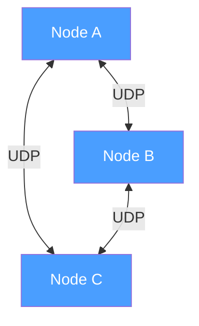
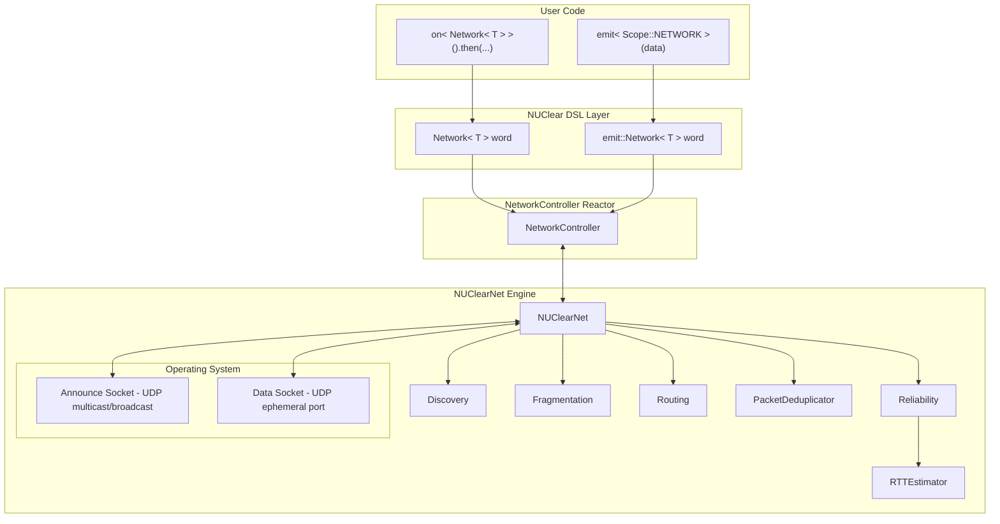
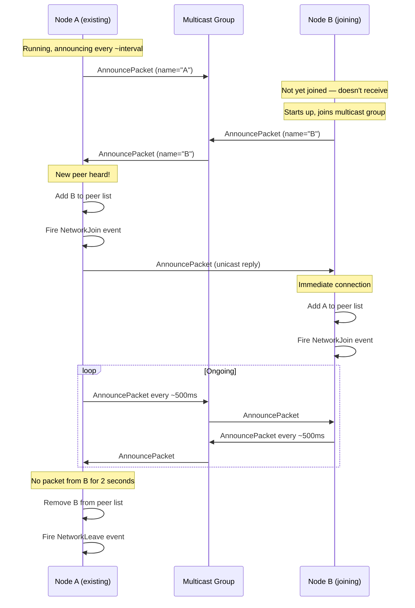
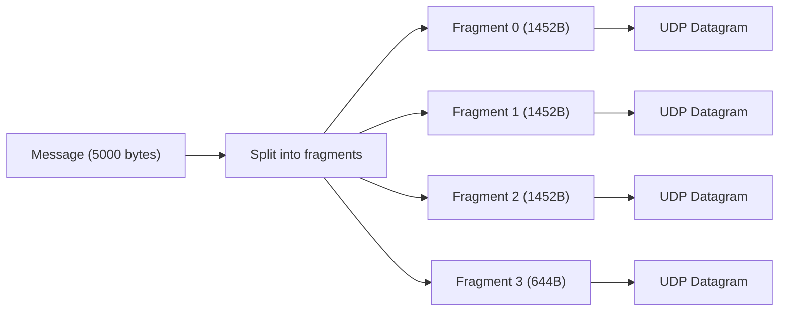
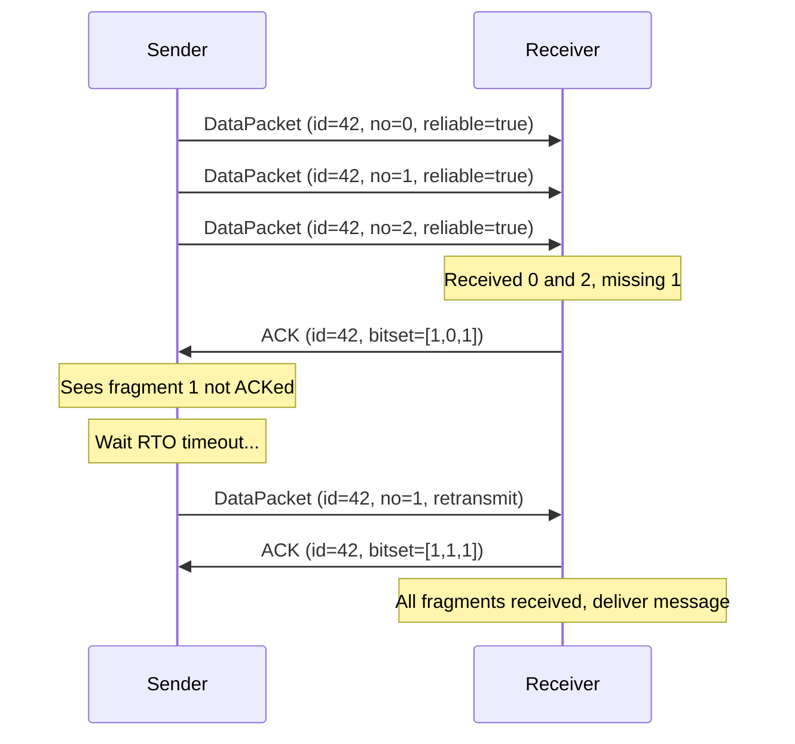
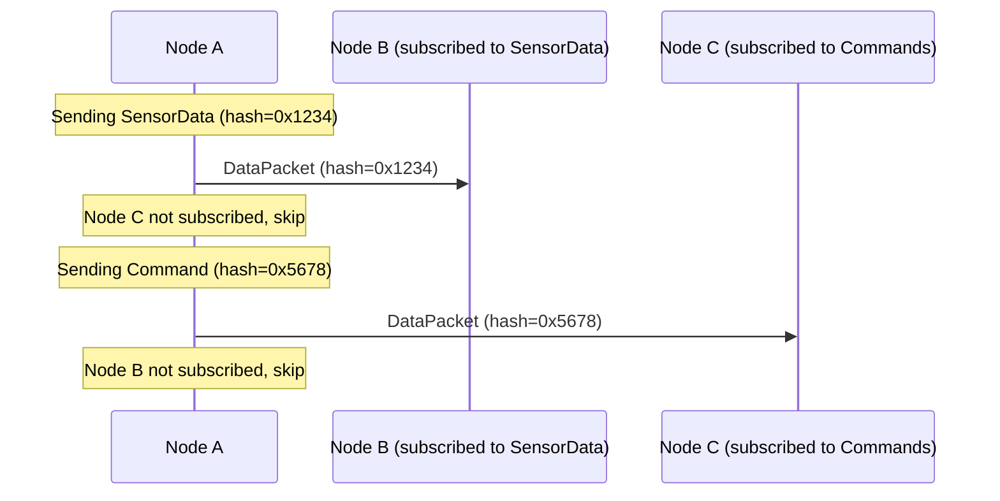
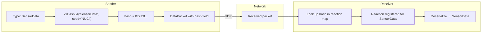
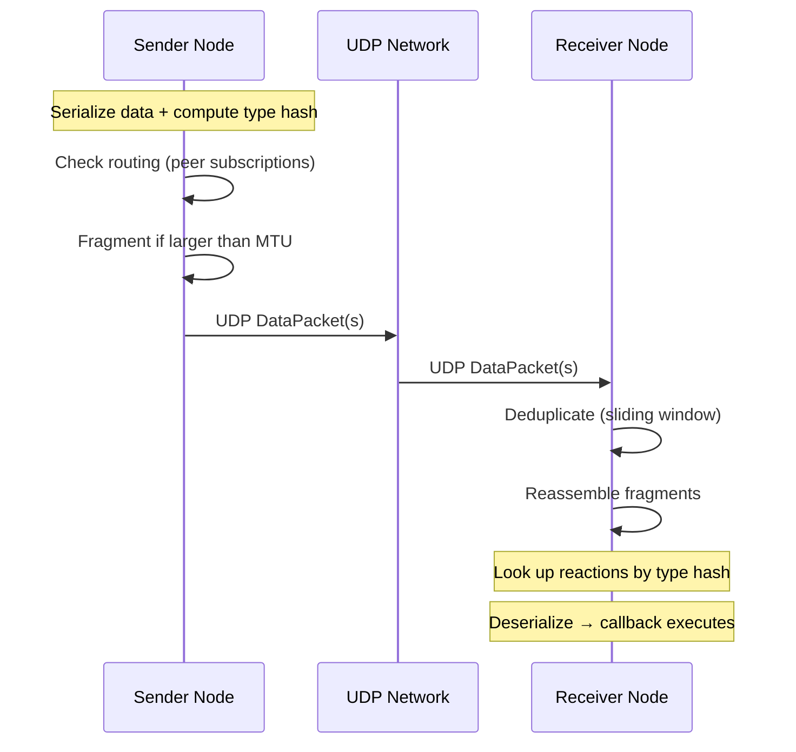

# NUClearNet: peer-to-peer networking

NUClearNet is NUClear's built-in networking layer — a decentralized, peer-to-peer messaging system that lets NUClear nodes communicate transparently across a network.
It's designed for robotics and distributed systems where nodes need to discover each other automatically and exchange typed messages with minimal configuration.

## Architecture and design



Key design principles:

- **Decentralized mesh** — no central server or message broker.
    Every node is equal.
- **Autonomous discovery** — nodes find each other via periodic announcements, no manual configuration of peer addresses.
- **UDP-only** — both discovery and data transfer use UDP (User Datagram Protocol), not TCP.
    This keeps the implementation simple and avoids head-of-line blocking.
- **Two socket types** — each node has an *announce socket* (for receiving discovery messages) and a *data socket* (for sending announces and transferring data).
- **Subscription-based routing** — nodes advertise which message types they are interested in,
    and senders only transmit messages to peers that have subscribed to that type.

The announce socket listens on a shared multicast/broadcast address that all nodes agree on.
The data socket uses an ephemeral port unique to each node — peers learn each other's data address from the UDP source address of announce packets.

## Modular component architecture



The NUClearNet engine is decomposed into focused modules:

| Module               | Responsibility                                                           |
| -------------------- | ------------------------------------------------------------------------ |
| `Discovery`          | Peer lifecycle — announce, join/leave detection, peer timeout            |
| `Fragmentation`      | Splitting large messages into MTU-sized (Maximum Transmission Unit) fragments, reassembly on receive |
| `Reliability`        | ACK/NACK (Acknowledgment/Negative Acknowledgment) tracking, retransmission scheduling |
| `Routing`            | Subscription-based message filtering per peer                            |
| `PacketDeduplicator` | Sliding-window duplicate detection per peer                              |
| `RTTEstimator`       | Per-peer RTT (Round-Trip Time) estimation for retransmission timing      |

## Peer discovery

Every node periodically sends an `AnnouncePacket` on the announce address.
This is how nodes find each other.

### Discovery sequence



When a node hears an announce from an unknown peer,
it immediately sends its own announce back via unicast directly to that peer.
This eliminates the need to wait for the next periodic announce cycle —
new peers connect within a single round trip rather than waiting up to one full announce interval.

### Announce address options

The announce address can be:

- **Multicast** (e.g., `239.226.152.162`) — the most common setup.
    All nodes on the same network join the multicast group and hear each other's announcements.
- **Broadcast** (e.g., `255.255.255.255`) — works on simple LANs without multicast support.
- **Unicast** — for point-to-point setups or testing.

### NAT-friendly port learning

NAT (Network Address Translation) devices translate source ports and addresses between networks.
Announces are sent from the *data socket* (ephemeral port), not the announce socket.
This means the receiver learns the sender's data port directly from the UDP source address — no explicit port field is needed in the announce packet.
This design also works naturally with NAT devices that translate source ports.

### Peer timeout

Each peer's `last_seen` timestamp is refreshed every time any packet is received from them.
If no packet is received within the configured timeout (default 2 seconds), the peer is considered gone — it's removed from the peer list and a `NetworkLeave` event fires.

### Graceful departure

When a node shuts down cleanly, it sends a `LeavePacket` so peers can remove it immediately without waiting for the timeout.

## Wire protocol

All NUClearNet packets share a common 5-byte header.

### Packet header


- **Bytes 0–2**: `0xE2 0x98 0xA2` — the ☢ (radioactive) symbol in UTF-8.
    Acts as a magic number to identify NUClear packets.
- **Byte 3**: Protocol version — `0x03` for the current implementation
- **Byte 4**: Packet type

A received packet is only accepted if the magic bytes, version, and type field all pass validation.

### Packet types

| Type     | Value | Purpose                                |
| -------- | ----- | -------------------------------------- |
| ANNOUNCE | 1     | Periodic discovery broadcast           |
| LEAVE    | 2     | Graceful departure notification        |
| DATA     | 3     | Data payload (original or retransmission) |
| ACK      | 4     | Acknowledgment of received fragments   |
| NACK     | 5     | Request for specific missing fragments |

### Announce packet


- **name_length** — length of the node name string
- **name** — the node's name (UTF-8, not null-terminated)
- **num_subscriptions** — how many type hashes follow (0 = interested in all messages)
- **subscription hashes** — `uint64_t` type hashes this node wants to receive

No port field is included — the receiver learns the sender's data port from the UDP source address.

### Data packet


- **packet_id** — a semi-unique identifier for this message group (wraps at 65535)
- **packet_no** — which fragment this is (0-indexed)
- **packet_count** — total number of fragments in this message
- **flags** — bit 0: reliable delivery requested
- **hash** — 64-bit type hash identifying what kind of data this is
- **payload** — the serialized payload bytes for this fragment

### ACK and NACK packets


- **packet_id** — which packet group this ACK/NACK refers to
- **packet_count** — total fragments in the group (for validation)
- **bitset** — one bit per fragment (LSB first).
    For ACK: bit set = fragment received.
    For NACK: bit set = fragment missing.

## Fragmentation and reassembly

UDP datagrams have a practical size limit (the network MTU).
Large messages are automatically split across multiple packets.

### MTU calculation

```
fragment_size = network_mtu - IP_header(20/40) - UDP_header(8) - DataPacket_header(20)
```

With a typical 1500-byte Ethernet MTU this gives approximately **1452 bytes per fragment** for IPv4.

### Sending large messages



### Reassembly on the receiver

The receiver collects fragments keyed by `(source_address, packet_id)`.
Once all `packet_count` fragments have arrived, the original message is reassembled and delivered.

**Assembly timeout:**
If an incomplete message hasn't received new fragments within the peer timeout (default 2 seconds), it's discarded.
This matches the peer liveness timeout — if no fragments have arrived in this period,
either the peer is dead (and will be removed) or the sender has moved on (unreliable message).
For reliable messages, the sender's retransmissions will keep refreshing the assembly's timestamp,
so the assembly will not expire while the sender is still alive and retransmitting.

**Maximum assembly size:**
A configurable limit (default 64 MB) prevents memory exhaustion from maliciously large messages.
If a message's total size would exceed this limit, the assembly is rejected.

## Reliable delivery

By default, NUClearNet is **unreliable** — packets are fire-and-forget, just like raw UDP.
When you need guaranteed delivery, the reliable mode adds ACK-based retransmission.

### Unreliable (default)

- Send and forget
- No ACKs, no retransmission
- Fastest possible — zero overhead
- Fine for high-frequency data where missing one update doesn't matter (sensor streams, video frames)

### Reliable mode



Key mechanisms:

- **Bitset ACK** — when the receiver gets a fragment,
    it responds with an ACK containing a bitset of *all* received fragments for that packet group.
    This gives the sender full visibility into what's been received.
- **RTO-based retransmission** — the sender waits one RTO (Retransmission Timeout) before retransmitting un-ACKed fragments.
    Retransmitting too early wastes bandwidth; too late adds latency.
- **Adaptive RTO estimation** — each peer's round-trip time is tracked using the Jacobson/Karels algorithm.
    The RTO adapts to changing network conditions.
- **NACK support** — the receiver can proactively request retransmission of specific missing fragments via NACK packets,
    which forces the sender to retransmit immediately.
- **No retransmission limit** — reliable packets are retransmitted indefinitely until either all fragments are ACKed,
    or the peer is removed (due to timeout or graceful leave).
    This guarantees delivery as long as the connection remains alive.

### RTT estimation (Jacobson/Karels)

NUClearNet uses the TCP-standard Jacobson/Karels algorithm (RFC 6298) for per-peer RTT estimation:

```
RTTVAR = (1 - β) × RTTVAR + β × |SRTT - sample|
SRTT   = (1 - α) × SRTT + α × sample
RTO    = SRTT + 4 × RTTVAR
```

Where:

- `α = 0.125` — smoothing factor for RTT (standard TCP value)
- `β = 0.25` — smoothing factor for RTT variation (standard TCP value)
- `SRTT` — smoothed RTT estimate
- `RTTVAR` — RTT variation (jitter)
- `RTO` — retransmission timeout (clamped between 100 ms and 60 s)

This provides smooth, responsive RTT tracking that adapts to network congestion without oscillating.

## Subscription-based routing

Nodes advertise which message types they want to receive via subscription hashes in their announce packets.
This allows senders to skip transmitting messages to peers that aren't interested in them.



**Default behavior:**
If a peer advertises an empty subscription set (no hashes), it receives *all* messages.
This ensures backward compatibility and supports "gateway" nodes that need to see everything.

When a local `on<Network<T>>` reaction is registered,
the `NetworkController` adds the corresponding type hash to this node's subscription list and re-announces with the updated subscriptions.

## Packet deduplication

Each peer has an associated `PacketDeduplicator` — a sliding-window bitset that tracks the last 256 packet IDs seen from that peer.
When a packet arrives:

1. If the packet ID falls within the window and is already marked as seen, it's dropped as a duplicate.
1. If the packet ID is newer than the window, the window slides forward and the packet is accepted.
1. If the packet ID is older than the entire window (more than 256 behind), it's dropped.

This handles scenarios like retransmissions arriving after the original was already processed,
or network loops causing packets to appear multiple times.

## Type routing

Messages are identified by a **type hash** rather than string names or channel IDs.



The hash is computed as:

```
xxHash64(demangled_type_name, seed = 0x4e55436c)  // "NUCl" in ASCII
```

Both sender and receiver must use **exactly the same type name**.
It's not enough to have structurally identical types — the demangled name must match.
In practice, this means sharing header files between nodes.

## Serialization

NUClearNet doesn't prescribe a single serialization format.
Instead, it uses the `Serialise<T>` template which selects a strategy based on the type:

- **Trivially copyable types** — direct `memcpy` (fast but architecture-dependent)
- **Protobuf messages** — `SerializeToString` / `ParseFromString`
- **Custom types** — user provides a `Serialise<T>` specialization

See [Serialization](serialization.md) for the full details.

## Integration with the NUClear DSL

The networking system integrates with NUClear through the `NetworkController` reactor — a built-in extension that bridges the low-level network engine with the task system.

### Receiving: `Network<T>`

```cpp
on<Network<SensorData>>().then([](const SensorData& data) {
    // data arrived from another node
});
```

When you use `Network<T>`:

1. At bind time, the reaction's type hash is registered with the `NetworkController`.
1. The `NetworkController` adds the hash to its subscription set and re-announces.
1. The hash is mapped to the reaction in an internal multimap.
1. When a packet arrives with that hash, the `NetworkController`:
    - Stores the raw bytes in `ThreadStore`
    - Calls `get_task()` on the matched reactions
    - The `Network<T>` word's `get()` deserializes the bytes into a `T`

### Sending: `emit<Scope::NETWORK>`

```cpp
emit<Scope::NETWORK>(std::make_unique<SensorData>(reading), "target_name", true);
```

This triggers:

1. `emit::Network<SensorData>` serializes the data and computes the type hash.
1. A `NetworkEmit` message is emitted locally.
1. `NetworkController` catches it and calls `NUClearNet::send(hash, payload, target, reliable)`.
1. The network engine checks which peers subscribe to the hash via the `Routing` module.
1. For each eligible peer, the message is fragmented and transmitted.
1. If reliable, the `Reliability` module tracks the packet group for ACK/retransmission.

### Peer lifecycle events

```cpp
on<Trigger<NetworkJoin>>().then([](const NetworkJoin& event) {
    log("Peer joined:", event.name);
});

on<Trigger<NetworkLeave>>().then([](const NetworkLeave& event) {
    log("Peer left:", event.name);
});
```

These are emitted by the `NetworkController` when its join/leave callbacks fire from the `Discovery` module.

## Data transmission flow



## Configuration

The network is configured by emitting a `NetworkConfiguration` message:

```cpp
emit(std::make_unique<NetworkConfiguration>(
    "my_node_name",           // This node's name
    "239.226.152.162",        // Announce address (multicast)
    7447                      // Announce port
));
```

### Configuration fields

| Field              | Type       | Default             | Description                                     |
| ------------------ | ---------- | ------------------- | ----------------------------------------------- |
| `name`             | `string`   | —                   | Unique name for this node on the network        |
| `announce_address` | `string`   | `"239.226.152.162"` | Address for node discovery announcements        |
| `announce_port`    | `uint16_t` | `7447`              | Port for announce messages                      |
| `bind_address`     | `string`   | `""` (all)          | Local interface to bind to                      |
| `mtu`              | `uint16_t` | `1500`              | Maximum transmission unit (fragments if larger) |

When a new configuration is received, the `NetworkController` tears down existing sockets and reinitializes with the new settings.
The node name becomes the identifier that other peers see in `NetworkJoin` events.

### Internal engine parameters

The `NUClearNet` engine supports additional parameters beyond what's exposed through `NetworkConfiguration`:

| Parameter           | Default   | Description                                              |
| ------------------- | --------- | -------------------------------------------------------- |
| `peer_timeout`      | 2 seconds | How long without a packet before a peer is removed       |

| `max_assembly_size` | 64 MB     | Maximum reassembled message size (prevents memory bombs) |
