# NUClearNet: peer-to-peer networking

NUClearNet is NUClear's built-in networking layer — a decentralized, peer-to-peer messaging system that lets NUClear nodes communicate transparently across a network.
It's designed for robotics and distributed systems where nodes need to discover each other automatically and exchange typed messages with minimal configuration.

## Architecture and design

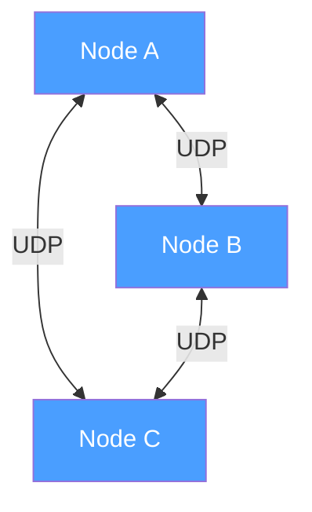

Key design principles:

- **Decentralized mesh** — no central server or message broker.
    Every node is equal.
- **Autonomous discovery** — nodes find each other via periodic announcements, no manual configuration of peer addresses.
- **UDP-only** — both discovery and data transfer use UDP (User Datagram Protocol), not TCP.
    This keeps the implementation simple and avoids head-of-line blocking.
- **Two socket types** — each node has an *announce socket* (for receiving discovery messages) and a *data socket* (for sending announces and transferring data).
- **Subscription-based routing** — nodes advertise which message types they are interested in,
    and senders only transmit messages to peers that have subscribed to that type.

The announce socket listens on a shared multicast/broadcast address that all nodes agree on.
The data socket uses an ephemeral port unique to each node — peers learn each other's data address from the UDP source address of announce packets.

## Modular component architecture

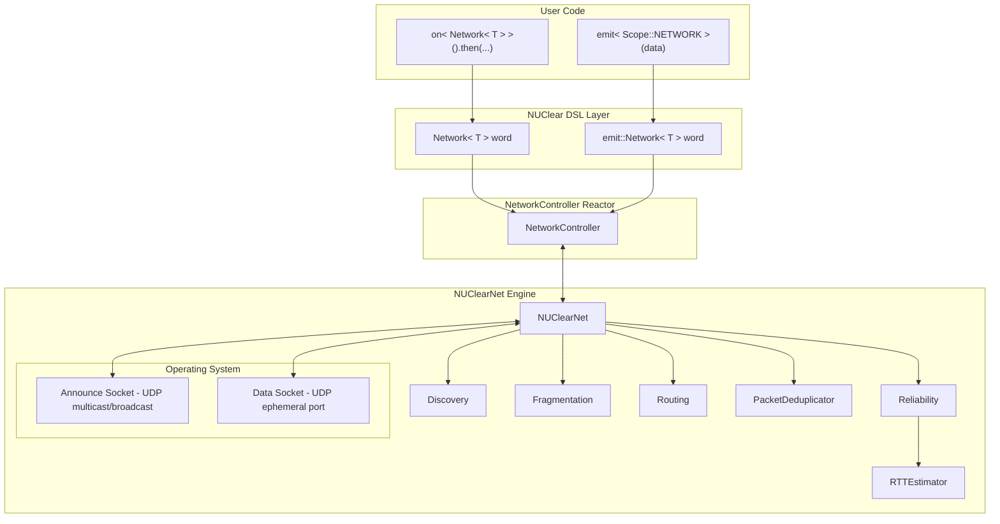

The NUClearNet engine is decomposed into focused modules:

| Module               | Responsibility                                                                                       |
| -------------------- | ---------------------------------------------------------------------------------------------------- |
| `Discovery`          | Peer lifecycle — announce, join/leave detection, peer timeout                                        |
| `Fragmentation`      | Splitting large messages into MTU-sized (Maximum Transmission Unit) fragments, reassembly on receive |
| `Reliability`        | ACK (Acknowledgment) tracking, retransmission scheduling                                             |
| `Routing`            | Subscription-based message filtering per peer                                                        |
| `PacketDeduplicator` | Sliding-window duplicate detection per peer                                                          |
| `RTTEstimator`       | Per-peer RTT (Round-Trip Time) estimation for retransmission timing                                  |

## Peer discovery

Every node periodically sends an `AnnouncePacket` on the announce address.
This is how nodes find each other.

### Discovery sequence

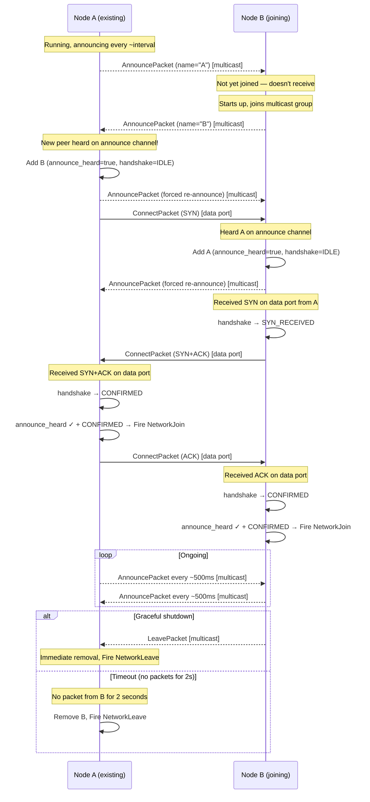

Dashed lines (`-->>`) represent packets sent to the multicast/broadcast group (announce channel).
Solid lines (`->>`) represent packets sent directly to a peer's data port (unicast).

When a node hears an announce from an unknown peer,
it immediately re-announces to the multicast group (so the new peer can hear it)
and sends a CONNECT(SYN) to the peer's data port to begin the data handshake.
The connection is only considered "up" once both the announce path and data path are confirmed
(see [Connection establishment](#connection-establishment) below).

### Announce address options

The announce address determines how discovery packets are delivered.
All nodes in a mesh must agree on the same address and port.
For multi-peer discovery on one host, the address must fan out to every process bound to the shared announce port.

#### Socket binding

NUClearNet binds the announce socket to **all interfaces** (`INADDR_ANY`) by default, even when the announce address is multicast or broadcast.
This default is required for broadcast fan-out on macOS.
An explicit `bind_address` to a specific interface IP can prevent broadcast reception on macOS.

#### Reuse options

NUClearNet sets **`SO_REUSEADDR`** on all platforms and **`SO_REUSEPORT`** when the platform provides it — the two options are always paired where `SO_REUSEPORT` exists.
Platforms without `SO_REUSEPORT` use `SO_REUSEADDR` alone.
Socket setup is consistent; fan-out vs load-balance depends on the announce address and OS stack.

#### Address types and multi-peer validity

The announce address can be:

- **Multicast** (e.g., `239.226.152.162`) — the most common setup.
    All nodes join the multicast group and hear each other's announcements.
    Valid for multi-peer on one host on both Linux and macOS (recommended on macOS).
- **Subnet broadcast** (e.g., `192.168.1.255`) — all nodes on the subnet receive announce messages.
    Valid for multi-peer on one host on both platforms (requires default `INADDR_ANY` bind on macOS).
- **Global broadcast** (`255.255.255.255`) — valid for multi-peer on one host on both platforms (noisy; requires default bind on macOS).
- **Loopback broadcast** (`127.255.255.255`) — valid for multi-peer local dev on **Linux only**.
    macOS does not deliver UDP to this address locally — a macOS stack limitation, not reuse-option behavior.
- **Unicast** (e.g., `127.0.0.1`, `192.168.1.50`) — for point-to-point setups between two known peers.
    Unicast does not fan out to every socket bound on the shared announce port — **invalid for multi-peer on one host** on both platforms.

#### Quick reference — multi-peer on one host

| Address | Linux | macOS |
| ------- | ----- | ----- |
| Multicast `239.226.152.162` | Valid | Valid (recommended) |
| Loopback broadcast `127.255.255.255` | Valid (recommended local dev) | **Invalid** |
| Subnet broadcast `x.x.x.255` | Valid | Valid (default bind) |
| Global broadcast `255.255.255.255` | Valid | Valid (default bind) |
| Unicast `127.0.0.1` / specific IP | **Invalid** | **Invalid** |

### NAT-friendly port learning

NAT (Network Address Translation) devices translate source ports and addresses between networks.
Announces are sent from the *data socket* (ephemeral port), not the announce socket.
This means the receiver learns the sender's data port directly from the UDP source address — no explicit port field is needed in the announce packet.
This design also works naturally with NAT devices that translate source ports.

### Peer timeout

Each peer's `last_seen` timestamp is refreshed every time any packet is received from them.
If no packet is received within the configured timeout (default 2 seconds), the peer is considered gone — it's removed from the peer list and a `NetworkLeave` event fires.

### Connection establishment

After discovering a peer via announce packets,
both sides must satisfy two independent conditions before the connection is considered "up":

1. **Announce path confirmed** (`announce_heard`) — the peer's announce was received on the multicast/broadcast channel.
    This proves that their data port can reach our announce address.
1. **Data handshake confirmed** (`handshake == CONFIRMED`) — a 3-way handshake over the data ports proves bidirectional data connectivity.

Both conditions are required because NAT devices may remap ephemeral ports,
making the data-to-data paths unreliable,
while the announce path (multicast group membership) confirms that broadcast-targeted messages will arrive.

There are four communication paths between two nodes:

| Path      | Meaning                                  | How confirmed                   |
| --------- | ---------------------------------------- | ------------------------------- |
| b_d → a_a | B's data port → A's announce (multicast) | A receives B's AnnouncePacket   |
| a_d → b_a | A's data port → B's announce (multicast) | B receives A's AnnouncePacket   |
| a_d → b_d | A's data port → B's data port (unicast)  | B receives ConnectPacket from A |
| b_d → a_d | B's data port → A's data port (unicast)  | A receives ConnectPacket from B |

The packet type encodes which path was used:

- **ANNOUNCE** packets are always sent to the multicast group — receiving one proves the announce path.
- **CONNECT** packets are always sent to a peer's data port — receiving one proves the data path.

This means no socket tracking is needed to determine which path a packet arrived on;
the packet type itself is the proof.

#### Two-flag connection model

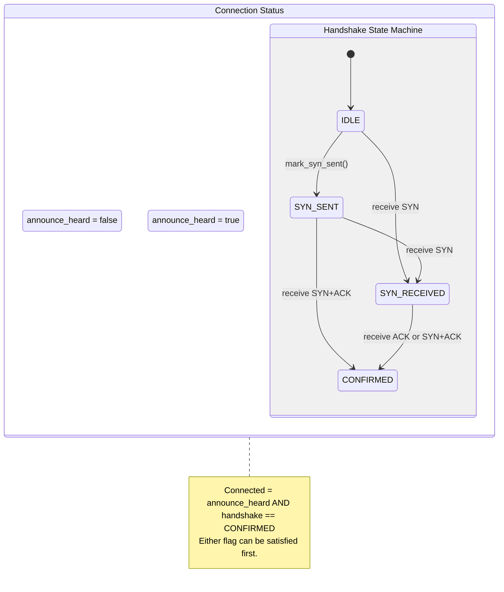

The two flags are independent — they can be satisfied in any order:

- **Normal flow**: Announce heard first (from periodic announce), then data handshake completes.
- **Late announce**: Data handshake completes first (CONNECT received before announce),
    then the announce arrives and triggers the join event.

#### Handshake sequence (normal flow)

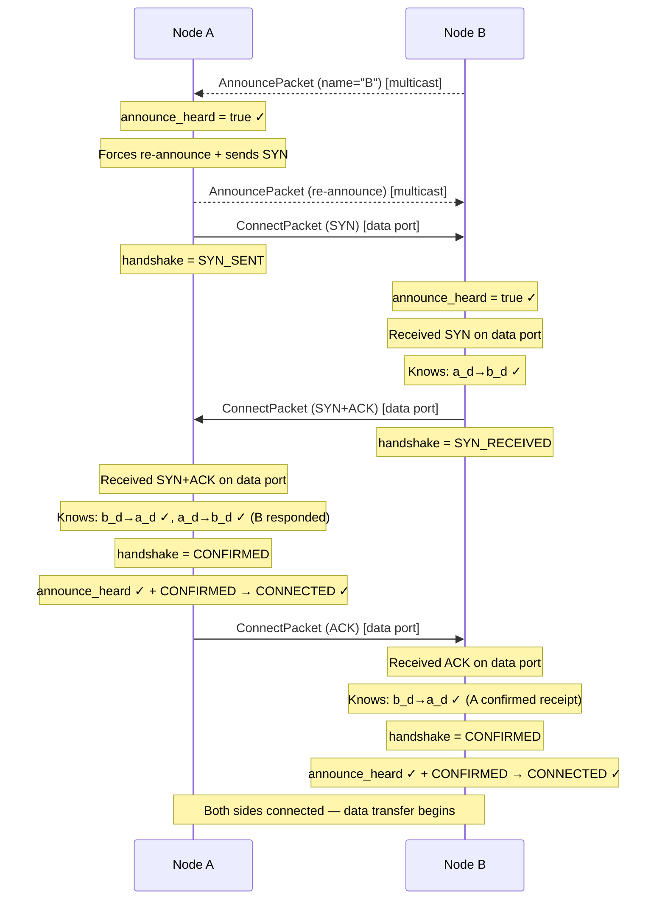

The knowledge progression:

1. **A receives B's announce on multicast** — A learns that `b_d→a_a` works (announce path).
1. **A sends SYN to B's data port** — when B receives this, B learns that `a_d→b_d` works.
1. **B sends SYN+ACK to A's data port** — when A receives this, A learns that `b_d→a_d` works.
    A also infers `a_d→b_d` works (because B's response proves the SYN arrived).
1. **A sends ACK to B's data port** — when B receives this, B learns that `b_d→a_d` works
    (because A's ACK proves the SYN+ACK arrived).

After step 4, both sides have confirmed all four communication paths.
Only then does the `NetworkJoin` event fire and data packets begin flowing.

#### Late announce (data handshake completes first)

If a CONNECT packet arrives from a peer before their announce has been heard
(for example, when multicast delivery is slower than unicast),
the data handshake proceeds normally but the connection is not declared "up" until the announce arrives:

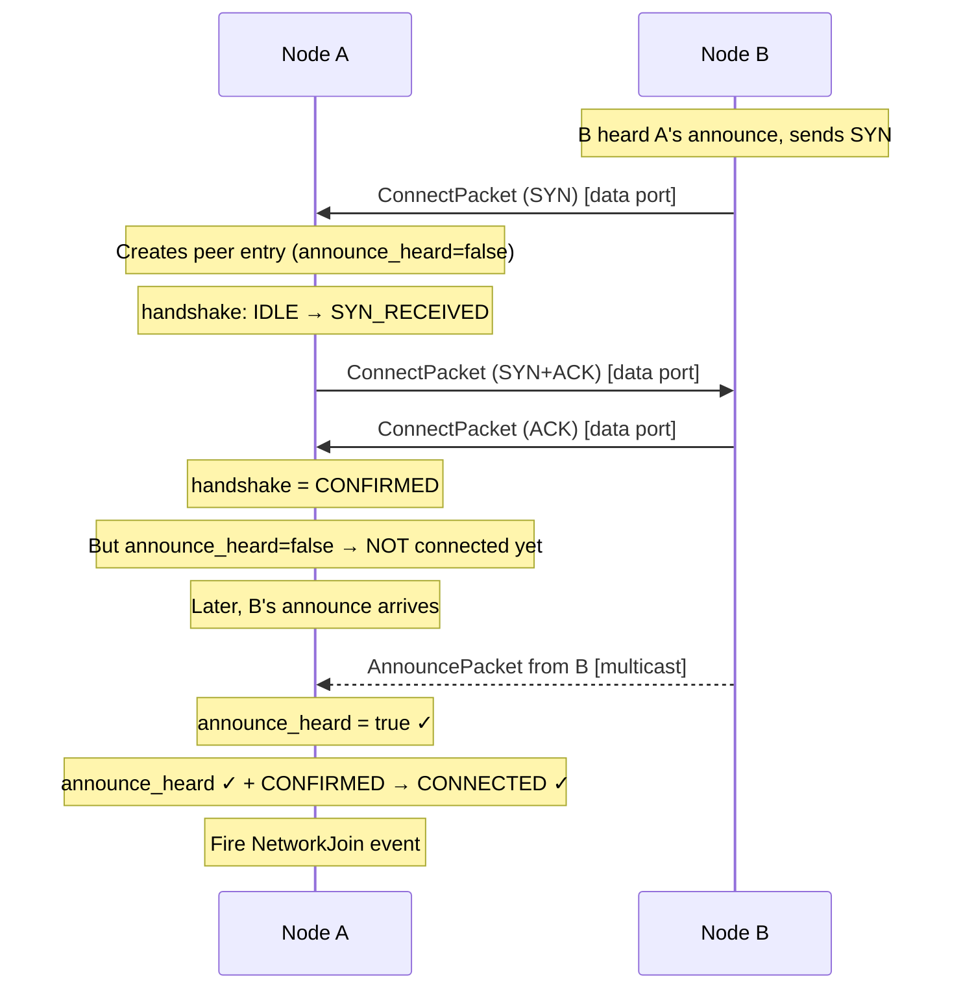

#### Simultaneous open

If both nodes hear each other's announces at nearly the same time,
both will send SYN simultaneously.
The state machine handles this gracefully:

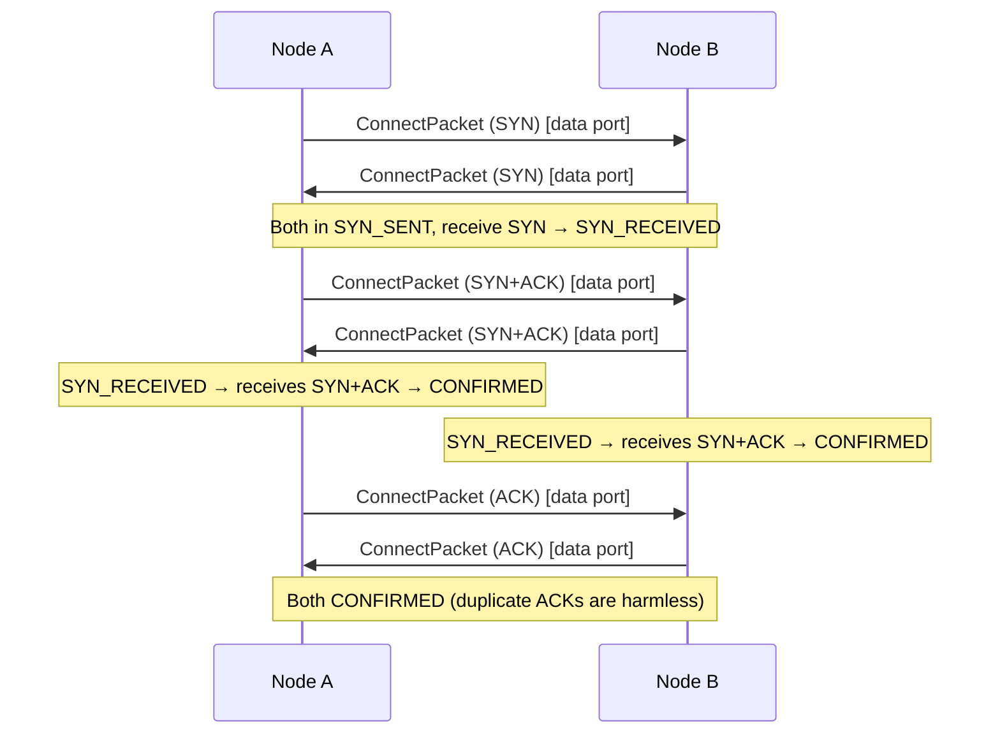

Duplicate or out-of-order handshake packets do not cause state regressions —
once a peer reaches CONFIRMED, it stays there.

#### Handshake resilience

UDP packets can be dropped at any point in the handshake.
Rather than adding a separate retransmission timer,
the handshake piggybacks on the periodic announce cycle (~500ms):

Each time an announce is received from a peer whose handshake is incomplete,
the appropriate CONNECT packet is retransmitted:

| Current state | Retransmit | Purpose                                         |
| ------------- | ---------- | ----------------------------------------------- |
| IDLE          | SYN        | Initial SYN was never sent or was dropped       |
| SYN_SENT      | SYN        | Our SYN was dropped, retry                      |
| SYN_RECEIVED  | SYN+ACK    | Our SYN+ACK was dropped, retry                  |
| CONFIRMED     | ACK        | Our ACK was dropped, help peer finish handshake |

This provides automatic recovery for every drop scenario:

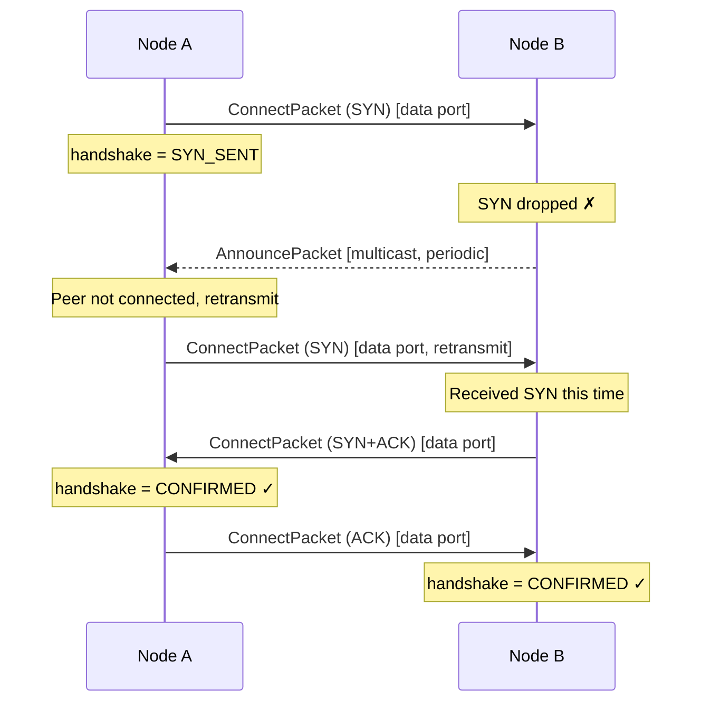

Since both peers announce periodically,
a dropped packet is retried within at most one announce interval.
If the data path is permanently broken in one direction,
the handshake will never complete — which is correct,
since bidirectional data connectivity is required for message exchange.

#### Connect packet

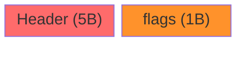

- **flags** — bit 0: SYN (initiating connection), bit 1: ACK (acknowledging receipt)

| Flags     | Value | Meaning                      |
| --------- | ----- | ---------------------------- |
| SYN       | 0x01  | Initiating a new connection  |
| ACK       | 0x02  | Acknowledging a received SYN |
| SYN + ACK | 0x03  | Responding to a received SYN |

CONNECT packets are always sent to a peer's data port (never to the multicast group).
Receiving a CONNECT packet proves that the sender's data port can reach your data port.

#### Data gating

While the connection is incomplete (either flag unsatisfied),
data packets from the peer are dropped.
This prevents processing messages from a peer whose connectivity has not been fully verified.
Once both `announce_heard` and `handshake == CONFIRMED` are satisfied,
normal data transfer begins immediately.

### Graceful departure

When a node shuts down cleanly, it sends a `LeavePacket` so peers can remove it immediately without waiting for the timeout.

## Wire protocol

All NUClearNet packets share a common 5-byte header.

### Packet header

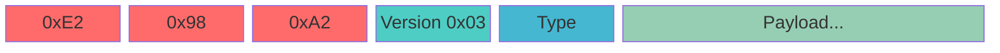

- **Bytes 0–2**: `0xE2 0x98 0xA2` — the ☢ (radioactive) symbol in UTF-8.
    Acts as a magic number to identify NUClear packets.
- **Byte 3**: Protocol version — `0x03` for the current implementation
- **Byte 4**: Packet type

A received packet is only accepted if the magic bytes, version, and type field all pass validation.

### Packet types

| Type     | Value | Purpose                                   |
| -------- | ----- | ----------------------------------------- |
| ANNOUNCE | 1     | Periodic discovery broadcast              |
| LEAVE    | 2     | Graceful departure notification           |
| DATA     | 3     | Data payload (original or retransmission) |
| ACK      | 4     | Acknowledgment of received fragments      |
| CONNECT  | 5     | Connection handshake (SYN/ACK flags)      |

### Announce packet

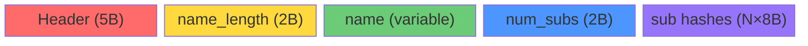

- **name_length** — length of the node name string
- **name** — the node's name (UTF-8, not null-terminated)
- **num_subscriptions** — how many type hashes follow (0 = interested in all messages)
- **subscription hashes** — `uint64_t` type hashes this node wants to receive

No port field is included — the receiver learns the sender's data port from the UDP source address.

### Data packet


- **packet_id** — a semi-unique identifier for this message group (wraps at 65535)
- **packet_no** — which fragment this is (0-indexed)
- **packet_count** — total number of fragments in this message
- **flags** — bit 0: reliable delivery requested
- **hash** — 64-bit type hash identifying what kind of data this is
- **payload** — the serialized payload bytes for this fragment

### ACK packet


- **packet_id** — which packet group this ACK refers to
- **packet_count** — total fragments in the group (for validation)
- **bitset** — one bit per fragment (LSB first).
    Bit set means the corresponding fragment has been received.

## Fragmentation and reassembly

Because NUClearNet uses UDP, each packet must fit within a single network datagram.
UDP datagrams have a practical size limit — the network's MTU.
Messages larger than this limit are automatically split into fragments,
each sent as a separate UDP datagram.
The receiver reassembles the fragments back into the complete message.

### MTU calculation

```
fragment_size = network_mtu - IP_header(20/40) - UDP_header(8) - DataPacket_header(20)
```

With a typical 1500-byte Ethernet MTU this gives approximately **1452 bytes per fragment** for IPv4.

### Sending large messages

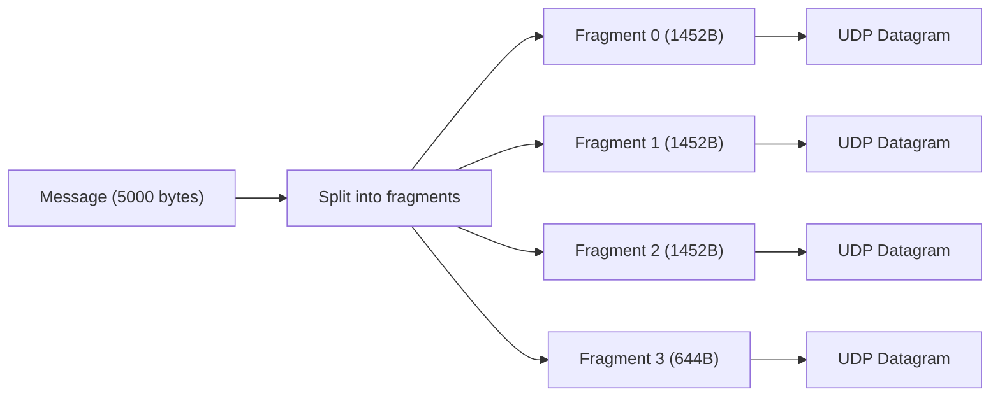

### Reassembly on the receiver

The receiver collects fragments keyed by `(source_address, packet_id)`.
Once all `packet_count` fragments have arrived, the original message is reassembled and delivered.

**Assembly timeout:**
If an incomplete message hasn't received new fragments within the peer timeout (default 2 seconds), it's discarded.
This matches the peer liveness timeout — if no fragments have arrived in this period,
either the peer is dead (and will be removed) or the sender has moved on (unreliable message).
For reliable messages, the sender's retransmissions will keep refreshing the assembly's timestamp,
so the assembly will not expire while the sender is still alive and retransmitting.

**Maximum assembly size:**
A configurable limit (default 64 MB) prevents memory exhaustion from maliciously large messages.
If a message's total size would exceed this limit, the assembly is rejected.

## Reliable delivery

Fragmentation solves the message *size* problem, but UDP itself provides no delivery guarantees.
Packets can be lost, reordered, or duplicated by the network.
For many robotics use cases (sensor streams, video frames), this is fine — a missing update is quickly superseded by the next one.
But some messages *must* arrive: configuration commands, state transitions, calibration data.

NUClearNet's reliable delivery mode adds ACK-based retransmission on top of the same fragmented UDP transport.
When you send a message reliably, the system tracks which fragments have been acknowledged by the receiver and retransmits any that go missing.

### Unreliable (default)

- Send and forget
- No ACKs, no retransmission
- Fastest possible — zero overhead
- Fine for high-frequency data where missing one update doesn't matter (sensor streams, video frames)

### Reliable mode

When reliable delivery is requested, the sender and receiver engage in a conversation to ensure all fragments arrive:

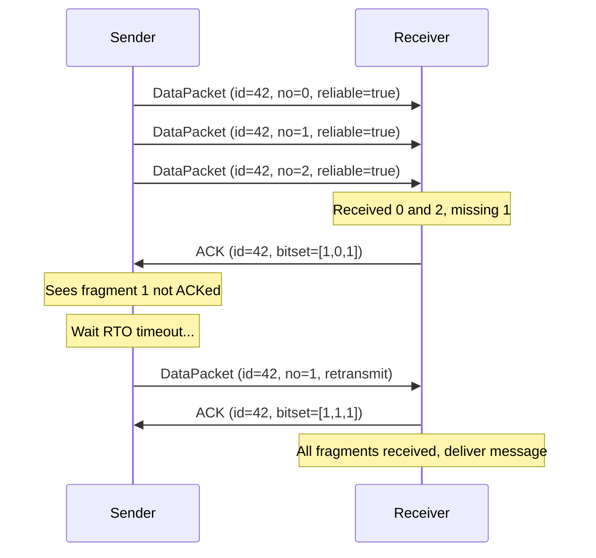

Key mechanisms:

- **Bitset ACK** — when the receiver gets a fragment,
    it responds with an ACK containing a bitset of *all* received fragments for that packet group.
    This gives the sender full visibility into what's been received.
- **RTO-based retransmission** — the sender waits one RTO (Retransmission Timeout) before retransmitting un-ACKed fragments.
    The RTO is calculated per peer based on measured round-trip times (see below).
- **No retransmission limit** — reliable packets are retransmitted indefinitely until either all fragments are ACKed,
    or the peer is removed (due to timeout or graceful leave).
    This guarantees delivery as long as the connection remains alive.

### How long to wait before retransmitting (RTT estimation)

The key challenge in retransmission is choosing *when* to retransmit.
Too soon, and you waste bandwidth resending packets that were simply delayed.
Too late, and the receiver is left waiting for data that was lost.

The answer depends on how long packets actually take to travel between two specific peers — the round-trip time.
NUClearNet measures this per peer by timing how long it takes between sending a fragment and receiving its ACK.
This measurement is then smoothed using the Jacobson/Karels algorithm (the same approach TCP uses, defined in RFC 6298):

```
RTTVAR = (1 - β) × RTTVAR + β × |SRTT - sample|
SRTT   = (1 - α) × SRTT + α × sample
RTO    = SRTT + 4 × RTTVAR
```

Where:

- `α = 0.125` — smoothing factor for RTT (standard TCP value)
- `β = 0.25` — smoothing factor for RTT variation (standard TCP value)
- `SRTT` — smoothed RTT estimate
- `RTTVAR` — RTT variation (jitter)
- `RTO` — retransmission timeout (clamped between 100 ms and 60 s)

The RTO is the actual wait time before retransmitting.
It's set slightly above the smoothed RTT (plus a jitter margin) so that under normal conditions,
the ACK arrives just before the timeout fires.
If the network gets congested and round-trip times increase, the RTO automatically grows to compensate.
If the network recovers, the RTO shrinks back down.

This means retransmission timing is always appropriate for the current link conditions between each specific pair of peers,
rather than relying on a fixed timeout that would be too aggressive for slow links or too conservative for fast ones.

## Subscription-based routing

With fragmentation, reliability, and deduplication handling the *transport* of messages,
the final piece is deciding *which peers* should receive each message.
Rather than broadcasting everything to all peers (which wastes bandwidth),
nodes advertise which message types they want to receive via subscription hashes in their announce packets.
This allows senders to skip transmitting messages to peers that aren't interested in them.

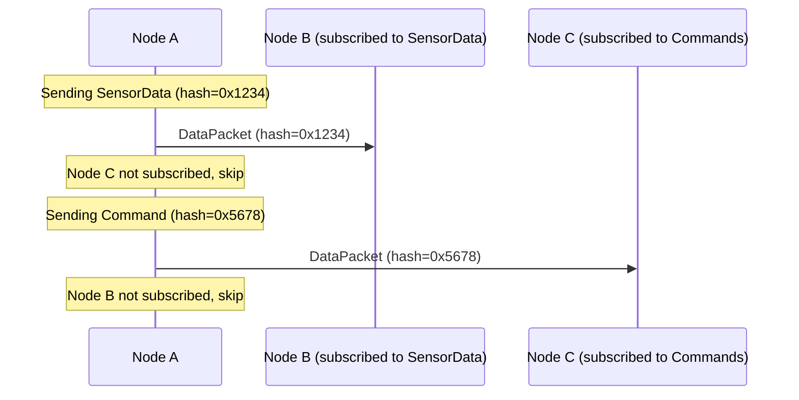

**Default behavior:**
If a peer advertises an empty subscription set (no hashes), it receives *all* messages.
This ensures backward compatibility and supports "gateway" nodes that need to see everything.

When a local `on<Network<T>>` reaction is registered,
the `NetworkController` adds the corresponding type hash to this node's subscription list and re-announces with the updated subscriptions.

### Broadcast delivery via multicast

When a message is sent without a specific target (broadcast to all peers) and does not require reliable delivery,
it is sent once to the multicast/broadcast group rather than unicast to each peer individually.
This is significantly more efficient when there are many peers:

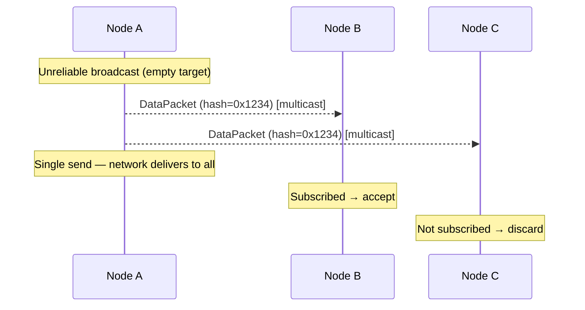

Each receiver checks its local subscription list and discards messages it is not interested in.
This filtering happens before fragmentation reassembly to avoid wasted work.

Reliable sends and targeted sends (to a specific named peer) are always unicast,
because ACK tracking and retransmission require per-peer communication.

## Packet deduplication

Reliable delivery creates a new problem: duplicate packets.
When a sender retransmits a fragment because the ACK was lost (not the fragment itself),
the receiver may process the same fragment twice.
Similarly, network anomalies can cause any UDP packet to arrive more than once.

To handle this, each peer has an associated `PacketDeduplicator` — a sliding-window bitset that tracks the last 256 packet IDs seen from that peer.
When a data packet arrives:

1. If the packet ID falls within the window and is already marked as seen, it's dropped as a duplicate.
1. If the packet ID is newer than the window, the window slides forward and the packet is accepted.
1. If the packet ID is older than the entire window (more than 256 behind), it's dropped.

This handles scenarios like retransmissions arriving after the original was already processed,
or network loops causing packets to appear multiple times.

## Type routing

Messages are identified by a **type hash** rather than string names or channel IDs.

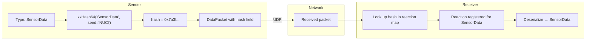

The hash is computed as:

```
xxHash64(demangled_type_name, seed = 0x4e55436c)  // "NUCl" in ASCII
```

Both sender and receiver must use **exactly the same type name**.
It's not enough to have structurally identical types — the demangled name must match.
In practice, this means sharing header files between nodes.

## Serialization

NUClearNet doesn't prescribe a single serialization format.
Instead, it uses the `Serialise<T>` template which selects a strategy based on the type:

- **Trivially copyable types** — direct `memcpy` (fast but architecture-dependent)
- **Protobuf messages** — `SerializeToString` / `ParseFromString`
- **Custom types** — user provides a `Serialise<T>` specialization

See [Serialization](serialization.md) for the full details.

## Integration with the NUClear DSL

The networking system integrates with NUClear through the `NetworkController` reactor — a built-in extension that bridges the low-level network engine with the task system.

### Receiving: `Network<T>`

```cpp
on<Network<SensorData>>().then([](const SensorData& data) {
    // data arrived from another node
});
```

When you use `Network<T>`:

1. At bind time, the reaction's type hash is registered with the `NetworkController`.
1. The `NetworkController` adds the hash to its subscription set and re-announces.
1. The hash is mapped to the reaction in an internal multimap.
1. When a packet arrives with that hash, the `NetworkController`:
    - Stores the raw bytes in `ThreadStore`
    - Calls `get_task()` on the matched reactions
    - The `Network<T>` word's `get()` deserializes the bytes into a `T`

### Sending: `emit<Scope::NETWORK>`

```cpp
emit<Scope::NETWORK>(std::make_unique<SensorData>(reading), "target_name", true);
```

This triggers:

1. `emit::Network<SensorData>` serializes the data and computes the type hash.
1. A `NetworkEmit` message is emitted locally.
1. `NetworkController` catches it and calls `NUClearNet::send(hash, payload, target, reliable)`.
1. The network engine checks which peers subscribe to the hash via the `Routing` module.
1. For each eligible peer, the message is fragmented and transmitted.
1. If reliable, the `Reliability` module tracks the packet group for ACK/retransmission.

### Peer lifecycle events

```cpp
on<Trigger<NetworkJoin>>().then([](const NetworkJoin& event) {
    log("Peer joined:", event.name);
});

on<Trigger<NetworkLeave>>().then([](const NetworkLeave& event) {
    log("Peer left:", event.name);
});
```

These are emitted by the `NetworkController` when its join/leave callbacks fire from the `Discovery` module.

## Data transmission flow

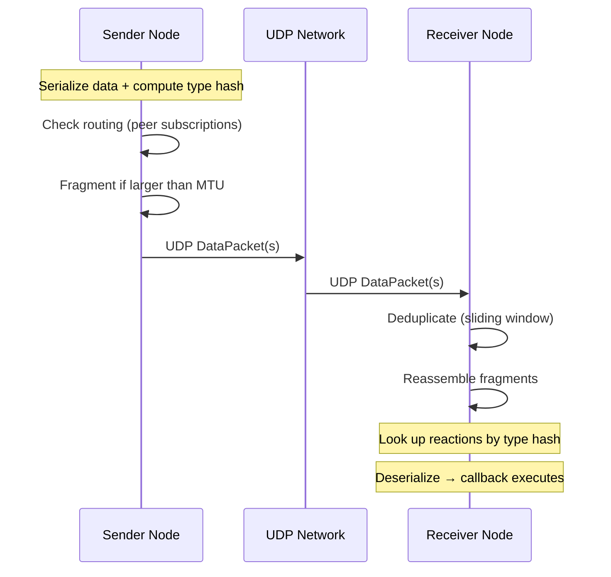

## Configuration

The network is configured by emitting a `NetworkConfiguration` message:

```cpp
emit(std::make_unique<NetworkConfiguration>(
    "my_node_name",           // This node's name
    "239.226.152.162",        // Announce address (multicast)
    7447                      // Announce port
));
```

### Configuration fields

| Field              | Type       | Default             | Description                                     |
| ------------------ | ---------- | ------------------- | ----------------------------------------------- |
| `name`             | `string`   | —                   | Unique name for this node on the network        |
| `announce_address` | `string`   | `"239.226.152.162"` | Address for node discovery announcements        |
| `announce_port`    | `uint16_t` | `7447`              | Port for announce messages                      |
| `bind_address`     | `string`   | `""` (all)          | Local interface to bind to (default `INADDR_ANY`; required for broadcast fan-out on macOS) |
| `mtu`              | `uint16_t` | `1500`              | Maximum transmission unit (fragments if larger) |

When a new configuration is received, the `NetworkController` tears down existing sockets and reinitializes with the new settings.
The node name becomes the identifier that other peers see in `NetworkJoin` events.

### Internal engine parameters

The `NUClearNet` engine supports additional parameters beyond what's exposed through `NetworkConfiguration`:

| Parameter      | Default   | Description                                        |
| -------------- | --------- | -------------------------------------------------- |
| `peer_timeout` | 2 seconds | How long without a packet before a peer is removed |

| `max_assembly_size` | 64 MB | Maximum reassembled message size (prevents memory bombs) |
