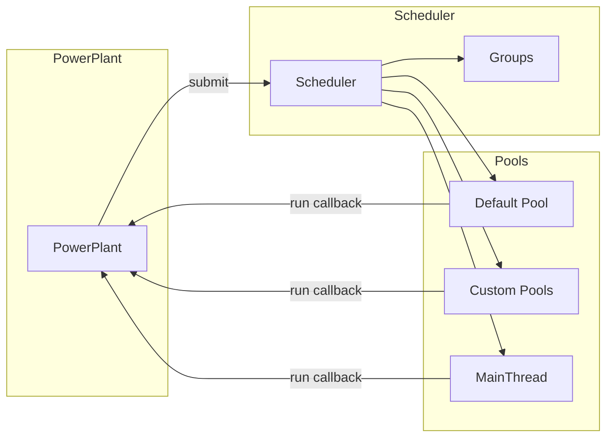
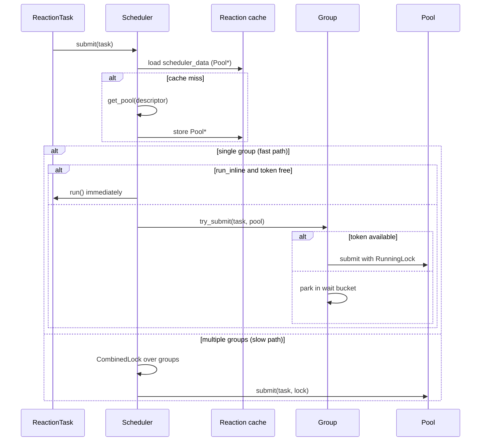

# Scheduler

This page explains how NUClear's task scheduler works internally — the lock-free queues, thread pools, group tokens, and the path from `emit()` to a running reaction callback.

For the user-facing view of pools, priorities, groups, and idle tasks, see [Threading Model](threading.md). For DSL usage, see the [Scheduling](../reference/dsl/index.md) reference words.

## Role in the system

Every reaction execution is a **task** (`ReactionTask`) submitted to the scheduler. The `PowerPlant` owns a single `Scheduler` instance and forwards all work to it:

1. A trigger (message emit, timer, IO event, etc.) creates a `ReactionTask`.
1. `PowerPlant::submit()` calls `Scheduler::submit()`.
1. The scheduler resolves the target **pool**, acquires any required **group** tokens, and enqueues the task.
1. A pool worker dequeues the task, runs the callback, and releases group locks when the callback returns.

`PowerPlant::start()` calls `Scheduler::start()`, which starts worker pools and then blocks the calling thread in the **MainThread** pool until shutdown. `PowerPlant::shutdown()` emits the shutdown event and calls `Scheduler::stop()`.

## Core components

### Scheduler

The scheduler is the central coordinator. It:

- **Owns pools** — lazily created from `ThreadPoolDescriptor` values (default pool, `MainThread`, custom `Pool<T>`, etc.).
- **Owns groups** — lazily created from `GroupDescriptor` values (`Sync<T>`, `Group<T>`, etc.).
- **Routes submission** — resolves pool and group constraints, then hands runnable work to the correct pool.
- **Tracks idle reactions** — global idle tasks and a count of pools that participate in idle detection.

Pool and group maps are protected by mutexes, but those locks are **not** on the hot path for steady-state submission: pool pointers are cached on each `Reaction`, and single-group tasks use a lock-free fast path (see below).

Destruction order matters: `groups` are declared after `pools` in the scheduler so groups (which hold non-owning `Pool*` in parked waiters) are destroyed before pools.

### Pool

Each pool is a set of worker threads (or a single thread for `MainThread`) plus:

- **Five priority-bucket queues** — one lock-free queue per priority level.
- **A condition variable** — workers sleep when no runnable work is available.
- **Idle machinery** — per-pool and global idle reactions, counting locks, and a `pending_idle` latch for external waiters.

Workers loop in `Pool::run()`: dequeue a task, call `ReactionTask::run()`, repeat until shutdown.

The default pool's thread count comes from `Configuration::default_pool_concurrency` (typically hardware concurrency). Other pools use the `concurrency` value from their descriptor.

### Group

A group limits how many tasks sharing the same descriptor may run concurrently. `Sync<T>` is a group with concurrency 1.

Groups maintain:

- A **token counter** (`tokens`) — starts at the group's concurrency; decremented when a task runs, incremented when it finishes.
- **Fast-path waiter buckets** — lock-free `TaskQueue` instances keyed by priority, holding tasks that could not acquire a token immediately.
- **Slow-path queue** — mutex-backed sorted list used when a task needs locks on **multiple** groups at once (`CombinedLock`).

## Task submission path

When `Scheduler::submit()` receives a task:

### Pool resolution cache

The first submit for a reaction calls `get_pool()` under `pools_mutex`. The resulting `Pool*` is stored in `Reaction::scheduler_data` — a plain `std::atomic<Pool*>` rather than `atomic<shared_ptr>` to avoid libstdc++'s hashed mutex pool for atomic shared pointers, which would contend on hot paths.

Subsequent submits load the cached pointer with acquire semantics. Concurrent first submits may both resolve the pool; they store the same pointer, so the race is benign.

### Inline execution

If a reaction is bound with `Inline` and belongs to a single group, the scheduler tries to acquire a group token and run the callback on the submitting thread without enqueueing. This avoids queue overhead for synchronous emit paths.

## Thread pools and queue selection

Each pool holds an array of five `Queue<Task>` instances — one per priority bucket. At construction time the pool chooses the concrete queue type:

| Pool kind                                                  | Queue type         | Why                                                                                                |
| ---------------------------------------------------------- | ------------------ | -------------------------------------------------------------------------------------------------- |
| Default pool (`Pool<>`)                                    | `TaskQueue` (MPMC) | Concurrency may differ from the descriptor's nominal value; multiple workers dequeue concurrently. |
| `MainThread`, Trace pool, any pool with `concurrency == 1` | `MPSCQueue` (MPSC) | Exactly one consumer; simpler and cheaper than MPMC.                                               |
| Custom pools with `concurrency > 1`                        | `TaskQueue` (MPMC) | Multiple workers compete for tasks.                                                                |

The virtual `Queue` interface lets `Pool` store both implementations in one `std::array` without templating the entire pool. The virtual call cost is negligible compared to the atomic operations inside enqueue and dequeue.

Workers identify themselves via a thread-local `Pool::current_pool` pointer, set when `run()` starts. `Pool::current()` returns a `shared_ptr` to the active pool, or `nullptr` off-scheduler threads.

## Priority buckets

Tasks are not kept in one monolithic priority queue. Instead, each pool has **five fixed buckets** scanned from highest to lowest priority:

| Bucket   | Priority range | DSL level                    |
| -------- | -------------- | ---------------------------- |
| REALTIME | ≥ 1000         | `Priority::REALTIME`         |
| HIGH     | ≥ 750          | `Priority::HIGH`             |
| NORMAL   | ≥ 500          | `Priority::NORMAL` (default) |
| LOW      | ≥ 250          | `Priority::LOW`              |
| IDLE     | < 250          | `Priority::IDLE`             |

`Pool::try_dequeue_task()` walks buckets 0→4 and returns the first available task. Within a bucket, ordering is **FIFO** (per-producer FIFO in the MPMC queue; strict FIFO in MPSC). Priority therefore dominates bucket order; tie-breaking within a bucket follows enqueue order, not reaction ID.

Priority affects **queuing order only**. Running tasks are never preempted.

## Lock-free queues

Both queue implementations use a **block-based** design: fixed-size blocks of 64 slots linked in a list. Producers claim slots with `write.fetch_add(1)`, construct the payload in place, then set a `committed` flag. Consumers read committed slots and advance head/tail as blocks drain.

### TaskQueue (MPMC)

Used where multiple pool threads dequeue concurrently.

- **Producers**: wait-free slot claim within a non-full block; lock-free block linking when a block overflows.
- **Consumers**: CAS on per-block read index; may spin briefly waiting for a producer to commit a slot.
- **Graveyard**: fully drained blocks are retired to a graveyard list rather than deleted immediately, so producers still referencing an old block via `tail` cannot use freed memory. Blocks are freed when the queue is destroyed.

Cross-producer ordering is not guaranteed; per-producer FIFO is preserved.

### MPSCQueue (MPSC)

Used for single-consumer pools (`MainThread`, concurrency-1 custom pools).

The producer side matches `TaskQueue`. The consumer side is simpler: a plain (non-atomic) read index, no CAS on dequeue, and immediate block retirement to the graveyard when advancing.

`try_dequeue` must only be called from the designated consumer thread. Force shutdown from another thread delegates queue draining to that consumer via `discard_queues_requested`.

### Shared block helpers

`queue/detail/block_ops.hpp` provides `link_next_block`, `retire_block`, and spin/backoff helpers shared by both queues.

### Lock-free vs wait-free

The queues are **lock-free** at the algorithm level: no mutexes, and the system makes progress under contention. They are **not wait-free end-to-end**:

- Block allocation uses `operator new`.
- Overflow paths use CAS loops on list pointers.
- Consumers may spin waiting for a producer's `committed` flag.

The hot-path slot claim via `fetch_add` is wait-free within a non-full block.

## Group and sync semantics

### Single-group fast path

Most reactions belong to at most one group (including `Sync<T>`). For these, `Group::try_submit()`:

1. Tries to decrement `tokens` with a compare-exchange.
1. On success, submits to the pool immediately with a `RunningLock` that calls `release_token()` on destruction.
1. On failure, **parks** the task in priority-ordered waiter buckets via `park_publish()` / `park_reconcile()`.

The token counter can go **negative** when waiters reserve slots they have not yet consumed. This signed counter, combined with per-waiter **arbiter slots** (`atomic<bool>`), ensures no lost wakeups and exact accounting when multiple waiters race with draining threads.

When a running task finishes, `release_token()` increments `tokens` and drains at most one parked waiter into the pool — keeping running count bounded by the group's concurrency.

### Multi-group slow path

Tasks bound to multiple groups (`Sync<A>` and `Sync<B>`, etc.) use `CombinedLock`: each group gets a `GroupLock` backed by a mutex-protected sorted queue. `slow_pending` on each group prevents fast-path submitters from jumping ahead of older multi-group waiters.

When a `GroupLock` is released, the group may drain a fast-path waiter even if slow-path waiters exist, if the pre-release token count indicates a committed fast waiter is owed a slot — avoiding deadlocks between fast and slow paths.

### External waiters

When a task is parked in a group's wait buckets (not yet in the pool queue), the destination pool must not go idle as if it had no work. `Pool::register_external_waiter()` increments `external_waiters`, keeping workers alive until the parked task is drained or the registration is destroyed.

If idle reactions are registered for that pool (or globally), a `pending_idle` latch ensures one idle epoch fires before the next dequeue — preserving the invariant that parking a non-runnable task triggers idle detection, even if the worker is preempted and a runnable task arrives in the queue before the worker resumes.

### Slow-path locks in the pool

Tasks submitted with a `GroupLock` (slow path) or dequeued before their lock is acquirable are re-enqueued and the worker waits on the condition variable until `notify()` runs from lock release.

## Idle tasks and shutdown

### Idle tasks

Idle reactions (`on<Idle<>>`, `on<Idle<Pool<T>>>`) are registered via `PowerPlant::add_idle_task()` → `Scheduler::add_idle_task()`.

When a pool worker finds no runnable task:

1. It tries `get_idle_task()` — acquiring counting locks that track per-thread and per-pool idle state.
1. When all threads in a pool are idle and the pool holds the global idle lock, global idle reactions are collected.
1. A synthetic `ReactionTask` runs that re-submits each idle reaction's task via `scheduler.submit()`.

`global_idle_count` is an atomic so pools can cheaply check whether global idle exists without locking the scheduler on every external-waiter registration.

### Shutdown sequence

`Scheduler::stop(force)` sets `running = false` and stops all pools.

| Stop type | Behaviour                                                                                                                        |
| --------- | -------------------------------------------------------------------------------------------------------------------------------- |
| `NORMAL`  | Pools stop accepting new work (except **persistent** pools, which keep accepting during shutdown). Workers drain queued tasks.   |
| `FINAL`   | Used after the main thread exits `start()`; even persistent pools stop once their queues empty.                                  |
| `FORCE`   | Clears queues and wakes all threads; used for forced test timeouts. MPSC pools require the consumer thread to perform the drain. |

`Scheduler::start()` starts worker pools first, then blocks in `MainThread::start()`. When the main thread pool exits (after shutdown), pools are stopped in order — non-persistent pools before persistent ones — then joined.

Persistent pools (`ThreadPoolDescriptor::persistent`) continue accepting tasks during a normal shutdown so networking or logging reactors can finish in-flight work.

## Design tradeoffs

| Choice                               | Rationale                                                                                                                                                           |
| ------------------------------------ | ------------------------------------------------------------------------------------------------------------------------------------------------------------------- |
| Virtual `Queue` interface            | One bucket array in `Pool` without templating the entire pool; indirection cost is dwarfed by atomics.                                                              |
| Separate `MPSCQueue`                 | Single-consumer pools avoid MPMC CAS on dequeue; meaningful win for `MainThread` and concurrency-1 pools.                                                           |
| Priority buckets vs one sorted queue | Fixed five buckets give O(1) bucket selection and lock-free queues per level; fine-grained priority within a bucket is FIFO, not strict global ordering by task ID. |
| Lock-free group fast path            | Single-group `Sync` is the common case; parking in lock-free buckets avoids mutex contention on submission.                                                         |
| Mutex for pool/group maps            | Pools and groups are created once per descriptor; mutex cost is paid on first use, not every submit.                                                                |
| Condition variable for workers       | Lock-free queues hold tasks, but workers must sleep when idle; CV + `live` flag avoids busy-waiting.                                                                |
| Non-preemptive execution             | Simpler reasoning, no priority inversion from preemption; long tasks hold a thread until completion.                                                                |

## See also

- [Threading Model](threading.md) — pools, priorities, groups, and idle tasks from a user perspective
- [Synchronization](../how-to/synchronization.md) — using `Sync` and `Group` in reactors
- [Priority](../reference/dsl/priority.md) — DSL priority levels and values
- [Pool](../reference/dsl/pool.md) — routing reactions to custom thread pools
- [Group](../reference/dsl/group.md) — limiting concurrent execution
- [Idle](../reference/dsl/idle.md) — running work when pools are idle
