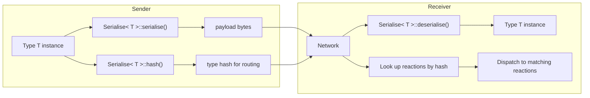
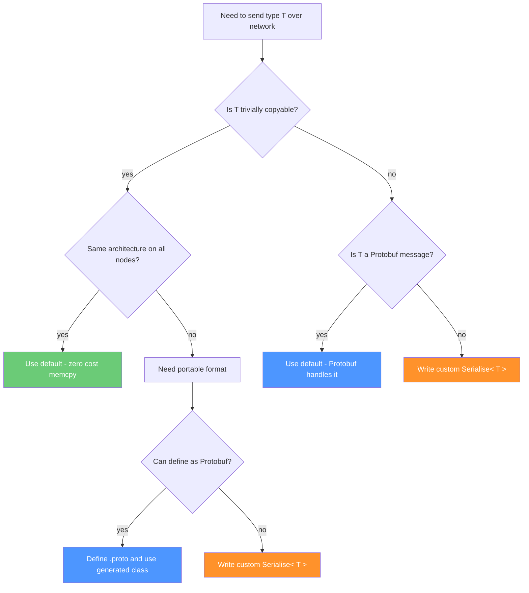

# Serialization

NUClear's serialization system handles the conversion between in-memory C++ types and byte sequences suitable for network transmission.
It's built around a single template — `Serialise<T>` — that provides three operations: serialize, deserialize, and hash.

## The Serialise Template

```cpp
template <typename T>
struct Serialise {
    static std::vector<uint8_t> serialise(const T& in);
    static T deserialise(const std::vector<uint8_t>& in);
    static uint64_t hash();
};
```

These three methods form the complete interface:

- **`serialise`** — converts a `T` into bytes for transmission
- **`deserialise`** — reconstructs a `T` from received bytes
- **`hash`** — returns a 64-bit identifier used for type routing

## The Serialization Pipeline



The hash travels in the packet header so the receiver knows *what* type was sent.
The payload is the serialized bytes.
On arrival, the receiver looks up which reactions are registered for that hash, then deserializes the payload back into the original type.

## Built-in Strategies

NUClear provides three automatic specializations of `Serialise<T>` selected via SFINAE (template metaprogramming).
You don't need to write any serialization code if your type matches one of these.

### Trivially Copyable Types

```cpp
template <typename T>
struct Serialise<T, std::enable_if_t<std::is_trivially_copyable<T>::value, T>> {
    static std::vector<uint8_t> serialise(const T& in) {
        std::vector<uint8_t> out(sizeof(T));
        std::memcpy(out.data(), &in, sizeof(T));
        return out;
    }

    static T deserialise(const std::vector<uint8_t>& in) {
        return *reinterpret_cast<const T*>(in.data());
    }
};
```

For types like `int`, `float`, simple structs with no pointers — anything where `memcpy` gives you a valid copy — this "just works".
It's the fastest possible serialization: zero overhead, no parsing.

**Caveat**: This is **not portable** across different architectures.
Endianness, struct padding, and alignment can all differ.
Only use this when sender and receiver are:

- The same machine (local IPC), or
- Identical hardware with identical compiler settings

### Iterables of Trivial Types

```cpp
// Matches: std::vector<int>, std::array<float, 3>, etc.
template <typename T>
struct Serialise<T, std::enable_if_t<
    std::is_trivially_copyable<iterator_value_type_t<T>>::value, T>>
```

If your type is iterable (has `begin()`/`end()`) and its elements are trivially copyable, NUClear serializes it element-by-element.
This handles `std::vector<float>`, `std::array<double, 3>`, and similar containers automatically.

Deserialization reconstructs the container by dividing the byte count by element size.

### Google Protocol Buffers

```cpp
template <typename T>
struct Serialise<T, std::enable_if_t<
    std::is_base_of<google::protobuf::Message, T>::value, T>>
```

If your type inherits from `google::protobuf::Message` or `MessageLite`, NUClear automatically uses Protobuf's built-in serialization:

- **Serialize**: `SerializeToArray`
- **Deserialize**: `ParseFromArray`
- **Hash**: based on `GetTypeName()` (the Protobuf message name)

This gives you portable, schema-evolving serialization with no extra work — just define your `.proto` file and use the generated class.

## Type Hashing

Every serializable type gets a 64-bit hash used for routing messages to the correct reactions:

```cpp
static uint64_t hash() {
    const std::string type_name = demangle(typeid(T).name());
    return xxhash64(type_name.c_str(), type_name.size(), 0x4e55436c);
}
```

Key details:

- **Algorithm**: xxHash64 — extremely fast, good distribution
- **Input**: the demangled C++ type name (e.g., `"MyNamespace::SensorData"`)
- **Seed**: `0x4e55436c` — the ASCII bytes for "NUCl"

### Important Implications

Both sender and receiver must have **exactly the same demangled type name**.
This means:

- Share the header file defining the type between all nodes
- The type must be in the same namespace
- Template parameters must match exactly
- Different compilers/platforms may demangle differently (though in practice GCC and Clang agree for most types)

For Protobuf types, the hash uses the Protobuf message name (`GetTypeName()`) rather than the C++ class name.
This is more stable across compiler differences.

## Custom Serialization

For types that don't fit the built-in strategies, specialize `Serialise<T>`:

```cpp
namespace NUClear {
namespace util {
namespace serialise {

template <>
struct Serialise<MyComplexType> {
    static std::vector<uint8_t> serialise(const MyComplexType& in) {
        std::vector<uint8_t> out;
        // Custom encoding logic
        // e.g., write fields in a portable order with known sizes
        return out;
    }

    static MyComplexType deserialise(const std::vector<uint8_t>& in) {
        MyComplexType out;
        // Custom decoding logic matching the encoding
        return out;
    }

    static uint64_t hash() {
        // Usually fine to use the default name-based hash:
        const std::string name = demangle(typeid(MyComplexType).name());
        return xxhash64(name.c_str(), name.size(), 0x4e55436c);
    }
};

}  // namespace serialise
}  // namespace util
}  // namespace NUClear
```

You need a custom specialization when:

- Your type has pointers or references (can't memcpy)
- You need cross-architecture portability for a non-Protobuf type
- You have a complex nested structure
- You want to use a different serialization library (FlatBuffers, MessagePack, etc.)

## When to Use What



| Scenario                                    | Strategy                          | Pros                                   | Cons                                    |
| ------------------------------------------- | --------------------------------- | -------------------------------------- | --------------------------------------- |
| Same machine / identical targets            | Trivially copyable (default)      | Zero overhead, no code needed          | Not portable                            |
| Cross-architecture, schema evolution needed | Protobuf                          | Portable, versioning, widely supported | Requires .proto definitions             |
| Cross-architecture, no Protobuf             | Custom `Serialise<T>`             | Full control                           | Manual implementation                   |
| Containers of primitives                    | Iterable specialization (default) | Automatic for vectors/arrays           | Still not portable across architectures |

## Relationship to Networking

The serialization system is used by two DSL words:

- **`emit<Scope::NETWORK>`** — calls `Serialise<T>::serialise()` and `Serialise<T>::hash()` to prepare data for sending
- **`Network<T>`** — calls `Serialise<T>::deserialise()` to reconstruct received data, uses `hash()` at bind time to register interest

The `NUClearNetwork` engine itself is serialization-agnostic — it only sees `uint64_t hash` and `std::vector<uint8_t> payload`.
The type-aware serialization happens in the DSL layer above it.
