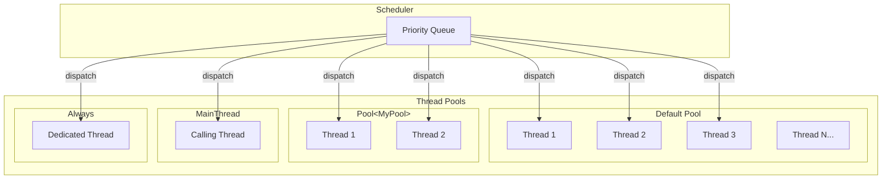
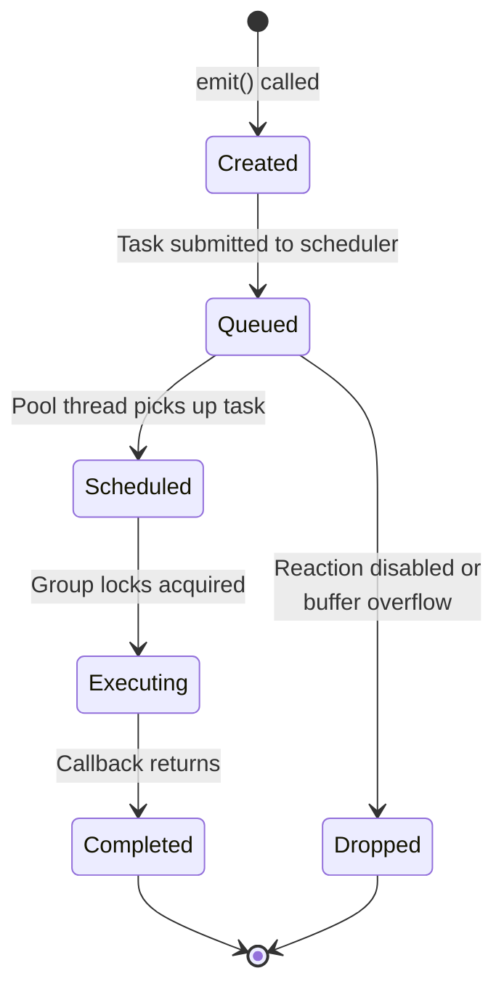
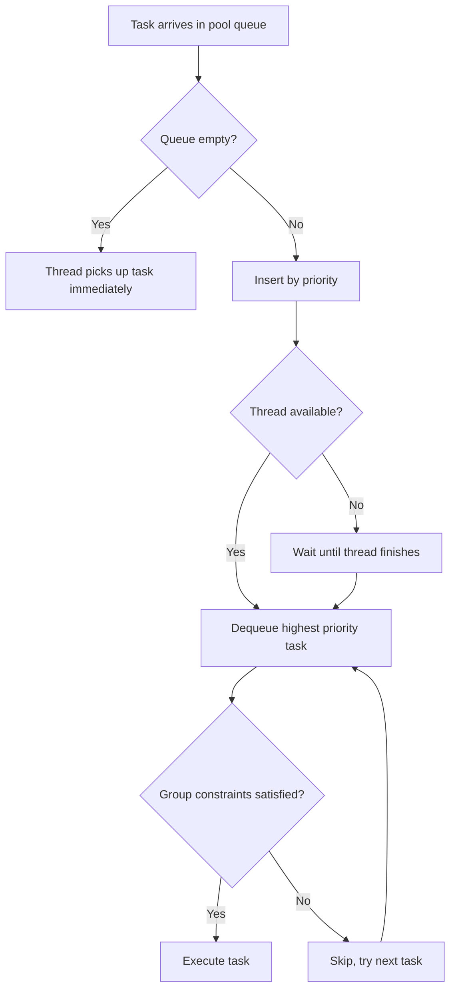

# Threading Model

NUClear's threading model is designed around a simple goal: **you should never have to write a mutex**.
The framework handles concurrency for you through immutable messages, thread pools, and a priority-based scheduler.

## Thread Pool Architecture

NUClear uses multiple thread pools, each serving a different purpose:



### Default Pool

When you write a reaction without specifying a pool, it runs on the **default pool**.
This pool has a configurable number of threads — by default, it matches your hardware concurrency (number of CPU cores).

```cpp
NUClear::Configuration config;
config.default_pool_concurrency = 4;  // Override the default
NUClear::PowerPlant plant(config);
```

The default pool is your workhorse.
Most reactions will run here, and the scheduler ensures they're dispatched efficiently across all available threads.

### Custom Pools ([`Pool<T>`](../reference/dsl/pool.md))

Sometimes you need dedicated threads for specific workloads — maybe a group of reactions that do heavy computation and shouldn't starve your I/O handlers:

```cpp
struct ComputePool {
    static constexpr int concurrency = 2;
};

on<Trigger<HeavyData>, Pool<ComputePool>>().then([](const HeavyData& d) {
    // Runs on one of ComputePool's 2 dedicated threads
});
```

Custom pools create their own threads, separate from the default pool.
Tasks assigned to a custom pool will *only* run on that pool's threads.

### Main Thread ([`MainThread`](../reference/dsl/main-thread.md))

Some operations must run on the main thread — typically platform-specific requirements like GUI updates or OpenGL contexts.
The `MainThread` pool is special: it has exactly one thread, and that thread is the one that called `PowerPlant::start()`.

```cpp
on<Trigger<Frame>, MainThread>().then([](const Frame& f) {
    // Always runs on the main thread
});
```

### [Always](../reference/dsl/always.md) (Dedicated Thread)

`Always` creates a **dedicated thread for a single reaction**.
The reaction's callback runs continuously in a loop — as soon as it returns, it's called again.
This is useful for blocking operations like polling hardware:

```cpp
on<Always>().then([] {
    // This runs in its own dedicated thread, looping forever
    auto data = blocking_hardware_read();
    emit(std::make_unique<SensorData>(data));
});
```

## Task Lifecycle

Every reaction execution goes through a well-defined lifecycle:



1. **Created** — an `emit()` triggers a reaction, creating a task with bound data
1. **Queued** — the task enters the scheduler's priority queue for its target pool
1. **Scheduled** — a thread from the pool picks up the highest-priority available task
1. **Executing** — group constraints are satisfied, the callback runs
1. **Completed** — the callback returns, any group locks are released

Tasks can also be **dropped** if the reaction has been disabled (via [`ReactionHandle`](../reference/api/reaction-handle.md)) or if a [`Buffer`](../reference/dsl/buffer.md) limit is exceeded.

## Priority-Based Scheduling

The scheduler uses a **priority queue** — tasks with higher priority are always dequeued first.
Within the same priority level, tasks are ordered by creation time (earlier tasks run first).



You set priority on a reaction using the [`Priority`](../reference/dsl/priority.md) DSL word:

```cpp
on<Trigger<Critical>, Priority::REALTIME>().then(...);  // Runs before everything
on<Trigger<Normal>>().then(...);                         // Default priority (NORMAL)
on<Trigger<Background>, Priority::IDLE>().then(...);    // Runs when nothing else needs to
```

## [Group](../reference/dsl/group.md) Constraints

Groups provide mutual exclusion without mutexes.
A group specifies a maximum concurrency — how many tasks from that group can run simultaneously:

```cpp
struct SerialPort {
    static constexpr int concurrency = 1;  // Only one task at a time
};

on<Trigger<SendCommand>, Group<SerialPort>>().then(...);
on<Trigger<ReadResponse>, Group<SerialPort>>().then(...);
```

Even though these reactions might be triggered simultaneously, the group ensures only one runs at a time.
The scheduler checks group availability before dispatching — if a group is at capacity, the task waits in the queue until a slot opens.

This is strictly better than a mutex because:

- **No deadlocks** — the scheduler manages ordering globally
- **Priority is respected** — high-priority tasks get the group slot first
- **No blocking** — waiting threads aren't consumed, they can pick up other tasks

## [Idle](../reference/dsl/idle.md) Tasks

Idle tasks run when a pool has **no other work to do**.
They're useful for background housekeeping:

```cpp
on<Idle<Pool<MyPool>>>().then([] {
    // Only runs when MyPool has no pending or running tasks
});
```

The scheduler tracks which pools are idle.
When a pool's queue empties and all threads complete their current tasks, idle reactions for that pool are triggered.

## No Preemption

Once a task starts executing, **it runs to completion**.
The scheduler never interrupts a running task to run a higher-priority one.
This is a deliberate design choice:

- Simpler reasoning about state — your callback won't be suspended mid-execution
- No priority inversion from preemption
- Predictable execution times for real-time workloads

The trade-off is that a long-running low-priority task *will* occupy a thread until it finishes.
If this is a concern, split the work into smaller chunks, or assign it to a dedicated pool so it doesn't block others.

## Thread Safety Through Immutability

The final piece of the puzzle: **messages are immutable**.
When you emit data, it's wrapped in a `shared_ptr<const T>`:

```cpp
emit(std::make_unique<SensorData>(reading));
// Once emitted, the data becomes shared_ptr<const SensorData>
// Multiple reactions can read it simultaneously — no locks needed
```

When a reaction receives data, it gets a `const` reference (or a `shared_ptr<const T>`).
Multiple reactions can read the same data concurrently because nobody can modify it.
This is why NUClear can be heavily multi-threaded without requiring you to think about synchronisation — the data model prevents conflicts by construction.
