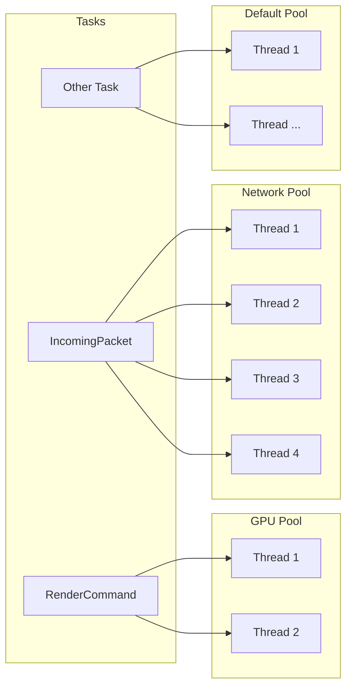

# Custom Thread Pools

> Route specific reactions to dedicated threads, separate from the default pool.

## Problem

You have tasks with different resource requirements — GPU work that should run on a small set of threads, and networking tasks that need higher concurrency — and you want to isolate them from the default thread pool.

## Solution

Define a pool descriptor struct with a `name` and `concurrency`, then use `Pool<MyPool>` in your reaction's DSL.

### 1. Define the Pool

A pool descriptor is a struct with two static constexpr members:

```cpp
struct GPUPool {
    static constexpr const char* name = "GPU";
    static constexpr int concurrency = 2;
};

struct NetworkPool {
    static constexpr const char* name = "Network";
    static constexpr int concurrency = 4;
};
```

- **`name`** — A human-readable identifier for debugging and logging.
- **`concurrency`** — The number of threads allocated to this pool.

### 2. Use the Pool in a Reaction

```cpp
on<Trigger<RenderCommand>, Pool<GPUPool>>().then([](const RenderCommand& cmd) {
    // Runs on one of the 2 GPU pool threads
    perform_gpu_work(cmd);
});

on<Trigger<IncomingPacket>, Pool<NetworkPool>>().then([](const IncomingPacket& pkt) {
    // Runs on one of the 4 Network pool threads
    process_packet(pkt);
});
```

### 3. Complete Example

```cpp
#include <nuclear>

struct GPUPool {
    static constexpr const char* name = "GPU";
    static constexpr int concurrency = 2;
};

struct NetworkPool {
    static constexpr const char* name = "Network";
    static constexpr int concurrency = 4;
};

struct RenderCommand {
    int frame_id;
};

struct IncomingPacket {
    std::vector<uint8_t> data;
};

class WorkRouter : public NUClear::Reactor {
public:
    explicit WorkRouter(std::unique_ptr<NUClear::Environment> environment) : Reactor(std::move(environment)) {

        on<Trigger<RenderCommand>, Pool<GPUPool>>().then([](const RenderCommand& cmd) {
            log<INFO>("Rendering frame", cmd.frame_id, "on GPU pool");
            // ... GPU work ...
        });

        on<Trigger<IncomingPacket>, Pool<NetworkPool>>().then([](const IncomingPacket& pkt) {
            log<INFO>("Processing packet of size", pkt.data.size(), "on network pool");
            // ... network work ...
        });
    }
};
```

## How It Works



Tasks are routed to their designated pool based on the [`Pool`](../reference/dsl/pool.md) word. Tasks without a `Pool<>` specification run on the default pool.

!!! warning "Thread count considerations"

    Each pool creates real OS threads. Use custom pools sparingly — too many threads competing for CPU can degrade overall performance. Reserve custom pools for work with genuinely different characteristics (blocking I/O, GPU dispatch, real-time constraints).

!!! note "Task ordering within a pool"

    Tasks queued to the same pool are ordered by priority level first, then by task ID. Use [`Priority`](../reference/dsl/priority.md) to influence execution order within a pool.
