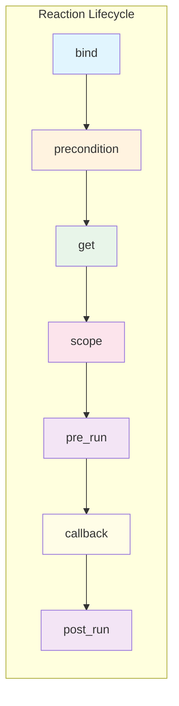

# Creating Custom DSL Words

> How to extend NUClear's DSL with your own words that add new behavior to reactions.

## How It Works

A DSL word is a struct that implements one or more **extension points** as static template methods.
The Fusion Engine discovers which points your word implements and combines them with the other words in an `on<>()` statement.



Your word only needs to implement the extension points relevant to its behavior.

## Step-by-Step

1. Create a struct (never instantiated — delete the constructor)
1. Implement the desired extension points as static template methods
1. Use your word in `on<>()` like any built-in word

## Example 1: LogTiming — Measuring Callback Duration

This word logs how long each callback takes to execute using `pre_run` and `post_run`:

```cpp
#include "nuclear"
#include <chrono>

struct LogTiming {

    LogTiming() = delete;

    template <typename DSL>
    static void pre_run(NUClear::threading::ReactionTask& task) {
        // Store start time in the task's thread-local storage
        start_time = std::chrono::steady_clock::now();
    }

    template <typename DSL>
    static void post_run(NUClear::threading::ReactionTask& task) {
        auto elapsed = std::chrono::steady_clock::now() - start_time;
        auto us = std::chrono::duration_cast<std::chrono::microseconds>(elapsed).count();

        if (us > 1000) {  // Only log if > 1ms
            NUClear::log<NUClear::LogLevel::WARN>("Slow reaction:",
                                         task.reaction->identifiers->name,
                                         "took", us, "µs");
        }
    }

private:
    static thread_local std::chrono::steady_clock::time_point start_time;
};

thread_local std::chrono::steady_clock::time_point LogTiming::start_time;
```

**Usage:**

```cpp
on<Trigger<SensorData>, LogTiming>().then([](const SensorData& data) {
    // If this takes too long, a warning is logged
    heavy_computation(data);
});
```

## Example 2: RateLimit — Limiting Reaction Frequency

This word prevents a reaction from firing more often than a specified rate, using `precondition` and a timer set up in `bind`:

```cpp
#include "nuclear"
#include <chrono>
#include <mutex>

template <int MaxCount, typename Period = std::chrono::seconds>
struct RateLimit {

    RateLimit() = delete;

    template <typename DSL>
    static void bind(const std::shared_ptr<NUClear::threading::Reaction>& reaction) {
        // Initialize the token bucket for this reaction
        auto& state = get_state(reaction->id);
        state.tokens     = MaxCount;
        state.last_check = NUClear::clock::now();
    }

    template <typename DSL>
    static bool precondition(NUClear::threading::ReactionTask& task) {
        auto& state = get_state(task.reaction->id);
        const std::lock_guard<std::mutex> lock(state.mutex);

        // Replenish tokens based on elapsed time
        auto now     = NUClear::clock::now();
        auto elapsed = std::chrono::duration_cast<Period>(now - state.last_check).count();

        if (elapsed > 0) {
            state.tokens     = std::min(MaxCount, state.tokens + static_cast<int>(elapsed) * MaxCount);
            state.last_check = now;
        }

        // Consume a token if available
        if (state.tokens > 0) {
            --state.tokens;
            return true;
        }
        return false;  // Task is dropped
    }

private:
    struct State {
        std::mutex mutex;
        int tokens{0};
        NUClear::clock::time_point last_check;
    };

    static State& get_state(uint64_t reaction_id) {
        static std::map<uint64_t, State> states;
        static std::mutex map_mutex;
        const std::lock_guard<std::mutex> lock(map_mutex);
        return states[reaction_id];
    }
};
```

**Usage:**

```cpp
// Allow at most 10 executions per second
on<Trigger<HighFrequencyData>, RateLimit<10, std::chrono::seconds>>().then(
    [](const HighFrequencyData& data) {
        // Guaranteed to run at most 10 times per second
        update_display(data);
    });
```

## Example 3: Composing Words with Fusion

NUClear's built-in [`Sync`](../reference/dsl/sync.md)`<T>` is simply defined as inheriting from [`Group`](../reference/dsl/group.md)`<T>` — the Fusion Engine resolves inherited extension points.
You can compose existing words the same way:

```cpp
// A word that combines Single (at most one active task) with a priority
template <typename T>
struct CriticalSingle : NUClear::dsl::word::Single,
                        NUClear::dsl::word::Priority::HIGH {
};
```

**Usage:**

```cpp
on<Trigger<EmergencyAlert>, CriticalSingle<EmergencyHandler>>().then([](const EmergencyAlert& alert) {
    // Runs at HIGH priority, never overlaps with itself
    handle_emergency(alert);
});
```

The Fusion Engine walks the inheritance tree and collects all extension points from base classes.

## Extension Point Summary

| Point          | Purpose                              | Returns         | Fusion Strategy     |
| -------------- | ------------------------------------ | --------------- | ------------------- |
| `bind`         | Register reaction at creation time   | `void`          | All called          |
| `get`          | Retrieve data for callback arguments | Any type        | Tuple concatenation |
| `precondition` | Gate whether the task should run     | `bool`          | Logical AND         |
| `pre_run`      | Hook before callback execution       | `void`          | All called          |
| `post_run`     | Hook after callback execution        | `void`          | All called          |
| `scope`        | RAII lock held during execution      | RAII type       | All held            |
| `priority`     | Task scheduling priority             | `PriorityLevel` | Maximum wins        |
| `group`        | Concurrency group membership         | Set             | Union               |
| `pool`         | Which thread pool to run on          | Descriptor      | (single value)      |

See [Extension Points Reference](../reference/extensions/extension-points.md) and [Fusion Engine](../reference/extensions/fusion-engine.md) for full details.

## Thread Context

Different extension points run in different thread contexts.
This is critical to understand when using `thread_local` storage or sharing state:

| Point          | Runs on                              | Notes                                               |
| -------------- | ------------------------------------ | --------------------------------------------------- |
| `bind`         | The thread that calls `on<>()`       | Usually the main thread during reactor construction |
| `get`          | The thread that **created** the task | Often different from the execution thread           |
| `precondition` | The thread that **created** the task | Same thread as `get`                                |
| `pre_run`      | The **execution** thread             | Same thread as the callback                         |
| `post_run`     | The **execution** thread             | Same thread as the callback                         |
| `scope`        | The **execution** thread             | RAII object lives for callback duration             |

!!! warning "thread_local in get vs pre_run/post_run"

    ```
    Because `get` runs on the task-creation thread (not the execution thread), `thread_local` variables set in `get` will **not** be visible in `pre_run`, `post_run`, or the callback itself.
    ```

    If you need per-execution state, use `pre_run`/`post_run` or the `scope` extension point, which provides RAII objects that persist for the lifetime of the reaction execution.

## Tips

- Words are never instantiated — delete the constructor to make this clear.
- Use `thread_local` storage for per-execution state in `pre_run`/`post_run` only — not in `get`.
- Use the `scope` extension point if you need state that persists across the reaction execution with RAII semantics.
- Template parameters on your word become compile-time configuration (like `RateLimit<10, seconds>`).
- Test custom words the same way you test any reactor — single-threaded plant with assertions.
