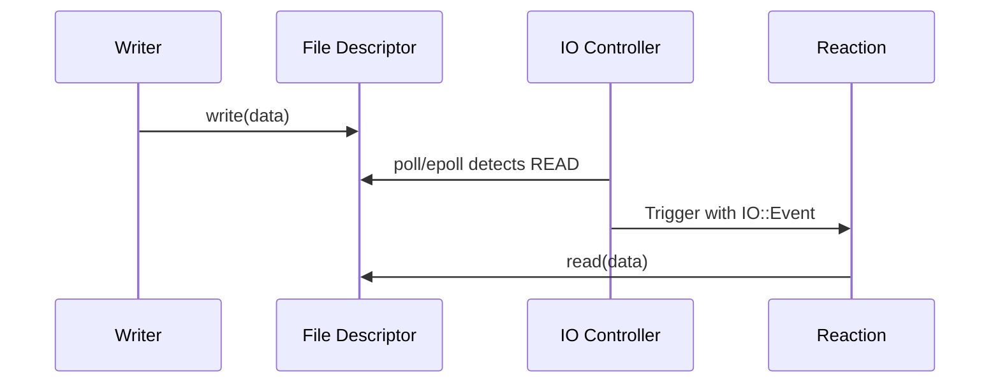

# IO Events

> React when a file descriptor has data to read, is ready to write, or encounters an error.

## Problem

You have a file descriptor (pipe, socket, device file, etc.) and need to react when I/O activity occurs on it, without polling or blocking a thread.

## Solution

Use `on<`[`IO`](../reference/dsl/io.md)`>(fd, events)` to bind a reaction to file descriptor events. NUClear monitors the descriptor and triggers your callback when the specified events occur.

### Event Types

| Event       | Description                                      |
|-------------|--------------------------------------------------|
| `IO::READ`  | Data is available to read                        |
| `IO::WRITE` | File descriptor is ready to accept writes        |
| `IO::CLOSE` | The remote end closed the connection             |
| `IO::ERROR` | An error occurred on the file descriptor         |

Events can be combined with bitwise OR: `IO::READ | IO::ERROR`.

### 1. Get a File Descriptor

```cpp
// Example: create a Unix pipe
int pipefd[2];
::pipe(pipefd);
int read_fd = pipefd[0];
int write_fd = pipefd[1];
```

### 2. Bind to IO Events

```cpp
on<IO>(read_fd, IO::READ).then([](const IO::Event& event) {
    // event.fd    — the file descriptor that triggered
    // event.events — bitmask of events that occurred

    char buffer[1024];
    ssize_t bytes = ::read(event.fd, buffer, sizeof(buffer));
    if (bytes > 0) {
        // Process data
    }
});
```

### 3. Complete Example

```cpp
#include <nuclear>
#include <unistd.h>

class PipeReader : public NUClear::Reactor {
public:
    explicit PipeReader(std::unique_ptr<NUClear::Environment> environment) : Reactor(std::move(environment)) {

        // Create a pipe
        int pipefd[2];
        ::pipe(pipefd);
        int read_fd = pipefd[0];
        int write_fd = pipefd[1];

        // React when data is available on the read end
        on<IO>(read_fd, IO::READ | IO::CLOSE).then([](const IO::Event& event) {
            if (event.events & IO::READ) {
                char buffer[256];
                ssize_t n = ::read(event.fd, buffer, sizeof(buffer) - 1);
                if (n > 0) {
                    buffer[n] = '\0';
                    log<INFO>("Received:", buffer);
                }
            }

            if (event.events & IO::CLOSE) {
                log<INFO>("Pipe closed");
            }
        });

        // Write some data after startup
        on<Startup>().then([write_fd] {
            const char* msg = "Hello from the pipe!";
            ::write(write_fd, msg, strlen(msg));
            ::close(write_fd);
        });
    }
};
```

## How It Works



NUClear's IO controller uses the platform's efficient polling mechanism (`epoll` on Linux, `poll` on POSIX, `WSAEventSelect` on Windows) to monitor registered file descriptors without consuming a thread per descriptor.

!!! warning "Blocking during IO reactions"

    While a reaction is processing an IO event, no other IO triggers for the same file descriptor will fire until the reaction completes. Process data promptly or emit it for handling elsewhere.

!!! note "File descriptor lifetime"

    You are responsible for the lifecycle of the file descriptor. If the descriptor is closed externally, you will receive an `IO::CLOSE` or `IO::ERROR` event. Use [`ReactionHandle`](../reference/api/reaction-handle.md)`.unbind()` to stop monitoring a descriptor you intend to close.
