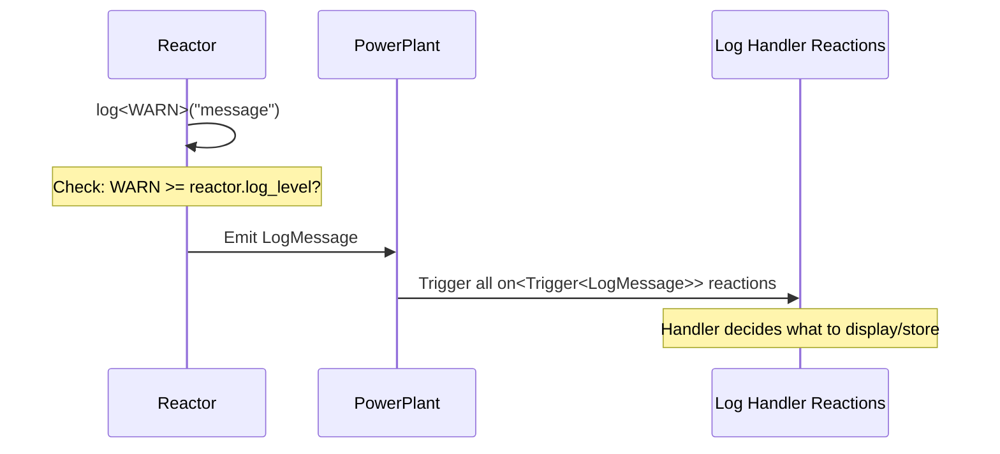

# Logging

> Log messages at different severity levels and control what gets displayed.

## Problem

You need to emit diagnostic messages from your reactors at varying levels of detail, and control which messages are actually displayed or processed.

## Solution

Use `log<Level>(args...)` inside any reaction to emit log messages. Handle them by reacting to `NUClear::message::LogMessage`.

### Log Levels

| Level   | Purpose                                                     |
| ------- | ----------------------------------------------------------- |
| `TRACE` | Extremely verbose, line-by-line execution tracing           |
| `DEBUG` | Inputs/outputs of computation steps, branch decisions       |
| `INFO`  | High-level milestones — function starts, successful results |
| `WARN`  | Non-fatal problems that need attention                      |
| `ERROR` | Unexpected behavior, constraint violations                  |
| `FATAL` | Program-destroying errors that require immediate action     |

### 1. Emit Log Messages

```cpp
log<TRACE>("Entering processing loop, iteration", i);
log<DEBUG>("Input values:", x, y, z);
log<INFO>("Calibration complete");
log<WARN>("Sensor reading out of expected range:", value);
log<ERROR>("Failed to open file:", filename);
log<FATAL>("Memory corruption detected, shutting down");
```

Arguments are concatenated with spaces, similar to `std::cout` with `<<`. Any type that supports `operator<<` to a stream can be used.

### 2. Set Reactor Log Level

Each reactor has a `log_level` that controls the minimum severity for messages to be emitted:

```cpp
class MyReactor : public NUClear::Reactor {
public:
    explicit MyReactor(std::unique_ptr<NUClear::Environment> environment) : Reactor(std::move(environment)) {
        // Only emit WARN and above from this reactor
        log_level = WARN;
    }
};
```

Messages below the reactor's `log_level` are discarded before being emitted, avoiding unnecessary work.

### 3. Handle Log Messages

To actually display or record logs, create a reactor that reacts to `NUClear::message::LogMessage`:

```cpp
#include <nuclear>
#include <iostream>

class LogHandler : public NUClear::Reactor {
public:
    explicit LogHandler(std::unique_ptr<NUClear::Environment> environment) : Reactor(std::move(environment)) {

        on<Trigger<NUClear::message::LogMessage>>().then([](const NUClear::message::LogMessage& msg) {
            // Only display if the message level meets the reactor's display threshold
            if (msg.level >= msg.display_level) {
                std::cerr << "[" << msg.level << "]"
                          << " " << msg.reactor_name
                          << ": " << msg.message
                          << std::endl;
            }
        });
    }
};
```

### 4. LogMessage Fields

| Field           | Type                             | Description                                       |
| --------------- | -------------------------------- | ------------------------------------------------- |
| `level`         | `LogLevel`                       | The severity level of this message                |
| `display_level` | `LogLevel`                       | The log level of the reactor that emitted it      |
| `message`       | `std::string`                    | The formatted message content                     |
| `reactor_name`  | `std::string`                    | Name of the reactor that emitted the message      |
| `statistics`    | `shared_ptr<ReactionStatistics>` | Statistics of the task that produced this message |

### 5. Complete Example

```cpp
#include <nuclear>
#include <iostream>

class Logger : public NUClear::Reactor {
public:
    explicit Logger(std::unique_ptr<NUClear::Environment> environment) : Reactor(std::move(environment)) {

        on<Trigger<NUClear::message::LogMessage>>().then([](const NUClear::message::LogMessage& msg) {
            if (msg.level >= msg.display_level) {
                std::cerr << "[" << msg.level << "] "
                          << msg.reactor_name << ": "
                          << msg.message << std::endl;
            }
        });
    }
};

struct SensorReading {
    double temperature;
};

class SensorProcessor : public NUClear::Reactor {
public:
    explicit SensorProcessor(std::unique_ptr<NUClear::Environment> environment) : Reactor(std::move(environment)) {
        // Show INFO and above for this reactor
        log_level = INFO;

        on<Trigger<SensorReading>>().then([](const SensorReading& reading) {
            log<DEBUG>("Raw temperature:", reading.temperature);  // Filtered out

            if (reading.temperature > 100.0) {
                log<WARN>("Temperature exceeds safe threshold:", reading.temperature);
            }
            else {
                log<INFO>("Temperature nominal:", reading.temperature);
            }
        });
    }
};
```

!!! tip "Log level filtering"

    The `log<Level>()` call short-circuits before formatting if the level is below both the reactor's `log_level` and the system's `min_log_level`. This means disabled log statements have negligible cost.

!!! note "Default log level"

    Reactors default to `log_level = INFO`. Set it in your constructor to change the threshold.

## How the Log System Works



The log system is entirely message-driven:

1. A `log<Level>(...)` call in a reactor checks whether `Level` meets the reactor's `log_level` threshold
1. If it passes, a `LogMessage` is emitted into the system
1. Any reaction bound to `Trigger<LogMessage>` receives it
1. **Without a log handler installed, no output appears** — you must install a reactor that handles `LogMessage`

### Per-Reactor vs System Log Level

There are two filtering levels:

- **`log_level`** (per-reactor) — set in each reactor's constructor. Messages below this level are not emitted by that reactor.
- **`min_log_level`** (system-wide) — set in `NUClear::Configuration`. Messages below this level are discarded regardless of the reactor's setting.

A message is emitted only if its level meets **both** thresholds.

### The `display_level` Field

Each `LogMessage` carries a `display_level` field equal to the emitting reactor's `log_level`. This allows handlers to implement display filtering — a handler can choose to only display messages where `msg.level >= msg.display_level`, letting each reactor control its own verbosity without affecting other reactors.

## Writing Custom Log Handlers

Since log handling is just a reaction to `LogMessage`, you can write handlers that log to files, send to a network service, buffer output, or anything else:

### File Logger

```cpp
#include <nuclear>
#include <fstream>

class FileLogger : public NUClear::Reactor {
public:
    explicit FileLogger(std::unique_ptr<NUClear::Environment> environment) : Reactor(std::move(environment)) {

        on<Trigger<NUClear::message::LogMessage>>().then([this](const NUClear::message::LogMessage& msg) {
            if (msg.level >= msg.display_level) {
                file << "[" << msg.level << "] "
                     << msg.reactor_name << ": "
                     << msg.message << "\n";
                file.flush();
            }
        });
    }

private:
    std::ofstream file{"application.log"};
};
```

### Filtered Handler

You can create handlers that only process certain severity levels:

```cpp
class ErrorReporter : public NUClear::Reactor {
public:
    explicit ErrorReporter(std::unique_ptr<NUClear::Environment> environment) : Reactor(std::move(environment)) {

        on<Trigger<NUClear::message::LogMessage>>().then([this](const NUClear::message::LogMessage& msg) {
            if (msg.level >= ERROR) {
                // Send errors to external monitoring
                send_to_monitoring_service(msg.message);
            }
        });
    }
};
```

### Logging from Outside a Reactor

If you need to log from code that isn't inside a reactor (e.g., a utility function called from `main()`), use the free function with full qualification:

```cpp
NUClear::log<NUClear::LogLevel::INFO>("Starting up...");
```

This requires a PowerPlant to be running. The message will have no associated reactor name.
