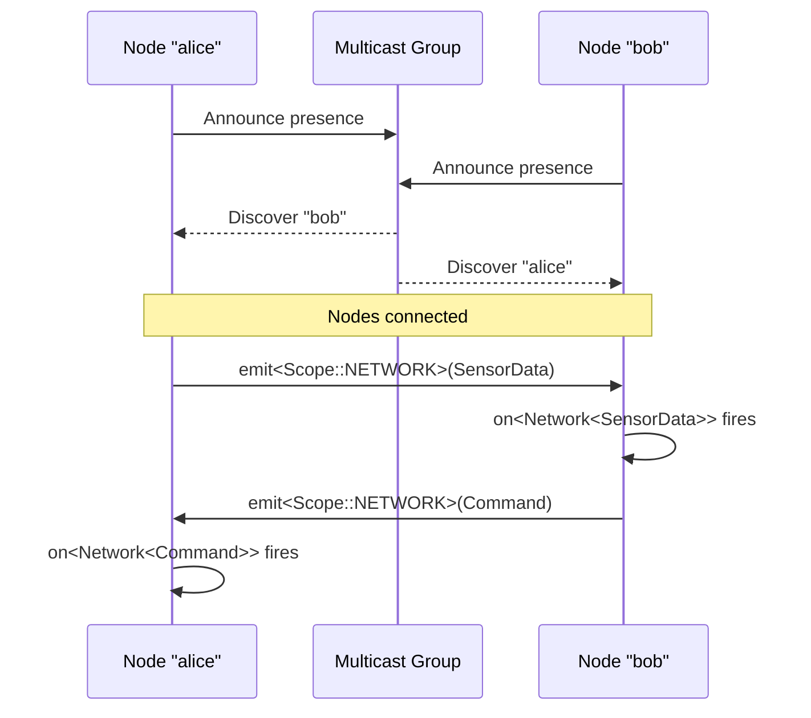

# Sending Messages Between NUClear Nodes

> How to send typed messages between NUClear instances on different machines.

## Overview

NUClear's built-in networking layer handles node discovery, serialization, and type-safe delivery. You emit a configuration to join the network, then send and receive messages with familiar `emit` and `on` patterns.



## 1. Configure Networking

Emit a `NetworkConfiguration` message to start the networking subsystem:

```cpp
#include "nuclear"

class NetworkSetup : public NUClear::Reactor {
public:
    NetworkSetup(std::unique_ptr<NUClear::Environment> environment)
        : Reactor(std::move(environment)) {

        on<Startup>().then([this] {
            emit(std::make_unique<NUClear::message::NetworkConfiguration>(
                "alice",             // Node name (unique on the network)
                "239.226.152.162",   // Multicast announce address
                7447                 // Announce port
            ));
        });
    }
};
```

### NetworkConfiguration Fields

| Field              | Type       | Default    | Description                                     |
| ------------------ | ---------- | ---------- | ----------------------------------------------- |
| `name`             | `string`   | —          | Unique name for this node on the network        |
| `announce_address` | `string`   | —          | Address for node discovery announcements        |
| `announce_port`    | `uint16_t` | —          | Port for announce messages                      |
| `bind_address`     | `string`   | `""` (all) | Local interface to bind to                      |
| `mtu`              | `uint16_t` | `1500`     | Maximum transmission unit (fragments if larger) |

### Network Modes

NUClearNet supports several discovery modes depending on the `announce_address` you configure:

| Mode                  | Address Type | Example           | Use Case                        |
| --------------------- | ------------ | ----------------- | ------------------------------- |
| **Multicast IPv4**    | `239.x.x.x`  | `239.226.152.162` | LAN discovery, multiple nodes   |
| **Multicast IPv6**    | `ff02::x`    | `ff02::1`         | IPv6 LAN discovery              |
| **Broadcast IPv4**    | `x.x.x.255`  | `192.168.1.255`   | Simple LAN, all nodes on subnet |
| **Unicast IPv4/IPv6** | Specific IP  | `192.168.1.50`    | Point-to-point, two nodes       |

#### Multicast (Default)

Multicast is the most common mode. All nodes join a multicast group and discover each other automatically:

```cpp
emit(std::make_unique<NUClear::message::NetworkConfiguration>(
    "my-node", "239.226.152.162", 7447));
```

The default multicast address `239.226.152.162` with port `7447` is a conventional choice. All nodes that share the same announce address and port will discover each other.

#### Broadcast

For simpler networks, use a broadcast address. All nodes on the subnet will receive announce messages:

```cpp
emit(std::make_unique<NUClear::message::NetworkConfiguration>(
    "my-node", "192.168.1.255", 7447));
```

#### Unicast (Point-to-Point)

For direct connections between exactly two nodes, use unicast. Each node sets its announce address to the other node's IP:

```cpp
// On Node A (IP: 192.168.1.10)
emit(std::make_unique<NUClear::message::NetworkConfiguration>(
    "node-a", "192.168.1.20", 7447));  // Point to Node B

// On Node B (IP: 192.168.1.20)
emit(std::make_unique<NUClear::message::NetworkConfiguration>(
    "node-b", "192.168.1.10", 7447));  // Point to Node A
```

In unicast mode, each peer announces directly to the other. This is useful when multicast/broadcast is unavailable (e.g., across subnets or VPNs).

## 2. Send Messages

Use [`emit<Scope::NETWORK>`](../reference/emit/network.md) to broadcast a message to all connected nodes:

```cpp
// Send to all nodes (unreliable)
emit<Scope::NETWORK>(std::make_unique<SensorData>(reading));

// Send to a specific node by name (unreliable)
emit<Scope::NETWORK>(std::make_unique<SensorData>(reading), "bob");

// Send reliably (retransmits until acknowledged)
emit<Scope::NETWORK>(std::make_unique<SensorData>(reading), "bob", true);

// Send reliably to all nodes
emit<Scope::NETWORK>(std::make_unique<SensorData>(reading), true);
```

## 3. Receive Messages

Use `on<`[`Network`](../reference/dsl/network.md)`<T>>` to react to messages arriving from the network:

```cpp
on<Network<SensorData>>().then(
    [this](const std::shared_ptr<NetworkSource>& src, const SensorData& data) {
        // src->name     - name of the sending node
        // src->reliable - whether this was sent reliably
        log("Received sensor data from", src->name);
    });
```

The callback receives:

- `std::shared_ptr<NetworkSource>` — metadata about the sender (name, address, reliability flag)
- `const T&` — the deserialized message

## 4. Handle Join/Leave Events

React to nodes joining or leaving the network:

```cpp
on<Trigger<NUClear::message::NetworkJoin>>().then([this](const NUClear::message::NetworkJoin& join) {
    log("Node joined:", join.name);
});

on<Trigger<NUClear::message::NetworkLeave>>().then([this](const NUClear::message::NetworkLeave& leave) {
    log("Node left:", leave.name);
});
```

## 5. Complete Two-Node Example

### Shared message type

```cpp
// Messages.hpp
struct SensorData {
    float temperature;
    float humidity;
};
```

### Node A — Sender

```cpp
#include "nuclear"
#include "Messages.hpp"

class SensorNode : public NUClear::Reactor {
public:
    SensorNode(std::unique_ptr<NUClear::Environment> environment)
        : Reactor(std::move(environment)) {

        on<Startup>().then([this] {
            emit(std::make_unique<NUClear::message::NetworkConfiguration>(
                "sensor-node", "239.226.152.162", 7447));
        });

        on<Every<1, std::chrono::seconds>>().then([this] {
            auto msg = std::make_unique<SensorData>();
            msg->temperature = read_sensor();
            msg->humidity    = read_humidity();
            emit<Scope::NETWORK>(msg);
        });
    }
};
```

### Node B — Receiver

```cpp
#include "nuclear"
#include "Messages.hpp"

class DashboardNode : public NUClear::Reactor {
public:
    DashboardNode(std::unique_ptr<NUClear::Environment> environment)
        : Reactor(std::move(environment)) {

        on<Startup>().then([this] {
            emit(std::make_unique<NUClear::message::NetworkConfiguration>(
                "dashboard", "239.226.152.162", 7447));
        });

        on<Network<SensorData>>().then(
            [this](const std::shared_ptr<NetworkSource>& src, const SensorData& data) {
                log("From", src->name, "- temp:", data.temperature, "humidity:", data.humidity);
            });

        on<Trigger<NUClear::message::NetworkJoin>>().then([this](const auto& join) {
            log("Sensor connected:", join.name);
        });
    }
};
```

## Reliable vs Unreliable Delivery

| Mode       | Behavior                                             | Use when                         |
| ---------- | ---------------------------------------------------- | -------------------------------- |
| Unreliable | Fire-and-forget. No retransmission. Lowest latency.  | Streaming data, periodic updates |
| Reliable   | Retransmits until acknowledged. Delivery guaranteed. | Commands, configuration, events  |

Pass `true` as the reliability argument to `emit<Scope::NETWORK>`:

```cpp
// Unreliable (default)
emit<Scope::NETWORK>(std::make_unique<Command>(cmd));

// Reliable
emit<Scope::NETWORK>(std::make_unique<Command>(cmd), true);
```

## Serialization Requirements

Types sent over the network must be serializable. NUClear handles this automatically for **trivially copyable** types (POD structs with no pointers or dynamic memory).

For complex types, specialize `NUClear::util::serialise::Serialise<T>` to provide custom `serialise()`, `deserialise()`, and `hash()` methods.

Type safety across nodes is ensured by hash matching — if a type's hash doesn't match between sender and receiver, the message is silently discarded.
