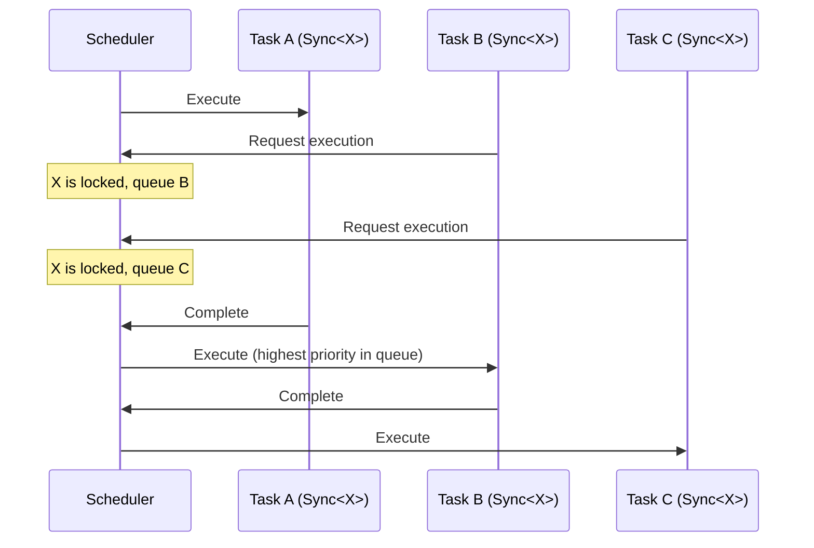

# Synchronization

> Prevent concurrent access to shared state without using mutexes.

## Problem

Multiple reactions access or modify shared state.
In a multithreaded environment you need mutual exclusion, but mutexes block threads and waste pool resources.

## Solution

Use [`Sync`](../reference/dsl/sync.md)`<GroupType>` to ensure only one reaction in a sync group runs at a time.
NUClear manages the scheduling so threads are never blocked — other tasks run instead.

### 1. Define a Sync Group

A sync group is any type — it doesn't need any members.
It simply acts as a label.

```cpp
struct DatabaseAccess {};
```

### 2. Apply Sync to Reactions

All reactions that share state should use the same sync group:

```cpp
on<Trigger<WriteRequest>, Sync<DatabaseAccess>>().then([](const WriteRequest& req) {
    // Only one DatabaseAccess-synced reaction runs at a time
    db.write(req.key, req.value);
});

on<Trigger<ReadRequest>, Sync<DatabaseAccess>>().then([](const ReadRequest& req) {
    // This won't run concurrently with the write above
    auto result = db.read(req.key);
    emit(std::make_unique<ReadResult>(result));
});
```

### 3. Complete Example — Thread-Safe State

```cpp
#include <nuclear>

struct IncrementCommand {};
struct DecrementCommand {};
struct GetCounter {};
struct CounterValue { int value; };

// Sync group for counter state
struct CounterSync {};

class Counter : public NUClear::Reactor {
public:
    explicit Counter(std::unique_ptr<NUClear::Environment> environment) : Reactor(std::move(environment)) {

        on<Trigger<IncrementCommand>, Sync<CounterSync>>().then([this] {
            ++count;
            log<INFO>("Incremented to", count);
        });

        on<Trigger<DecrementCommand>, Sync<CounterSync>>().then([this] {
            --count;
            log<INFO>("Decremented to", count);
        });

        on<Trigger<GetCounter>, Sync<CounterSync>>().then([this] {
            emit(std::make_unique<CounterValue>(CounterValue{count}));
        });
    }

private:
    int count = 0;
};
```

## How It Works



When a synced task is running, other tasks in the same group are queued rather than blocking.
Queued tasks are ordered by priority then task ID.

## Limited Concurrency with Group

If you need to allow more than one (but not unlimited) concurrent tasks, use [`Group`](../reference/dsl/group.md)`<T>` directly instead of `Sync<T>`:

```cpp
struct ConnectionPool {
    static constexpr const char* name = "ConnectionPool";
    static constexpr int concurrency = 3;  // Allow up to 3 concurrent tasks
};

on<Trigger<Query>, Group<ConnectionPool>>().then([](const Query& q) {
    // Up to 3 of these can run simultaneously
    execute_query(q);
});
```

`Sync<T>` is simply `Group<T>` with a default concurrency of 1.

!!! tip "Use the reactor as a sync group"

    ```
    A common pattern is using the reactor class itself as the sync group when all its reactions share state:
    ```

    ```cpp
    class MyReactor : public NUClear::Reactor {
        // Use MyReactor as the sync group
        on<Trigger<A>, Sync<MyReactor>>().then([] { /* ... */ });
        on<Trigger<B>, Sync<MyReactor>>().then([] { /* ... */ });
    };
    ```

!!! warning "Avoid mutexes in NUClear"

    ```
    Mutexes block threads, which wastes pool resources since blocked threads cannot execute other tasks.
    ```

    `Sync` achieves mutual exclusion cooperatively — threads are freed to do other work while waiting.
