# Tracing Reactions

NUClear includes a built-in tracing system that records reaction execution, scheduling, and log messages into a [Perfetto](https://perfetto.dev/)-compatible trace file.
This lets you visualise exactly what your system is doing across threads and time.

## Prerequisites

- The `TraceController` extension must be installed in your PowerPlant
- The output `.trace` file can be viewed in [Perfetto UI](https://ui.perfetto.dev/) or Chrome's `chrome://tracing`

## Installing the TraceController

The `TraceController` must be installed before you can start tracing.
Add it to your PowerPlant setup:

```cpp
#include <nuclear>

int main(int argc, const char* argv[]) {
    NUClear::Configuration config;
    NUClear::PowerPlant plant(config, argc, argv);

    // Install the trace controller
    plant.install<NUClear::extension::TraceController>();

    // Install your reactors
    plant.install<MyApp>();

    plant.start();
}
```

## Starting a Trace

To begin recording, emit a `BeginTrace` message.
This opens a trace file and starts capturing all reaction events:

```cpp
#include <nuclear>

class MyApp : public NUClear::Reactor {
public:
    explicit MyApp(std::unique_ptr<NUClear::Environment> environment)
        : Reactor(std::move(environment)) {

        on<Startup>().then([this] {
            // Start tracing to a file
            emit(std::make_unique<NUClear::message::BeginTrace>("my_system.trace"));
        });
    }
};
```

The `BeginTrace` message takes two parameters:

| Parameter | Type          | Default         | Description                                  |
| --------- | ------------- | --------------- | -------------------------------------------- |
| `file`    | `std::string` | `"trace.trace"` | Path to the output trace file                |
| `logs`    | `bool`        | `true`          | Whether to include log messages in the trace |

## Stopping a Trace

To stop recording and flush the file, emit an `EndTrace` message:

```cpp
emit(std::make_unique<NUClear::message::EndTrace>());
```

This closes the trace file cleanly.
If you don't emit `EndTrace`, the file will be closed when the PowerPlant shuts down, but may be incomplete.

## Viewing the Trace

Once you have a `.trace` file:

1. Open [https://ui.perfetto.dev/](https://ui.perfetto.dev/) in your browser
1. Click **Open trace file** (or drag and drop)
1. Select your `.trace` file

The trace viewer shows:

- **Thread lanes** — each thread pool thread gets its own lane showing which reactions ran and when
- **Reaction slices** — coloured bars showing the duration of each reaction execution
- **Flow arrows** — connecting task creation to task execution, showing scheduling flow
- **Log messages** — if enabled, log entries appear as instant events on the thread they were emitted from
- **Thread CPU time** — counter tracks showing per-thread CPU usage

```mermaid
gantt
    title Example Trace View
    dateFormat X
    axisFormat %L ms

    section Default Pool 1
    Vision::processImage     :0, 5
    Vision::detectObjects    :5, 8

    section Default Pool 2
    Sensor::readIMU          :1, 2
    Motor::updateServos      :3, 4
    Planner::computePath     :6, 10

    section Main Thread
    Display::render          :2, 7
```



## Tracing a Subset of Execution

You can start and stop tracing at any point during execution.
This is useful for capturing only the interesting portion of a long-running system:

```cpp
on<Trigger<StartRecording>>().then([this] {
    emit(std::make_unique<NUClear::message::BeginTrace>("interesting_section.trace"));
});

on<Trigger<StopRecording>>().then([this] {
    emit(std::make_unique<NUClear::message::EndTrace>());
});
```

Starting a new trace while one is already active will close the previous trace file and begin a new one.

## What Gets Recorded

The trace captures these events for every reaction:

| Event            | Description                                                      |
| ---------------- | ---------------------------------------------------------------- |
| **Created**      | A task was generated (data emitted, preconditions checked)       |
| **Started**      | A task began executing on a thread                               |
| **Finished**     | A task completed execution                                       |
| **Blocked**      | A task was blocked by scheduling constraints (Sync, Group, etc.) |
| **Missing Data** | A task was dropped because required data was unavailable         |

Each event records:

- Wall-clock timestamp
- Thread CPU time
- Thread and pool identity
- Reaction name (from `.then("name", callback)` labels or demangled DSL type)
- Task ID for flow correlation

## Tips

!!! tip "Name your reactions"

    ```
    Give reactions descriptive labels to make traces easier to read:
    ```

    ```cpp
    on<Trigger<Image>>().then("Vision::processFrame", [](const Image& img) {
        // ...
    });
    ```

    ```
    Without a label, the trace uses the demangled DSL type signature, which can be verbose.
    ```

!!! tip "Disable logs for performance traces"

    ```
    If you're measuring timing and don't need log messages cluttering the trace, disable them:
    ```

    ```cpp
    emit(std::make_unique<NUClear::message::BeginTrace>("perf.trace", false));
    ```

!!! tip "Use in tests"

    ```
    NUClear's test utilities provide a helper for adding tracing to test binaries:
    ```

    ```cpp
    #include "test_util/common.hpp"

    // In your test setup:
    test_util::add_tracing(plant);
    ```

    ```
    This writes a trace file alongside the test binary with a `.trace` extension.
    ```

## See Also

- [Logging](logging.md) — NUClear's log system (traces can include log messages)
- [Threading Model](../explanation/threading.md) — understanding the thread pools shown in traces
- [Built-in Extensions](../reference/extensions/built-in-extensions.md) — the TraceController extension
