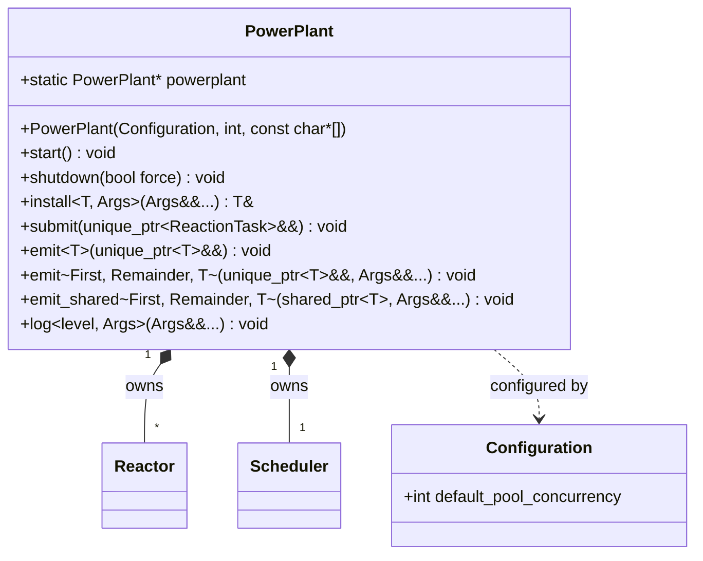

# PowerPlant

> The central runtime that manages reactors, thread pools, and the task scheduler.

## Overview

`PowerPlant` is the core of every NUClear system. It holds all installed reactors, manages their communications, stores data between reactions, and coordinates threading via a task scheduler. There is exactly one `PowerPlant` instance per process, accessible through the static `powerplant` pointer.



## API

### Constructor

```cpp
PowerPlant(Configuration config = Configuration(), int argc = 0, const char* argv[] = nullptr);
```

Constructs the PowerPlant. Command line arguments are emitted as a `CommandLineArguments` message. Non-copyable, non-movable.

### `start()`

```cpp
void start();
```

Blocking call that starts all thread pools and processes tasks until shutdown. Must be called from the main thread.

### `shutdown(bool force = false)`

```cpp
void shutdown(bool force = false);
```

Signals the PowerPlant to shut down. If `force` is true, does not wait for currently running tasks to complete.

### `install<T>(args...)`

```cpp
template <typename T, typename... Args>
T& install(Args&&... args);
```

Installs a reactor of type `T`. `T` must derive from `Reactor`. Returns a reference to the installed instance.

### `submit(task)`

```cpp
void submit(std::unique_ptr<threading::ReactionTask>&& task) noexcept;
```

Submits a task directly to the scheduler for execution.

### `emit<T>(data)`

```cpp
template <typename T>
void emit(std::unique_ptr<T>&& data);
```

Emits data at `Local` scope (default). Creates tasks using the thread pool.

### `emit<Scope>(data, args...)`

```cpp
template <template<typename> class First, template<typename> class... Remainder, typename T, typename... Arguments>
void emit(std::unique_ptr<T>&& data, Arguments&&... args);
```

Emits data with an explicit scope (e.g., `emit<Scope::NETWORK>(...)`).

### `emit_shared<Scope>(data, args...)`

```cpp
template <template<typename> class First, template<typename> class... Remainder, typename T, typename... Arguments>
void emit_shared(std::shared_ptr<T> data, Arguments&&... args);
```

Emits already-shared data. Useful for forwarding previously emitted data without copying.

### `log<level>(args...)`

```cpp
template <LogLevel::Value level, typename... Arguments>
void log(Arguments&&... args);
```

Logs a message at the given level. Arguments are streamed into a string.

### Static Members

| Member | Description |
|--------|-------------|
| `static PowerPlant* powerplant` | Global singleton pointer to the active PowerPlant |

## Example

```cpp
#include <nuclear>

class MyReactor : public NUClear::Reactor {
public:
    explicit MyReactor(std::unique_ptr<NUClear::Environment> environment)
        : Reactor(std::move(environment)) {
        on<Startup>().then([] { /* ... */ });
    }
};

int main(int argc, const char* argv[]) {
    NUClear::Configuration config;
    config.default_pool_concurrency = 4;

    NUClear::PowerPlant plant(config, argc, argv);
    plant.install<MyReactor>();
    plant.start();
}
```

## See Also

- [Configuration](configuration.md)
- [Reactor](reactor.md)
- [ReactionHandle](reaction-handle.md)
