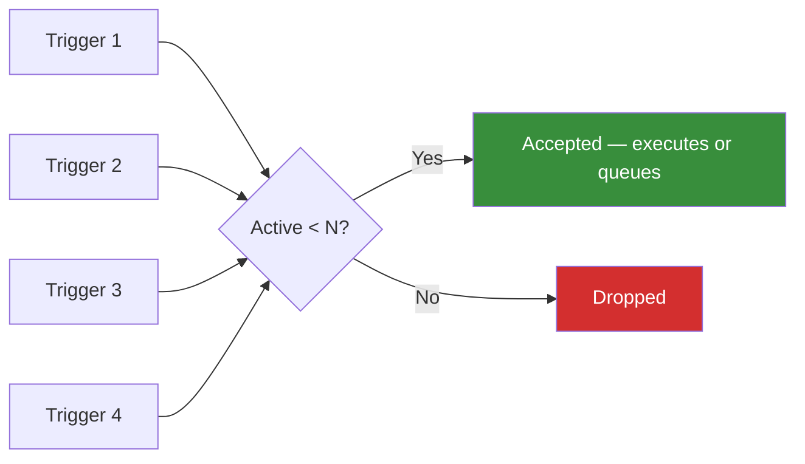

# Buffer

Limits the number of concurrent instances of a reaction that can be active or queued at any time. Excess triggers are dropped.

## Syntax

```cpp
on<Trigger<T>, Buffer<N>>()
```

## Parameters

| Parameter | Description                                                                           |
| --------- | ------------------------------------------------------------------------------------- |
| `N`       | Maximum number of active or queued instances of this reaction. Compile-time constant. |

## Behavior

`Buffer<N>` implements the `precondition` extension point. Before a reaction is scheduled, the runtime checks how many instances of that reaction are currently executing or queued. If the count is already at `N`, the new trigger is silently dropped.



!!! warning

    Dropped triggers are permanently lost. If every trigger must be processed, use [Group](group.md) instead, which queues excess tasks rather than discarding them.

## Example

```cpp
on<Trigger<Event>, Buffer<3>>().then([](const Event& e) {
    // At most 3 instances of THIS reaction exist at once
    // Additional triggers while 3 are active are silently dropped
});
```

## Notes

- [`Single`](single.md) is equivalent to `Buffer<1>` — at most one instance active at a time, extras dropped.
- The check includes both currently executing tasks and tasks waiting in the thread pool queue.
- Key distinction from [`Group`](group.md):
    - **Group**: excess tasks **queue** and wait for a slot.
    - **Buffer**: excess tasks are **dropped**.

## See Also

- [Single](single.md)
- [Group](group.md)
- [Sync](sync.md)
