# Every

Triggers a reaction periodically at a fixed interval or frequency.

## Syntax

```cpp
// Fixed interval — fires once every <ticks> units of <period>
on<Every<ticks, period>>().then(callback);

// Frequency — fires <N> times per <period>
on<Every<N, Per<period>>>().then(callback);

// Dynamic — period specified at runtime
on<Every<>>(duration).then(callback);
```

## Parameters

| Parameter     | Description                                                                      |
| ------------- | -------------------------------------------------------------------------------- |
| `ticks`       | Number of time units between firings                                             |
| `period`      | A `std::chrono::duration` type (e.g., `std::chrono::seconds`)                    |
| `N`           | Number of times to fire per period (frequency)                                   |
| `Per<period>` | Wrapper indicating frequency mode — `N` times per `period`                       |
| `duration`    | (Dynamic form only) A `std::chrono::duration` value passed as a runtime argument |

The callback receives no arguments.

## Behavior

Every registers a `ChronoTask` with the [ChronoController](../extensions/built-in-extensions.md) extension.
When the task fires, it reschedules itself by adding the period to the current time point, producing a steady cadence.

```mermaid
gantt
    title Every&lt;1, std::chrono::seconds&gt; execution timeline
    dateFormat X
    axisFormat %s s
    section Reaction
        Fire :milestone, 0, 0
        Fire :milestone, 1, 1
        Fire :milestone, 2, 2
        Fire :milestone, 3, 3
        Fire :milestone, 4, 4
```



Rescheduling is based on the *scheduled* time, not the completion time of the previous execution.
This means the timer maintains a consistent period regardless of how long the callback takes — unless execution exceeds the period itself.

## Example

```cpp
#include <nuclear>

class Printer : public NUClear::Reactor {
public:
    explicit Printer(std::unique_ptr<NUClear::Environment> environment) : Reactor(std::move(environment)) {

        // Fire at 30 Hz
        on<Every<30, Per<std::chrono::seconds>>>().then([] {
            // Called ~30 times per second
        });

        // Fire every 500 milliseconds
        on<Every<500, std::chrono::milliseconds>>().then([] {
            // Called every 500ms
        });

        // Dynamic period determined at runtime
        on<Every<>>(std::chrono::milliseconds(100)).then([] {
            // Called every 100ms
        });
    }
};
```

## Notes

!!! warning "Timer drift under load"

    ```
    If a callback takes longer than the period to execute, the next firing will be scheduled in the past.
    ```

    The ChronoController will fire it immediately, but accumulated drift can cause bursts of rapid executions.
    Design callbacks to complete well within the period, or use a longer interval.

- **Clock**: Every uses `NUClear::clock`, not the system wall clock.
    If `NUClear::clock` is adjusted (e.g., for simulation time scaling), the effective period changes accordingly.
- **Per\<period>**: `Every<60, Per<std::chrono::seconds>>` means 60 firings per second (60 Hz).
    The actual interval is `period / N`.
- **Bind only**: Every has no `get` operation — it solely controls *when* the reaction runs, not *what data* it receives.
- **Dynamic form**: `Every<>` accepts the period as a runtime argument to `on<>()`, useful when the interval is configuration-driven.

## See Also

- [Always](always.md) — runs continuously whenever the thread pool is idle
- [Watchdog](watchdog.md) — fires once if not serviced within a timeout
- [Idle](idle.md) — triggers when the system has no other work
