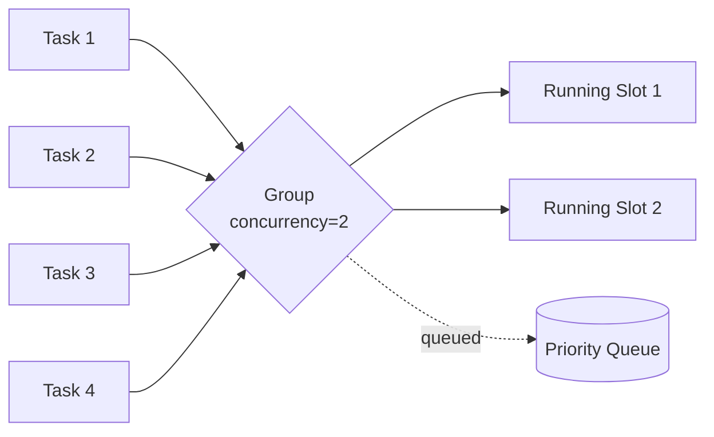

# Group

Limits the number of concurrently executing tasks within a named group.

## Syntax

```cpp
on<Trigger<T>, Group<GroupType>>()
```

## Parameters

| Parameter   | Description                                                                                             |
| ----------- | ------------------------------------------------------------------------------------------------------- |
| `GroupType` | A type with a `static constexpr int concurrency` member defining the maximum number of concurrent tasks |

`GroupType` must satisfy:

```cpp
struct GroupType {
    static constexpr int concurrency = N;
};
```

## Behavior

- At most `GroupType::concurrency` tasks from the group execute simultaneously.
- Tasks that exceed the concurrency limit are queued and dispatched by priority.
- Groups are identified by type — the same `GroupType` used in different reactors refers to the same group.
- A reaction can belong to multiple groups.
    It must satisfy **all** group constraints before executing.
- Implements the `group` extension point, returning a `GroupDescriptor`.



## Example

```cpp
struct MyGroup {
    static constexpr int concurrency = 3;
};

on<Trigger<Task>, Group<MyGroup>>().then([](const Task& t) {
    // At most 3 of these run concurrently
});

// Another reaction sharing the same group
on<Trigger<OtherTask>, Group<MyGroup>>().then([](const OtherTask& t) {
    // Shares the concurrency limit with the above
});
```

## Notes

- `Sync<T>` is equivalent to `Group<T>` where `T::concurrency = 1`.
- Use Group when you need bounded parallelism without full serialisation.
- Queue ordering follows task priority — higher priority tasks are dispatched first when a slot becomes available.

## See Also

- [Sync](sync.md) — mutual exclusion (concurrency = 1)
- [Buffer](buffer.md) — limits queued instances per reaction
- [Pool](pool.md) — dedicated thread pools
- [Priority](priority.md) — controls dispatch ordering within queues
