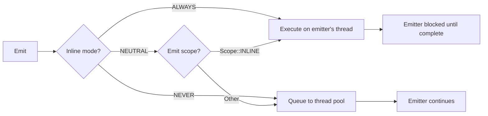

# Inline

Controls whether a reaction executes inline on the emitter's thread or is dispatched to the thread pool.

## Syntax

```cpp
on<Trigger<T>, Inline::ALWAYS>().then([](const T& t) { /* ... */ });
on<Trigger<T>, Inline::NEVER>().then([](const T& t) { /* ... */ });
```

## Modes

| Mode             | Behaviour                                                                 |
| ---------------- | ------------------------------------------------------------------------- |
| `Inline::ALWAYS` | Task runs immediately on the emitting thread, bypassing the scheduler.    |
| `Inline::NEVER`  | Task is always queued to the thread pool, even from an inline emit scope. |
| *(default)*      | NEUTRAL — respects the emit scope used by the caller.                     |

If both `Inline::ALWAYS` and `Inline::NEVER` are specified on the same reaction, a `std::logic_error` is thrown at binding time.

## Behaviour



When a reaction has `Inline::ALWAYS`, the emitting thread calls the reaction function directly. The emit call **blocks** until that reaction completes. This bypasses the scheduler, [Pool](pool.md), and [Priority](priority.md) settings entirely.

With `Inline::NEVER`, the reaction is unconditionally submitted to the thread pool regardless of the emit scope. This prevents `emit<Scope::INLINE>` from forcing inline execution on this reaction.

The default (NEUTRAL) defers to the emit scope: if the emitter uses [`emit<Scope::INLINE>`](../emit/inline.md), the reaction runs inline; otherwise it is queued.

## Example

```cpp
// Always execute inline (on emitter's thread)
on<Trigger<Event>, Inline::ALWAYS>().then([](const Event& e) {
    // Runs on whatever thread emitted Event
});

// Never inline, always use thread pool
on<Trigger<Event>, Inline::NEVER>().then([](const Event& e) {
    // Always queued to thread pool, even from inline emits
});
```

## Notes

!!! warning "Blocking the emitter"

    `Inline::ALWAYS` blocks the emitting thread for the full duration of the reaction. Long-running or
    blocking work in an always-inline reaction will stall the emitter and any other inline reactions
    waiting behind it.

- Implements the `run_inline` extension point in the task scheduler.
- Inline execution ignores the reaction's [Pool](pool.md) assignment — the task runs on the emitter's thread regardless of pool configuration.
- Combining `Inline::ALWAYS` with `Inline::NEVER` is a compile-time logical contradiction and raises `std::logic_error`.

## See Also

- [`emit<Scope::INLINE>`](../emit/inline.md) — emit-side control over inline execution
- [Pool](pool.md) — thread pool assignment (bypassed by inline execution)
- [Priority](priority.md) — scheduling priority (bypassed by inline execution)
