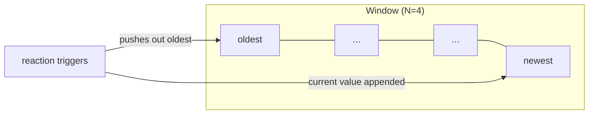

# Last

> Stores the last N values that were provided when the reaction triggered and provides them as an ordered list.

## Syntax

```cpp
on<Last<N, Trigger<T>>>()
on<Trigger<T1>, Last<N, With<T2>>>()
```

## Parameters

| Parameter   | Description                                       |
| ----------- | ------------------------------------------------- |
| `N`         | The maximum number of recent values to store.     |
| `DSLWords…` | The DSL word to wrap (`Trigger<T>` or `With<T>`). |

## Behavior

`Last` maintains a sliding window of the most recent N values that were provided to the reaction when it triggered. When the reaction executes, the callback receives the full window as a `std::list<std::shared_ptr<const T>>`, ordered oldest first.

- If fewer than N triggers have occurred, the list contains only what has been collected so far.
- When a new trigger occurs and the window is full, the oldest item is discarded.
- When wrapping `Trigger`, the reaction still fires on every emission of `T`.
- When wrapping `With`, the list is retrieved as supplementary data without triggering.

!!! warning "Last stores triggered values, not all emissions"

    `Last` records the value that was present each time the reaction was triggered — it does **not** track every emission of the type. If you combine `Last<N, Trigger<T>>` with `Single`, missed emissions (those that arrived while the reaction was already running) will not appear in the window. This is a subtle but important distinction: `Last` records "what the reaction saw", not "what was emitted".



## Example

```cpp
on<Last<10, Trigger<SensorReading>>>().then(
    [](const std::list<std::shared_ptr<const SensorReading>>& readings) {
        // readings contains up to 10 most recent readings, oldest first
        double avg = 0;
        for (const auto& r : readings) {
            avg += r->value;
        }
        avg /= readings.size();
    });
```

The reaction fires on each `SensorReading` emission. The callback receives the last 10 readings (or fewer if not yet emitted 10 times), enabling computations like moving averages.

## Notes

- The list is ordered oldest-first — `front()` is the oldest item, `back()` is the most recent.
- Items are held as `std::shared_ptr<const T>`, extending lifetime until they leave the window.
- Useful for moving averages, buffering sensor data, and maintaining state history.
- If no items have been emitted, the list is empty and the task may be dropped. Use `Optional` to handle this case.

## See Also

- [Trigger](trigger.md) — triggers the reaction on emission of a type.
- [With](with.md) — provides supplementary data without triggering.
- [Optional](optional.md) — prevents task dropping when data is unavailable.
