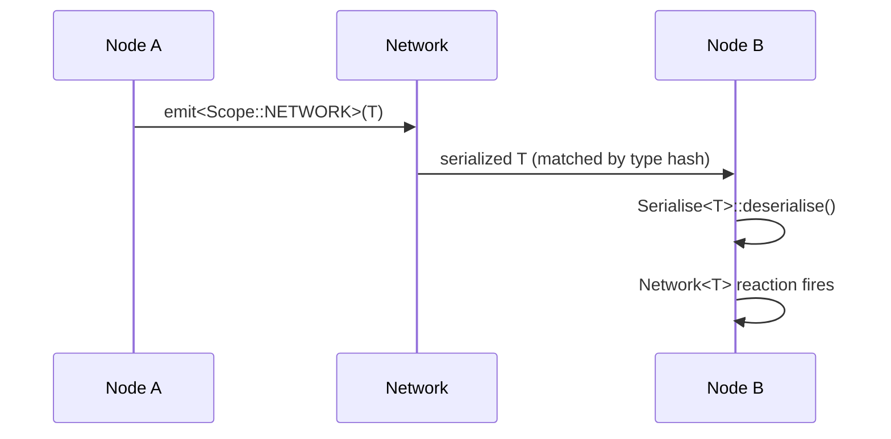

# Network

Triggers when a message of type `T` is received from a remote NUClear instance over the network.

## Syntax

```cpp
on<Network<T>>().then([](const NetworkSource& src, const T& data) {
    // handle network message
});
```

## Parameters

| Parameter | Type            | Description                                     |
| --------- | --------------- | ----------------------------------------------- |
| `T`       | typename        | The message type to listen for from the network |
| `src`     | `NetworkSource` | Metadata about the sending peer                 |
| `data`    | `const T&`      | The deserialized message payload                |

### NetworkSource

| Field      | Type           | Description                                         |
| ---------- | -------------- | --------------------------------------------------- |
| `name`     | `std::string`  | Name of the sending peer                            |
| `address`  | socket address | Network address of the sender                       |
| `reliable` | `bool`         | Whether the message was sent via reliable transport |

## Behavior



**Bind phase:** Emits a `NetworkListen` message with the type hash of `T` to register interest with the `NetworkController`.
The hash is also added to this node's subscription set, which is advertised to peers via announce packets.
Peers use this subscription information to avoid sending messages that no local reaction is listening for.

**Get phase:** Deserializes the message from `ThreadStore` data populated by `NetworkController`, using `Serialise<T>::deserialise()`.

Network<T> only fires on messages received from remote peers.
Local emits of `T` do **not** trigger this reaction.

Data is transient — the deserialized message is only valid for the duration of the callback execution.

### Type Hash Matching

Messages are routed by a hash of the type name.
Both the sending and receiving nodes must use the **same fully-qualified type name** for `T`.
If the type names differ (e.g., due to different namespaces), messages will not be delivered.

### Serialization Requirement

`T` must be serializable.
The framework uses `Serialise<T>::deserialise()` to reconstruct the object from network bytes.
If no serialization is defined for `T`, compilation will fail.

## Example

```cpp
// Configure networking (typically in a setup reactor)
auto config = std::make_unique<NUClear::message::NetworkConfiguration>();
config->name = "my_node";
config->announce_address = "239.226.152.162";
config->announce_port = 7447;
emit(config);

// Listen for network messages
on<Network<SensorReading>>().then([](const NetworkSource& src, const SensorReading& data) {
    log<INFO>("Got sensor reading from", src.name);
});
```

## Notes

!!! warning

    ```
    `NetworkConfiguration` must be emitted before any `Network<T>` reactions will fire.
    ```

    Without it, the networking subsystem is not started.

- Only reacts to messages received over the network, never to local emits.
- The type hash is computed from the type name string — renaming a type breaks compatibility with peers using the old name.
- Multiple nodes can listen for the same type simultaneously.
- Registering a `Network<T>` reaction causes this node to advertise the type hash as a subscription,
    enabling subscription-based routing so peers only send relevant messages.

## See Also

- [emit/Network](../emit/network.md) — emitting messages to the network
- [UDP](udp.md) — raw UDP communication
- [Nuclear Networking](../../explanation/nuclearnet.md) — how the network protocol works
- [Networking How-To](../../how-to/networking.md) — practical networking guide
