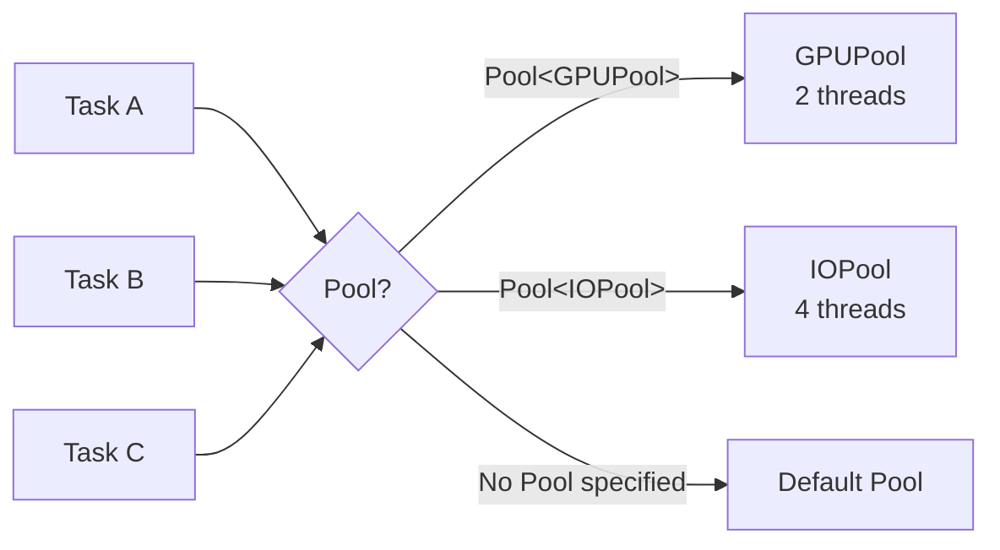

# Pool

Routes a reaction's tasks to a named thread pool with fixed concurrency.

## Syntax

```cpp
on<Trigger<T>, Pool<PoolType>>().then([](const T& data) {
    // executes on PoolType's thread pool
});
```

## Parameters

`Pool<PoolType>` takes a single template parameter: a struct defining the pool's identity and thread count.

The struct must satisfy:

| Member        | Type                           | Description                                                                    |
| ------------- | ------------------------------ | ------------------------------------------------------------------------------ |
| `name`        | `static constexpr const char*` | Optional. Name assigned to pool threads (defaults to the demangled type name). |
| `concurrency` | `static constexpr int`         | Required. Number of threads in the pool.                                       |

```cpp
struct GPUPool {
    static constexpr const char* name = "GPU";
    static constexpr int concurrency = 2;
};
```

## Behavior



- Each unique `PoolType` creates a dedicated set of threads, separate from all other pools.
- Pool threads are created lazily on first use.
- Threads are named using the `name` member, making them identifiable in debuggers and profilers.
- Without `Pool`, tasks execute on the default thread pool.
- Only **one** `Pool` may be specified per reaction.
    Specifying multiple results in a runtime exception (`std::invalid_argument`).
- Pool implements the `pool` DSL extension point.

## Example

```cpp
#include <nuclear>

struct ComputePool {
    static constexpr const char* name = "Compute";
    static constexpr int concurrency = 4;
};

class Processor : public NUClear::Reactor {
public:
    Processor(std::unique_ptr<NUClear::Environment> environment) : Reactor(std::move(environment)) {

        on<Trigger<WorkItem>, Pool<ComputePool>>().then([](const WorkItem& item) {
            // Runs on one of ComputePool's 4 threads
            process(item);
        });
    }
};
```

## Notes

- `MainThread` is a built-in pool with `concurrency = 1` that executes tasks on the main thread rather than spawning a new one.
- Pool controls **which** threads run a task; use [Group](group.md) to control **how many** tasks run concurrently across a logical group, and [Priority](priority.md) to control scheduling order.
- Thread pool size is fixed at compile time via the `concurrency` value.

## See Also

- [MainThread](main-thread.md)
- [Group](group.md)
- [Priority](priority.md)
- [How-To: Custom Thread Pool](../../how-to/custom-thread-pool.md)
