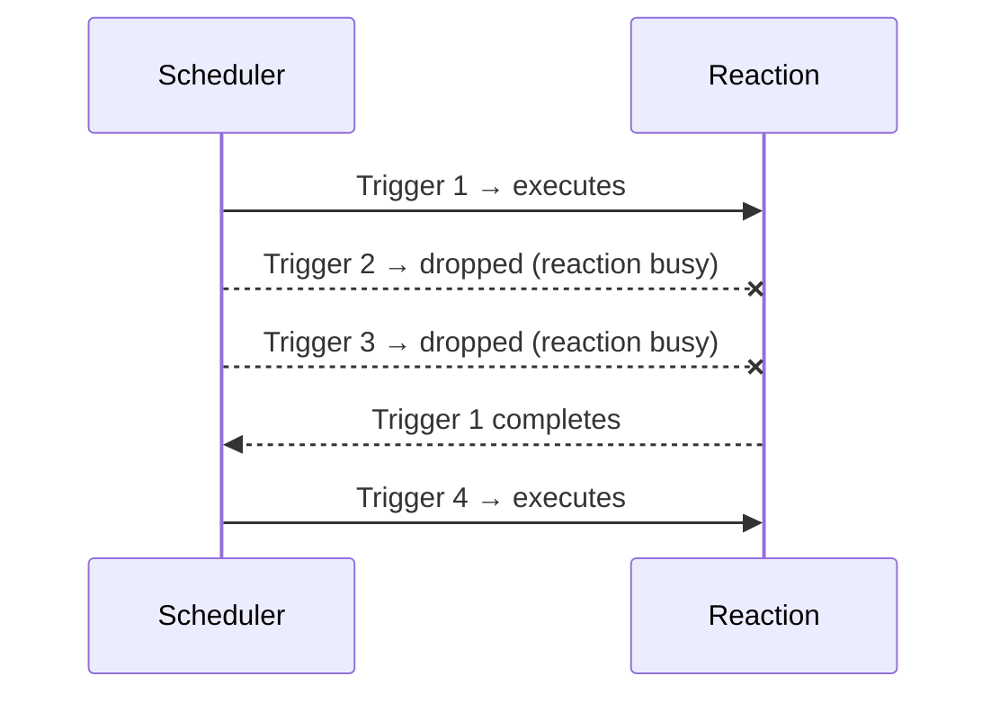

# Single

Limits a reaction to a single concurrent execution. Equivalent to [`Buffer<1>`](buffer.md).

## Syntax

```cpp
on<Trigger<T>, Single>().then([](const T& data) {
    // ...
});
```

## Behavior

Only one instance of the reaction may be active (running or queued) at any time. If a new trigger arrives while the reaction is already in progress, the new task is dropped.



## Example

```cpp
on<Trigger<Frame>, Single>().then([](const Frame& f) {
    // Only one instance runs at a time
    // If a new Frame arrives while this is processing, it's dropped
    process_frame(f);
});
```

A common use case is preventing work from piling up when processing is slower than the input rate (e.g. frame processing, expensive computations).

## Notes

- `Single` is literally `Buffer<1>` — it is a typedef/inheritance of `Buffer` with size 1.
- Dropped tasks are silently discarded; no error or log is emitted.

## See Also

- [Buffer](buffer.md) — generalised form allowing N concurrent executions
- [Sync](sync.md) — mutual exclusion across different reactions sharing a group
- [Once](once.md) — reaction that fires only a single time then is removed
