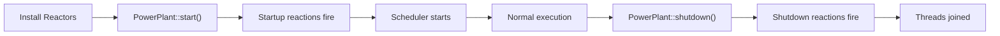

# Startup

> Triggers a reaction once when the PowerPlant starts execution.

## Syntax

```cpp
on<Startup>().then([] {
    // Runs once when the system starts
});
```

## Behavior

`Startup` fires after all reactors have been installed and `PowerPlant::start()` is called. All Startup reactions execute **before** the scheduler begins processing the general task queue. This guarantees that any data emitted during Startup is available before normal reactions begin executing.



Startup is emitted inline, meaning all Startup reactions complete before `start()` returns control to the scheduler. Each Startup reaction runs exactly once per PowerPlant lifecycle.

## Example

```cpp
#include <nuclear>

class InitReactor : public NUClear::Reactor {
public:
    InitReactor(std::unique_ptr<NUClear::Environment> environment) : Reactor(std::move(environment)) {

        on<Startup>().then([this] {
            log<INFO>("System started, emitting initial configuration");
            emit(std::make_unique<Config>(load_config()));
        });
    }
};
```

## Notes

- Startup fires only once — it cannot re-trigger.
- Common uses: emit initial data, open connections, log startup diagnostics.
- Tasks run on the default thread pool, so they are subject to normal scheduling.
- All reactors are fully installed before any Startup reaction fires.

## See Also

- [Shutdown](shutdown.md) — trigger a reaction during system shutdown
- [Once](once.md) — ensure any reaction runs exactly once
- [Lifecycle](../../explanation/lifecycle.md) — full PowerPlant lifecycle explanation
