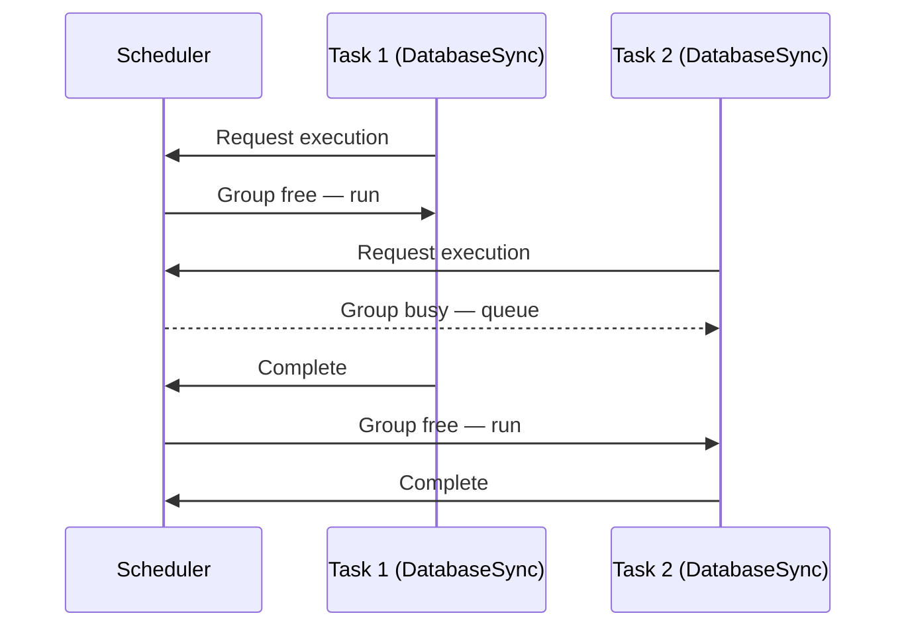

# Sync

Provides mutual exclusion for a group of reactions without explicit mutex locking.
Only one task from the sync group executes at a time; others are queued by priority.

## Syntax

```cpp
on<Trigger<T>, Sync<SyncGroup>>()
```

## Parameters

| Parameter   | Description                                                                                |
| ----------- | ------------------------------------------------------------------------------------------ |
| `SyncGroup` | An empty struct used as a compile-time type tag to identify the group. Never instantiated. |

## Behavior

`Sync<SyncGroup>` is an alias for `Group<SyncGroup>` with a concurrency of 1.
The scheduler enforces that at most one reaction belonging to the sync group runs at any time.

- If a task from the group is already executing, incoming tasks are queued.
- Queued tasks are dispatched in priority order (`Priority::HIGH` before `Priority::LOW`).
- Different sync groups are independent — `Sync<A>` does not block `Sync<B>`.
- A reaction can belong to multiple groups: `on<Trigger<T>, Sync<A>, Sync<B>>()`.
    The task must acquire both groups before it runs.
- No runtime mutex overhead — exclusion is handled entirely by the scheduler.



## Example

```cpp
// Define a type tag — an empty struct is sufficient
struct DatabaseSync {};

// Reactor A
on<Trigger<Query>, Sync<DatabaseSync>>().then([](const Query& q) {
    // Exclusive access guaranteed — no other DatabaseSync task runs concurrently
});

// Reactor B
on<Trigger<Write>, Sync<DatabaseSync>>().then([](const Write& w) {
    // Will not run at the same time as the handler above
});
```

!!! tip

    ```
    Prefer `Sync` over manual mutexes.
    ```

    The scheduler-based exclusion avoids deadlocks, eliminates lock contention, and respects task priority ordering.

## Notes

- The `SyncGroup` struct is never instantiated; it exists purely as a compile-time tag to name the group.
- Defined as `template <typename SyncGroup> struct Sync : Group<SyncGroup> {}`.
- Multiple unrelated reactors can share a sync group — all that matters is the type tag.

## See Also

- [Group](group.md) — the underlying primitive; `Sync` is `Group` with concurrency 1
- [Buffer](buffer.md) — controls how many pending tasks are kept for a reaction
- [Single](single.md) — limits a reaction to one queued task (drops duplicates)
- [Priority](priority.md) — determines dispatch order within a sync group's queue
