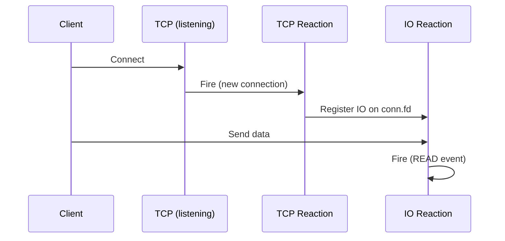

# TCP

Listen for new TCP connections on a bound port.

## Syntax

```cpp
on<TCP>(port).then([](const TCP::Connection& connection) { /* ... */ });
on<TCP>(port, bind_address).then([](const TCP::Connection& connection) { /* ... */ });
```

## Parameters

| Parameter      | Type          | Description                                             |
| -------------- | ------------- | ------------------------------------------------------- |
| `port`         | `in_port_t`   | Port to listen on. Use `0` for auto-assignment.         |
| `bind_address` | `std::string` | Optional. Address to bind to (default: all interfaces). |

## Behavior

`TCP` opens a listening socket on the specified port. When a remote client establishes a connection, the reaction fires **once** with a `TCP::Connection` containing:

| Field    | Type                    | Description                        |
| -------- | ----------------------- | ---------------------------------- |
| `fd`     | `fd_t`                  | File descriptor for the new socket |
| `local`  | `util::network::sock_t` | Local endpoint address             |
| `remote` | `util::network::sock_t` | Remote peer address                |

The connection object is boolean-convertible — it evaluates to `false` if the accept failed.

The reaction fires only for **new** connections. TCP is stream-based, so ongoing communication on an established connection must be handled separately using [IO](io.md) on the returned file descriptor.

When port `0` is used, the OS assigns an available port. The `on<TCP>().then()` call returns a tuple containing the handle, assigned port, and file descriptor:

```cpp
auto [handle, port, fd] = on<TCP>(0).then([](const TCP::Connection& conn) { /* ... */ });
// port is the OS-assigned port number
// fd is the listening socket's file descriptor
```

Both IPv4 and IPv6 addresses are supported. The address family is determined by the resolved `bind_address`, defaulting to IPv4 (`INADDR_ANY`) when omitted.

The listening socket backlog is set to 1024. When the reaction is unbound, the listening socket is shut down and closed automatically.



## Example

```cpp
#include <nuclear>

class Server : public NUClear::Reactor {
public:
    Server(std::unique_ptr<NUClear::Environment> environment) : Reactor(std::move(environment)) {

        on<TCP>(9000).then([this](const TCP::Connection& conn) {
            log<INFO>("New connection from", conn.remote);

            // Handle ongoing communication with IO
            on<IO>(conn.fd, IO::READ | IO::CLOSE).then([](IO::Event event) {
                if (event.events & IO::READ) {
                    char buf[1024];
                    ssize_t n = ::recv(event.fd, buf, sizeof(buf), 0);
                    if (n <= 0) {
                        ::close(event.fd);
                    }
                }
                if (event.events & IO::CLOSE) {
                    ::close(event.fd);
                }
            });
        });
    }
};
```

## Notes

- `TCP::Connection` is explicitly **not transient** — a connection will not be delivered to the same reaction twice.
- Multiple `TCP` words can be combined: `on<TCP, TCP>(port1, port2)` to listen on multiple ports.
- The file descriptor in `TCP::Connection` is released to the caller — you are responsible for closing it.
- The listening socket uses `SO_REUSEADDR` semantics implicitly through the bind lifecycle.

## See Also

- [IO](io.md) — monitor file descriptors for read/write/close events
- [UDP](udp.md) — connectionless datagram communication
- [TCP/UDP How-To](../../how-to/tcp-udp.md) — practical networking guide
