# Watchdog

Triggers a reaction if it is NOT serviced within a specified timeout period. Used for fault detection and recovery.

## Syntax

```cpp
// Static timeout — fires if not serviced within ticks * period
on<Watchdog<Group, ticks, period>>().then(callback);

// Runtime-keyed — independent watchdog per unique runtime argument
on<Watchdog<Group, ticks, period>>(key).then(callback);
```

## Parameters

| Parameter | Description                                                                                       |
| --------- | ------------------------------------------------------------------------------------------------- |
| `Group`   | A type used to identify this watchdog. Must be a declared type within the system                  |
| `ticks`   | Number of time units before the watchdog expires                                                  |
| `period`  | A `std::chrono::duration` type (e.g., `std::chrono::seconds`)                                     |
| `key`     | (Optional) A runtime argument to distinguish independent watchdog instances within the same group |

The callback receives no arguments.

## Behavior

Watchdog registers a `ChronoTask` with the [ChronoController](../extensions/built-in-extensions.md) extension. The timer starts when the reaction is bound. If the watchdog is not serviced before `ticks * period` elapses, the reaction fires.

Service the watchdog (reset the timer) by emitting with `Scope::WATCHDOG`:

```cpp
// Service a simple watchdog
emit<Scope::WATCHDOG>(ServiceWatchdog<Group>());

// Service a keyed watchdog instance
emit<Scope::WATCHDOG>(ServiceWatchdog<Group>(key));
```

Each service call resets the deadline to `now + ticks * period`. If the watchdog is serviced in time, the reaction never fires. After the reaction fires, the watchdog automatically re-arms — it will fire again after another full timeout if still not serviced.

```mermaid
---
displayMode: compact
---
gantt
    title Watchdog&lt;Group, 5, std::chrono::seconds&gt; timeline
    dateFormat X
    axisFormat %s s

    section Service
        Service :milestone, 0, 0
        Service :milestone, 3, 3
        Service :milestone, 6, 6
        (stops servicing) :milestone, 6, 6

    section Timer
        Waiting  :active, 0, 3
        Reset    :active, 3, 6
        Reset    :active, 6, 11

    section Reaction
        FIRES :crit, milestone, 11, 11
```



## Example

```cpp
#include <nuclear>

struct SystemHealth {};

class Monitor : public NUClear::Reactor {
public:
    explicit Monitor(std::unique_ptr<NUClear::Environment> environment) : Reactor(std::move(environment)) {

        // Fire if no heartbeat received for 5 seconds
        on<Watchdog<SystemHealth, 5, std::chrono::seconds>>().then([this] {
            log<WARN>("System health watchdog expired!");
            // Take recovery action
        });

        // Service the watchdog whenever a heartbeat arrives
        on<Trigger<Heartbeat>>().then([this] {
            emit<Scope::WATCHDOG>(ServiceWatchdog<SystemHealth>());
        });
    }
};
```

### Keyed watchdog — independent timeout per client

```cpp
struct ClientTimeout {};

class Server : public NUClear::Reactor {
public:
    explicit Server(std::unique_ptr<NUClear::Environment> environment) : Reactor(std::move(environment)) {

        // Each client_id gets its own independent 10-second watchdog
        on<Trigger<ClientConnected>>().then([this](const ClientConnected& c) {
            on<Watchdog<ClientTimeout, 10, std::chrono::seconds>>(c.id).then([this, id = c.id] {
                log<WARN>("Client", id, "timed out");
                disconnect(id);
            });
        });

        // Service the specific client's watchdog on activity
        on<Trigger<ClientMessage>>().then([this](const ClientMessage& msg) {
            emit<Scope::WATCHDOG>(ServiceWatchdog<ClientTimeout>(msg.client_id));
        });
    }
};
```

## Notes

!!! tip "Common pattern: fault detection"

    Watchdog is the primary mechanism for detecting stalled or unresponsive subsystems. Pair it with a recovery action — restarting a module, raising an alarm, or switching to a fallback mode.

- **Re-arming**: After the watchdog fires, it automatically resets. The reaction will fire repeatedly every `ticks * period` until serviced again.
- **Clock**: Uses `NUClear::clock`. If the clock is scaled (e.g., simulation time), the effective timeout scales with it.
- **Group type**: The `Group` template parameter is only used as a type tag for identification — it does not need any members or definitions beyond a forward declaration.
- **Keyed instances**: When a runtime argument is provided, each unique key value creates an independent watchdog with its own timer. Service calls must include the matching key.
- **Bind only**: Watchdog has no `get` operation — it controls *when* the reaction fires, not *what data* it receives.

## See Also

- [Every](every.md) — periodic execution at a fixed interval
- [emit Watchdog scope](../emit/watchdog.md) — the service/reset emission mechanism
- [Watchdog Timeouts (how-to)](../../how-to/watchdog-timeouts.md) — practical guide for implementing watchdog patterns
