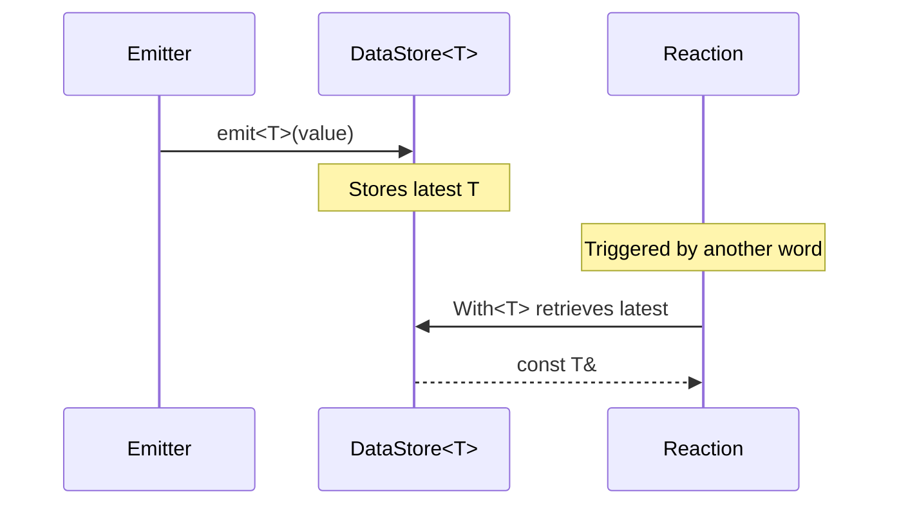

# With

> Provides supplementary read-only data to a reaction without triggering it.

## Syntax

```cpp
on<Trigger<T1>, With<T2>>()
on<Trigger<T1>, With<T2>, With<T3>>()
```

## Parameters

| Parameter | Description                                              |
| --------- | -------------------------------------------------------- |
| `T`       | The data type to retrieve from the most recent emission. |

## Behavior

`With` implements the **co-message** pattern described in [Houliston et al. (2016)](https://doi.org/10.3389/frobt.2016.00020). It retrieves the most recently emitted value of type `T` — a co-message — and provides it as a `const T&` argument in the callback. Unlike `Trigger`, it does **not** bind to the type and will never cause the reaction to run.

In traditional message-passing architectures, a module needing data from multiple sources must subscribe to each independently and maintain its own cache of secondary data. Co-messages eliminate this overhead: the system's [virtual data store](../../explanation/architecture.md) automatically retains the latest value of every emitted type, binding it into the reaction at task creation time.

A reaction using `With` must include at least one triggering word (`Trigger`, `Every`, etc.) to define when it executes. When the reaction is triggered, the latest value of each `With` type is retrieved from the data store at task creation time.

Multiple `With` words can be combined in a single `on` statement. Each contributes its type to the callback signature in declaration order.



!!! warning "Task dropping"

    If `T` has never been emitted when the reaction is triggered, the task is **dropped** — the callback will not execute. To allow execution with missing data, wrap in `Optional`: `Optional<With<T>>`.

## Example

```cpp
on<Trigger<SensorData>, With<Config>>().then([](const SensorData& data, const Config& cfg) {
    // Fires when SensorData is emitted, also receives latest Config
});
```

The reaction triggers only on `SensorData` emissions. The current `Config` value is retrieved as supplementary context each time.

## Notes

- `With` implements the `get` extension point — retrieving the latest value from NUClear's data cache without binding to the type or triggering a reaction.
- Data is captured at task creation time, not at execution time.
- If you need the reaction to trigger on `T`, use `Trigger<T>` instead.
- For data that may not yet exist, use `Optional<With<T>>` to receive a `nullptr` rather than dropping the task.

## See Also

- [Trigger](trigger.md) — binds to a type and triggers the reaction on emission.
- [Optional](optional.md) — prevents task dropping when data is unavailable.
- [Last](last.md) — retrieves the last N emissions of a type.
