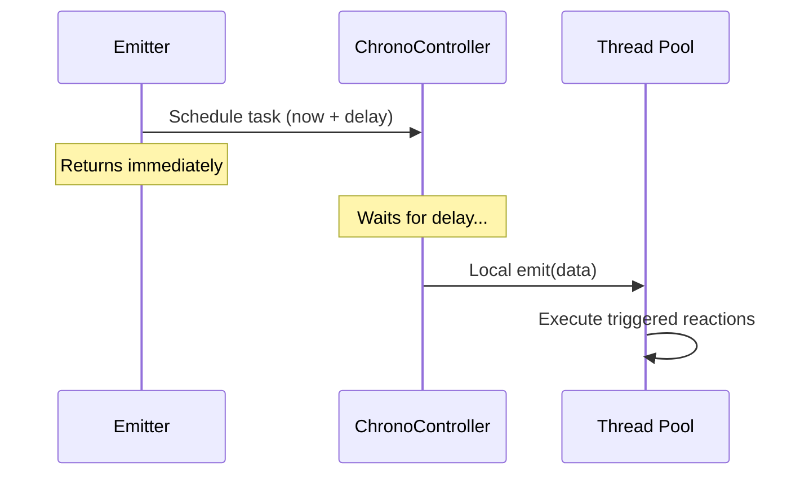

# Scope::DELAY

> Schedules a Local emit to occur after a specified time delay.

## Syntax

```cpp
// Delay by duration
emit<Scope::DELAY>(std::make_unique<T>(args...), std::chrono::seconds(5));

// Delay until time point
emit<Scope::DELAY>(std::make_unique<T>(args...), NUClear::clock::now() + std::chrono::milliseconds(500));
```

## Behavior

When data is emitted with `Scope::DELAY`:

1. A `ChronoTask` is registered with the [ChronoController](../extensions/built-in-extensions.md).
2. The emitter returns immediately — it does not block.
3. After the delay elapses, the data is emitted via `Scope::LOCAL`.
4. From that point, behavior is identical to a normal Local emit: tasks are queued in the thread pool and data is stored in the global cache.



## Example

```cpp
#include <nuclear>

struct Alert {
    std::string message;
};

class Scheduler : public NUClear::Reactor {
public:
    explicit Scheduler(std::unique_ptr<NUClear::Environment> environment) : Reactor(std::move(environment)) {

        on<Trigger<Alert>>().then([this](const Alert& a) {
            log<WARN>(a.message);
        });

        on<Startup>().then([this] {
            // Alert will fire 10 seconds after startup
            emit<Scope::DELAY>(std::make_unique<Alert>(Alert{"System check overdue"}),
                               std::chrono::seconds(10));
        });
    }
};
```

## Notes

- The delay uses `NUClear::clock`, which respects any clock adjustments configured in the system.
- The data is captured at emit time; modifications to the original after the call have no effect.
- There is no cancellation mechanism — once scheduled, the emit will occur.

## See Also

- [Local](local.md) — the emit that occurs after the delay
- [Every DSL word](../dsl/every.md) — for periodic execution
- [Watchdog DSL word](../dsl/watchdog.md) — timeout-based triggering
