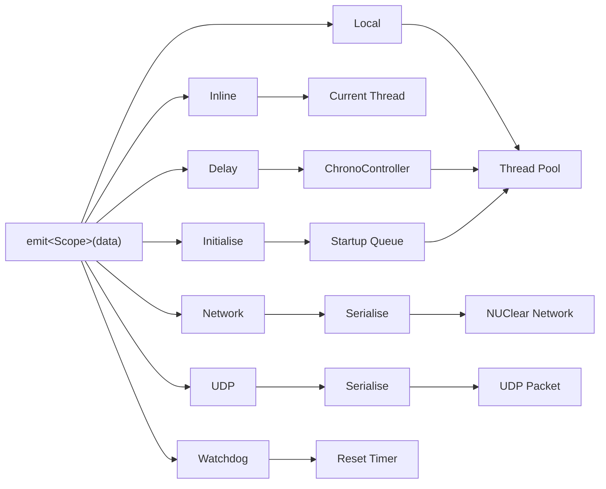

# Emit Scopes

> `emit` sends data into the NUClear system.
> The scope controls how that data is distributed.

## Syntax

```cpp
// Default (Local scope)
emit(std::make_unique<T>(args...));

// Explicit scope
emit<Scope::LOCAL>(std::make_unique<T>(args...));

// Scope with additional arguments
emit<Scope::DELAY>(std::make_unique<T>(args...), std::chrono::seconds(5));
```

## Overview

Every `emit` call takes a `std::unique_ptr` to the data being emitted.
The scope template parameter determines the distribution strategy.
When no scope is specified, `Scope::LOCAL` is used.

Scopes cannot be combined — each `emit` call uses exactly one scope.



## Scopes

| Scope               | Description                                                              | Link                        |
| ------------------- | ------------------------------------------------------------------------ | --------------------------- |
| `Scope::LOCAL`      | Distributes tasks via thread pool; stores data in global cache (default) | [Local](local.md)           |
| `Scope::INLINE`     | Executes reactions immediately on the emitter's thread                   | [Inline](inline.md)         |
| `Scope::DELAY`      | Schedules a Local emit after a time delay                                | [Delay](delay.md)           |
| `Scope::INITIALIZE` | Queues data to be emitted during system startup                          | [Initialise](initialise.md) |
| `Scope::NETWORK`    | Serializes and sends data to NUClear network peers                       | [Network](network.md)       |
| `Scope::UDP`        | Sends serialized data as a raw UDP packet                                | [UDP](udp.md)               |
| `Scope::WATCHDOG`   | Services (resets) a watchdog timer                                       | [Watchdog](watchdog.md)     |
