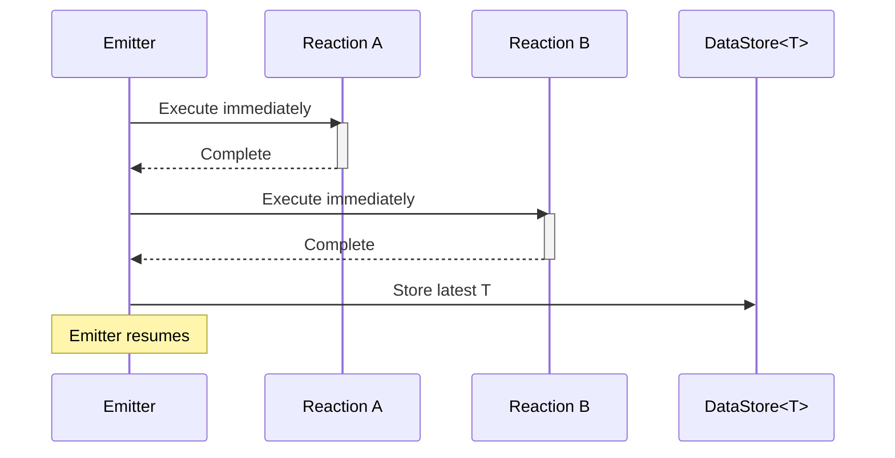

# Scope::INLINE

> Executes triggered reactions immediately on the emitter's thread, bypassing the thread pool.

## Syntax

```cpp
emit<Scope::INLINE>(std::make_unique<T>(args...));
```

## Behavior

When data is emitted with `Scope::INLINE`:

1. All reactions bound to `Trigger<T>` generate tasks that execute sequentially on the **current thread**.
1. The emitter blocks until all triggered reactions complete.
1. Data is stored in the global `DataStore<T>` after all reactions have run.
1. Tasks that specify they are not inlinable will be submitted to the thread pool instead.

Unlike `Scope::LOCAL`, inline emits execute during all system phases — including before `PowerPlant::start()` and during shutdown.



## Example

```cpp
#include <nuclear>

struct Command {
    std::string action;
};

class Controller : public NUClear::Reactor {
public:
    explicit Controller(std::unique_ptr<NUClear::Environment> environment) : Reactor(std::move(environment)) {

        on<Trigger<Command>>().then([this](const Command& cmd) {
            log<INFO>("Processing:", cmd.action);
        });

        on<Every<1, std::chrono::seconds>>().then([this] {
            // Reaction above will complete before this line proceeds
            emit<Scope::INLINE>(std::make_unique<Command>(Command{"ping"}));
            log<INFO>("All reactions finished");
        });
    }
};
```

## Notes

- Useful for self-emitting reactors where execution order matters.
- Works during startup (reactor constructors) and shutdown phases.
- **Warning**: Recursive inline emits will grow the call stack.
    Deeply recursive patterns can cause stack overflow.
- Reactions using `Inline::NEVER` in their DSL will be routed to the thread pool rather than executing inline.

## See Also

- [Local](local.md) — asynchronous thread pool distribution
- [Initialise](initialise.md) — startup-phase emission
- [Inline DSL word](../dsl/inline.md) — controls whether a reaction accepts inline execution
