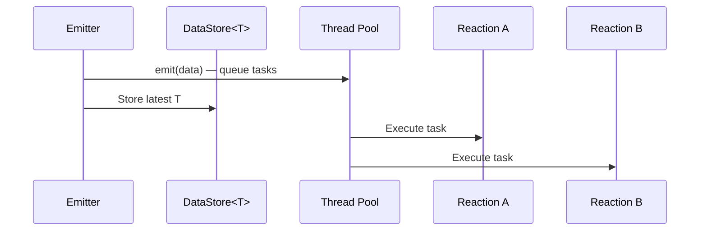

# Scope::LOCAL

> Default emit scope — distributes tasks via the thread pool and stores data in the global cache.

## Syntax

```cpp
// Implicit (shorthand)
emit(std::make_unique<T>(args...));

// Explicit
emit<Scope::LOCAL>(std::make_unique<T>(args...));
```

## Behavior

When data is emitted with `Scope::LOCAL`:

1. All reactions bound to `Trigger<T>` generate tasks queued for thread pool execution.
2. The data is stored in the global `DataStore<T>`, making it accessible to subsequent `With<T>` retrievals.
3. Tasks are scheduled normally — execution order depends on priority and thread availability.



## Example

```cpp
#include <nuclear>

struct SensorReading {
    double value;
};

class Sensor : public NUClear::Reactor {
public:
    explicit Sensor(std::unique_ptr<NUClear::Environment> environment) : Reactor(std::move(environment)) {

        on<Every<1, std::chrono::seconds>>().then([this] {
            emit(std::make_unique<SensorReading>(SensorReading{42.0}));
        });

        on<Trigger<SensorReading>>().then([this](const SensorReading& reading) {
            log<INFO>("Received:", reading.value);
        });
    }
};
```

## Notes

- This is the default scope. `emit(ptr)` and `emit<Scope::LOCAL>(ptr)` are equivalent.
- Data persists in the global store until overwritten by a subsequent emit of the same type.
- Tasks are not guaranteed to execute before the emitter continues — they are queued asynchronously.

## See Also

- [Inline](inline.md) — for synchronous execution on the emitter's thread
- [Trigger](../dsl/trigger.md) — DSL word that binds to emitted types
- [With](../dsl/with.md) — DSL word that reads the latest cached value
