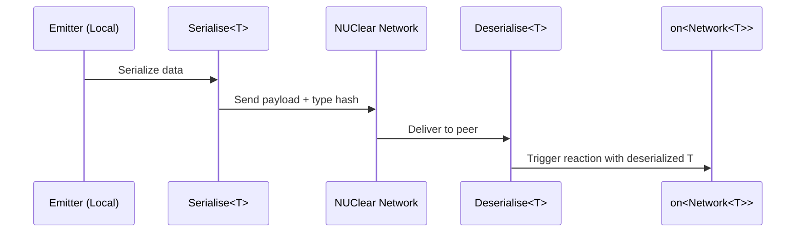

# Scope::NETWORK

> Serializes and sends data over the NUClear network to connected peers.

## Syntax

```cpp
// Broadcast to all peers, unreliable
emit<Scope::NETWORK>(std::make_unique<T>(args...));

// Send to specific peer, unreliable
emit<Scope::NETWORK>(std::make_unique<T>(args...), "peer_name");

// Broadcast to all peers, reliable
emit<Scope::NETWORK>(std::make_unique<T>(args...), true);

// Send to specific peer, reliable
emit<Scope::NETWORK>(std::make_unique<T>(args...), "peer_name", true);
```

## Parameters

| Parameter  | Type                 | Description                                                    |
| ---------- | -------------------- | -------------------------------------------------------------- |
| `data`     | `std::unique_ptr<T>` | The data to serialize and send                                 |
| `target`   | `std::string`        | Name of the target peer, or `""` for broadcast (default: `""`) |
| `reliable` | `bool`               | Whether to guarantee delivery (default: `false`)               |

## Behavior

When data is emitted with `Scope::NETWORK`:

1. The data is serialized using `util::serialise::Serialise<T>`.
1. A type hash is computed to identify the type on the receiving end.
1. The serialized payload is sent via the NUClear network layer.
1. On the receiving peer, data is deserialized and triggers `on<Network<T>>` reactions.



Network emits do **not** trigger local `Trigger<T>` reactions.
Only `on<Network<T>>` reactions on receiving peers are activated.

## Example

```cpp
#include <nuclear>

struct Heartbeat {
    std::string name;
    uint64_t timestamp;
};

class Broadcaster : public NUClear::Reactor {
public:
    explicit Broadcaster(std::unique_ptr<NUClear::Environment> environment) : Reactor(std::move(environment)) {

        on<Every<1, std::chrono::seconds>>().then([this] {
            emit<Scope::NETWORK>(std::make_unique<Heartbeat>(Heartbeat{"robot_1", now()}));
        });

        on<Network<Heartbeat>>().then([this](const Heartbeat& hb) {
            log<INFO>("Heartbeat from:", hb.name);
        });
    }
};
```

## Notes

- Requires `NetworkConfiguration` to be emitted for the network to be active.
- The type must be serializable: either trivially copyable, or provide a `util::serialise::Serialise<T>` specialization.
- Type routing uses a hash — the same type must be defined on both peers.
- If `reliable` is true, the message uses ACK-based retransmission with Jacobson/Karels RTO estimation.
    If false, packets are fire-and-forget (UDP-like).
- If the target peer is not connected, the message is silently dropped even with `reliable = true`.
- Messages are only sent to peers that have subscribed to the type hash (subscription-based routing).
    Peers with no subscriptions receive all messages by default.

## See Also

- [Network DSL word](../dsl/network.md) — receiving network messages
- [UDP](udp.md) — raw UDP packets for non-NUClear systems
