# Scope::WATCHDOG

> Services (resets) a watchdog timer, preventing its associated reaction from firing.

## Syntax

```cpp
// Service a simple watchdog
emit<Scope::WATCHDOG>(ServiceWatchdog<Group>());

// Service a keyed watchdog instance
emit<Scope::WATCHDOG>(ServiceWatchdog<Group>(key));
```

## Parameters

| Parameter | Type | Description |
|-----------|------|-------------|
| `Group` | type | The watchdog group type matching the `Watchdog<Group, ...>` declaration |
| `key` | (varies) | (Optional) Runtime key identifying a specific watchdog instance within the group |

## Behavior

When a watchdog is serviced:

1. The service time for the specified watchdog is updated to the current time.
2. The watchdog's deadline resets to `now + ticks * period`.
3. If serviced before the deadline, the watchdog reaction never fires.
4. If the watchdog is not serviced before the next deadline, the reaction fires and then automatically re-arms.

```mermaid
---
displayMode: compact
---
gantt
    title Watchdog&lt;Group, 5, std::chrono::seconds&gt;
    dateFormat X
    axisFormat %s s

    section Service Calls
        Service :milestone, 0, 0
        Service :milestone, 3, 3
        Service :milestone, 7, 7

    section Timer
        Active  :active, 0, 3
        Reset   :active, 3, 7
        Reset   :active, 7, 12

    section Reaction
        (does not fire) :done, 0, 12
```



## Example

```cpp
#include <nuclear>

struct ConnHealth {};

class Connection : public NUClear::Reactor {
public:
    explicit Connection(std::unique_ptr<NUClear::Environment> environment) : Reactor(std::move(environment)) {

        // Fire if no service within 10 seconds
        on<Watchdog<ConnHealth, 10, std::chrono::seconds>>().then([this] {
            log<WARN>("Connection watchdog expired — attempting reconnect");
        });

        on<Every<2, std::chrono::seconds>>().then([this] {
            if (connection_alive()) {
                emit<Scope::WATCHDOG>(ServiceWatchdog<ConnHealth>());
            }
        });
    }
};
```

### Keyed watchdog example

```cpp
struct PlayerTimeout {};

// One watchdog per player ID
on<Watchdog<PlayerTimeout, 30, std::chrono::seconds>>(player_id).then([this] {
    log<WARN>("Player timed out");
});

// Service a specific player's watchdog
emit<Scope::WATCHDOG>(ServiceWatchdog<PlayerTimeout>(player_id));
```

## Notes

- The watchdog group type and runtime key must match between the `on<Watchdog<...>>` declaration and the `ServiceWatchdog<...>` call.
- Throws `std::domain_error` if the watchdog has not been registered (no matching `on<Watchdog<...>>` exists).
- This emit does not distribute data or create tasks — it only updates the service timestamp.

## See Also

- [Watchdog DSL word](../dsl/watchdog.md) — declaring watchdog reactions
- [Delay](delay.md) — time-based emission scheduling
