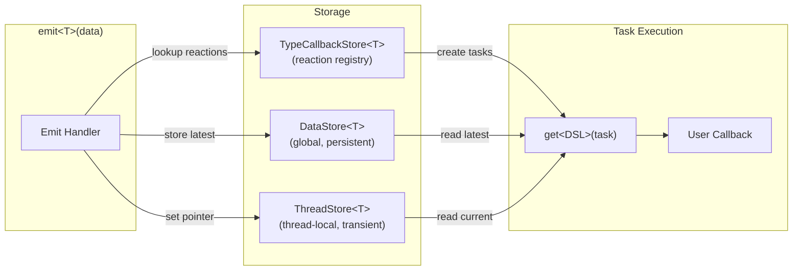

# Data Stores

NUClear uses three typed data stores to pass data between emit handlers, task creation, and reaction callbacks.
Each serves a different scope and lifetime requirement.



## DataStore\<T>

A global singleton store keyed by type.
Holds the most recently emitted value of each type as a `shared_ptr<const T>`.

```cpp
template <typename DataType>
using DataStore = util::TypeMap<DataType, DataType, DataType>;
```

**Characteristics:**

- One instance per type across the entire PowerPlant
- Thread-safe (shared_ptr atomic operations)
- Persistent — value remains until overwritten by a new emit
- Accessed via `DataStore<T>::get()` which returns `shared_ptr<const T>`

**Usage:** The primary data retrieval mechanism for words like `With` and `Trigger`.
When data is emitted, the emit handler stores it here.
When a reaction runs, `get` reads from here to provide callback arguments.

```cpp
// During emit
DataStore<T>::set(std::make_shared<const T>(data));

// During get
auto ptr = DataStore<T>::get();  // shared_ptr<const T>
```

## ThreadStore\<T>

A thread-local pointer store used for out-of-band communication between an emit handler and the `get` methods it triggers on the same thread.

```cpp
template <typename DataType, int Index = 0>
struct ThreadStore {
    static thread_local DataType* value;
};
```

**Characteristics:**

- Thread-local — each thread has its own independent pointer
- Transient — only valid during the current handler/task execution
- Not owning — stores a raw pointer to stack or heap data
- Supports multiple values of the same type via the `Index` parameter

**Usage:** Bridges the gap between the opaque reaction system and strongly-typed internals.
When an emit handler creates a task, it sets a `ThreadStore` pointer to local data.
The `get` method (running on the same thread during task creation) reads this pointer to access the specific emit event data rather than just "the latest value."

```cpp
// In emit handler (sets pointer to local data)
ThreadStore<T>::value = &local_data;
// ... trigger task creation ...
ThreadStore<T>::value = nullptr;  // Clean up

// In get method (reads the pointer)
auto* data = ThreadStore<T>::value;
```

This is essential for scenarios where multiple emits of the same type happen rapidly — the `ThreadStore` ensures each task gets the specific data that triggered it, not whatever was emitted most recently.

## TypeCallbackStore\<T>

A registry of reactions that should be triggered when type `T` is emitted.
Stored as a list of shared pointers to `Reaction` objects.

```cpp
template <typename TriggeringType>
using TypeCallbackStore = util::TypeList<TriggeringType, TriggeringType, std::shared_ptr<threading::Reaction>>;
```

**Characteristics:**

- One list per triggering type
- Compile-time dispatch — no runtime lookup needed
- Modified during `bind` (add reaction) and unbind (remove reaction)
- Read during emit to find which reactions to trigger

**Usage:** When a word's `bind` method is called, it adds the reaction to the appropriate `TypeCallbackStore`.
When data of that type is emitted, the emit handler iterates this store and creates a task for each registered reaction.

```cpp
// During bind
TypeCallbackStore<T>::add(reaction);

// During emit
for (auto& reaction : TypeCallbackStore<T>::get()) {
    // Create and submit a task for this reaction
}
```

## How They Work Together

A typical emit-to-callback flow:

1. `emit<T>(data)` is called
1. The emit handler stores `data` in `DataStore<T>` (persistent copy)
1. The emit handler sets `ThreadStore<T>::value` to point at `data` (transient reference)
1. The emit handler reads `TypeCallbackStore<T>` to find all registered reactions
1. For each reaction, a task is created — during creation, `get` reads from `ThreadStore` or `DataStore`
1. `ThreadStore<T>::value` is reset to `nullptr`
1. Tasks are submitted to their respective pools
1. When a task executes, the callback receives the data retrieved in step 5
