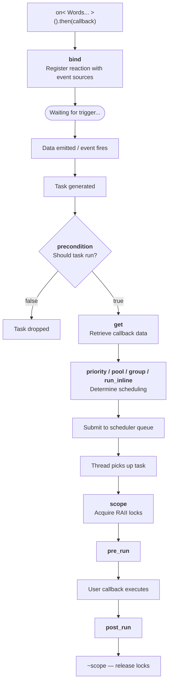

# Extension Points

Extension points are static template methods that a DSL word can implement to hook into different stages of the reaction lifecycle.
The Fusion Engine discovers which points each word implements and combines them according to point-specific strategies.

Every extension point receives a `DSL` template parameter — the full fused type of all words in the `on<>()` statement.
This gives each word access to the complete DSL context.

## Lifecycle Overview

The extension points are invoked at specific stages of a reaction's lifecycle:

## Extension Point Pages

Each extension point is documented in detail on its own page:

| Extension Point                        | When           | Thread Context                    | Purpose                                |
| -------------------------------------- | -------------- | --------------------------------- | -------------------------------------- |
| [bind](points/bind.md)                 | Registration   | Main thread (during construction) | Connect reaction to event sources      |
| [get](points/get.md)                   | Task creation  | Emitter's thread                  | Provide data to the callback           |
| [precondition](points/precondition.md) | Task creation  | Emitter's thread                  | Gate whether the task should run       |
| [priority](points/priority.md)         | Task creation  | Emitter's thread                  | Set scheduling priority                |
| [pool](points/pool.md)                 | Task creation  | Emitter's thread                  | Choose which thread pool runs the task |
| [group](points/group.md)               | Task creation  | Emitter's thread                  | Limit concurrent execution             |
| [run_inline](points/run-inline.md)     | Task creation  | Emitter's thread                  | Control inline vs queued execution     |
| [scope](points/scope.md)               | Task execution | Executor thread                   | Acquire RAII locks around callback     |
| [pre_run](points/pre-run.md)           | Task execution | Executor thread                   | Hook before callback                   |
| [post_run](points/post-run.md)         | Task execution | Executor thread                   | Hook after callback                    |

## Quick Reference

| Point          | Signature                      | Returns     | Fusion Strategy                   |
| -------------- | ------------------------------ | ----------- | --------------------------------- |
| `bind`         | `bind<DSL>(reaction, args...)` | void        | Arg-distributing (FunctionFusion) |
| `get`          | `get<DSL>(task)`               | data        | Tuple concatenation               |
| `precondition` | `precondition<DSL>(task)`      | bool        | AND (short-circuit)               |
| `priority`     | `priority<DSL>(task)`          | int         | Maximum                           |
| `pool`         | `pool<DSL>(task)`              | descriptor  | Exactly one                       |
| `group`        | `group<DSL>(task)`             | set         | Set union                         |
| `run_inline`   | `run_inline<DSL>(task)`        | Inline enum | Must agree                        |
| `scope`        | `scope<DSL>(task)`             | RAII lock   | All held                          |
| `pre_run`      | `pre_run<DSL>(task)`           | void        | Sequential                        |
| `post_run`     | `post_run<DSL>(task)`          | void        | Sequential                        |
