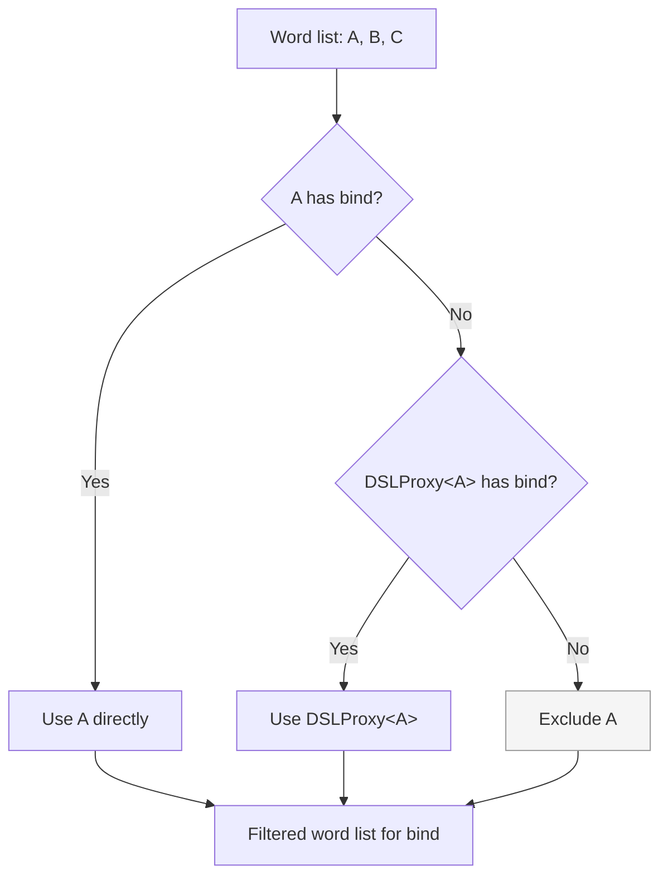
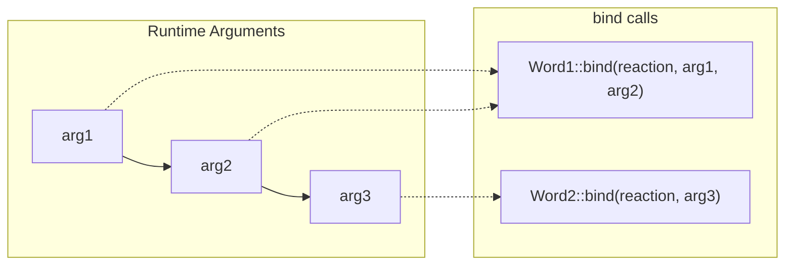

# Fusion Engine

The Fusion Engine is the compile-time machinery that combines multiple DSL words in an `on<>()` statement into a single unified reaction. It operates entirely through C++ template metaprogramming — there is no runtime overhead from word composition.

## Overview

When you write:

```cpp
on<Trigger<Sensor>, With<Config>, Priority::HIGH>().then(callback);
```

The Fusion Engine:

1. Creates `Fusion<Trigger<Sensor>, With<Config>, Priority::HIGH>`
1. For each extension point (bind, get, priority, etc.), finds which words implement it
1. Combines the matching words using that point's fusion strategy

## FindWords

For each extension point, `FindWords` filters the word list to only those that implement the relevant method. It uses a two-step resolution:

1. Check if the word itself has the method (e.g., `Word::bind` exists)
1. If not, check if `DSLProxy<Word>` has the method
1. If neither, the word is excluded for that extension point



This means a DSL word can implement extension points either:

- **Directly** — by defining the static method on its own struct
- **Via proxy** — by specializing `operation::DSLProxy<MyWord>` with the method

Direct methods take priority over proxy methods.

```cpp
// Direct implementation
struct MyWord {
    template <typename DSL>
    static void bind(const std::shared_ptr<threading::Reaction>& reaction) { /* ... */ }
};

// Proxy implementation (for types you don't control)
namespace NUClear::dsl::operation {
    template <>
    struct DSLProxy<ExternalType> {
        template <typename DSL>
        static void bind(const std::shared_ptr<threading::Reaction>& reaction) { /* ... */ }
    };
}
```

## FunctionFusion

For extension points that accept runtime arguments (primarily `bind`), the Fusion Engine uses **FunctionFusion** to distribute arguments across multiple words.

Each word's method consumes arguments from left to right. The first word takes as many arguments as its signature requires (after the fixed parameters), the next word takes arguments from where the first left off, and so on.



This is how a single `on<>()` call can pass different configuration arguments to different words without ambiguity.

## Fusion Strategies by Extension Point

Each extension point uses a specific strategy to combine results from multiple words:

| Extension Point | Strategy       | Implementation                                            |
| --------------- | -------------- | --------------------------------------------------------- |
| `bind`          | FunctionFusion | Each word called with consumed args, results concatenated |
| `get`           | FunctionFusion | Each word called, results flattened into tuple            |
| `scope`         | FunctionFusion | Each word called, all locks held simultaneously           |
| `precondition`  | Recursive AND  | Short-circuits on first `false`                           |
| `pre_run`       | Sequential     | Each word called in order                                 |
| `post_run`      | Sequential     | Each word called in order                                 |
| `priority`      | Maximum        | `std::max` across all words                               |
| `pool`          | Exclusive      | More than one throws `std::invalid_argument`              |
| `group`         | Set union      | All group sets merged                                     |
| `run_inline`    | Agreement      | `ALWAYS` + `NEVER` throws `std::logic_error`              |

## The DSL Template Parameter

Every extension point method receives the full fused DSL type as its template parameter:

```cpp
template <typename DSL>
static void bind(const std::shared_ptr<threading::Reaction>& reaction);
```

Here `DSL` is `Fusion<AllWords...>` — the complete type representing all words in the `on<>()` statement. This allows any word to query the capabilities of the entire fused set. For example, a word could check if another specific word is present in the DSL and adjust its behavior accordingly.

## Fusion Struct

The top-level `Fusion<Words...>` struct inherits from all point-specific fusers:

```cpp
template <typename... Words>
struct Fusion
    : fusion::BindFusion<Words...>
    , fusion::GetFusion<Words...>
    , fusion::GroupFusion<Words...>
    , fusion::InlineFusion<Words...>
    , fusion::PoolFusion<Words...>
    , fusion::PostRunFusion<Words...>
    , fusion::PreRunFusion<Words...>
    , fusion::PreconditionFusion<Words...>
    , fusion::PriorityFusion<Words...>
    , fusion::ScopeFusion<Words...> {};
```

Each `XxxFusion<Words...>` applies `FindWords` to filter to relevant words, then delegates to the appropriate `XxxFuser` which implements the combination logic. If no words implement a given point, the fuser is an empty struct with no method — the calling code uses SFINAE to detect this and skip the call.
