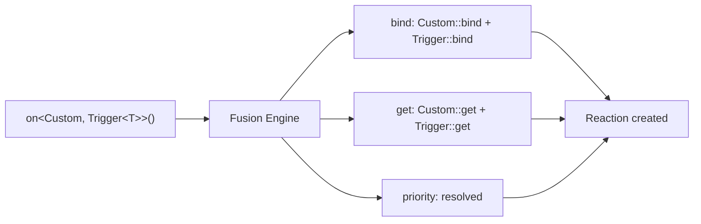

# Extension System

NUClear's DSL is fully extensible.
Every built-in word — `Trigger`, `With`, `Every`, `Pool` — is implemented using the same extension mechanism available to you.
Custom DSL words are first-class citizens.

## How It Works

A DSL word is a struct that implements one or more static template methods called **extension points**.
When you write an `on<>()` statement combining multiple words, the **Fusion Engine** introspects each word, discovers which extension points it provides, and combines them into a single fused reaction.

```cpp
// A DSL word is just a struct with static methods
struct MyWord {
    template <typename DSL>
    static void bind(const std::shared_ptr<threading::Reaction>& reaction) {
        // Called when the reaction is created
    }

    template <typename DSL>
    static Data get(threading::ReactionTask& task) {
        // Called when the reaction runs — provides data to the callback
    }
};
```



## Architecture

The extension system has several components:

- **Extension Points** — The static methods a word can implement to hook into the reaction lifecycle
- **Fusion Engine** — The compile-time machinery that discovers and combines extension points across words
- **Data Stores** — Thread-safe and thread-local storage used to pass data between emit handlers and reaction callbacks
- **Built-in Extensions** — Reactor-based controllers that provide time, IO, network, and trace functionality

## In This Section

| Page                                          | Description                                          |
| --------------------------------------------- | ---------------------------------------------------- |
| [Extension Points](extension-points.md)       | All available hooks and their signatures             |
| [Fusion Engine](fusion-engine.md)             | How words are combined at compile time               |
| [Data Stores](data-stores.md)                 | Storage mechanisms for inter-component communication |
| [Built-in Extensions](built-in-extensions.md) | The four controller reactors shipped with NUClear    |

## See Also

- [Extending the DSL](../../how-to/extending-dsl.md) — Practical walkthrough of creating a custom word
