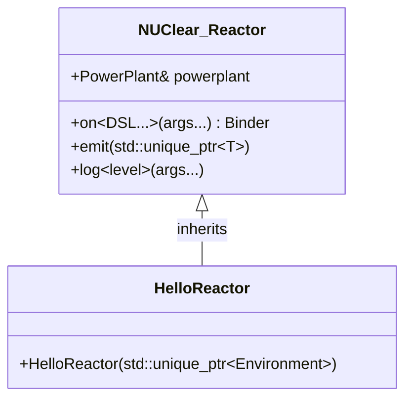
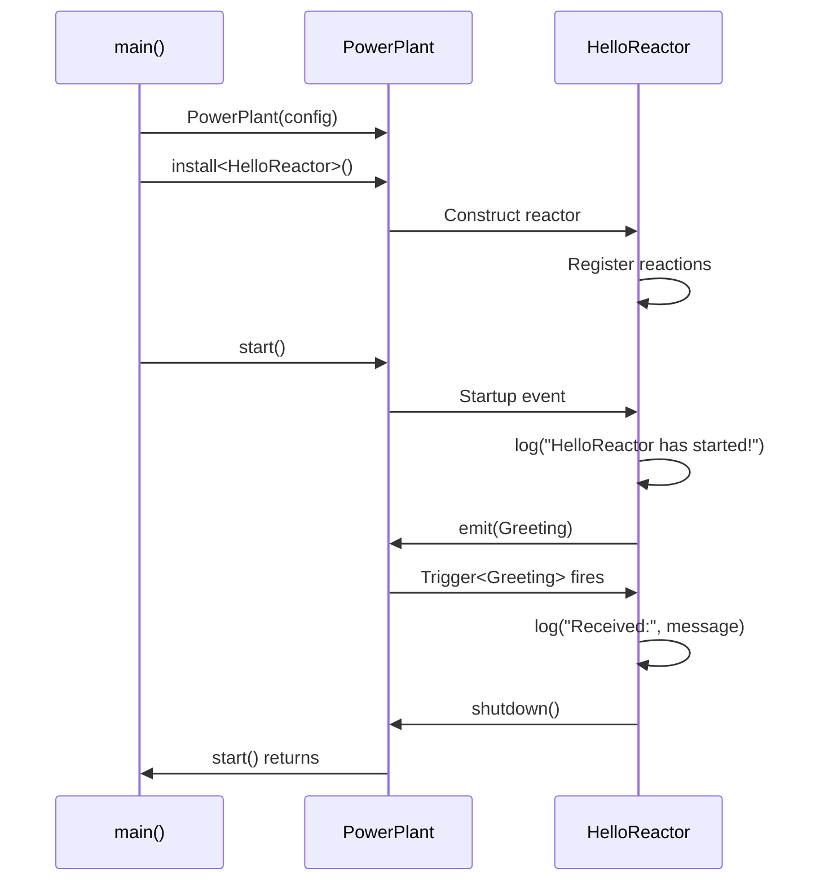

# Your First Reactor

In this tutorial, you'll build a complete NUClear application from scratch. By the end, you'll have a working program that starts up, emits a message, and reacts to it — covering the core concepts you'll use in every NUClear project.

## What You'll Build

A small application with a single reactor that:

1. Logs a greeting when the system starts
2. Emits a custom message
3. Reacts to that message and logs its contents

It's simple, but it demonstrates the fundamental pattern behind every NUClear system: **reactors emit messages, and other reactions respond to them**.

## Project Setup

Create a new directory for your project with the following structure:

```
hello_nuclear/
├── CMakeLists.txt
├── src/
│   ├── main.cpp
│   └── HelloReactor.hpp
```

### CMakeLists.txt

```cmake
cmake_minimum_required(VERSION 3.15)
project(hello_nuclear LANGUAGES CXX)

find_package(NUClear REQUIRED)

add_executable(hello_nuclear
    src/main.cpp
)

target_link_libraries(hello_nuclear PRIVATE NUClear::nuclear)
target_compile_features(hello_nuclear PUBLIC cxx_std_14)
```

!!! note "Finding NUClear"

    This assumes you've already installed NUClear on your system. If not, head back to the [Installation](installation.md) tutorial first.

## Creating Your Reactor Class

A **reactor** is a class that groups related reactions together. Think of it as a component in your system — it has its own state, its own reactions, and communicates with other reactors through messages.

Every reactor must:

1. Inherit from `NUClear::Reactor`
2. Accept a `std::unique_ptr<NUClear::Environment>` in its constructor
3. Pass that environment to the base class

Here's the skeleton:

```cpp title="src/HelloReactor.hpp"
#ifndef HELLO_REACTOR_HPP
#define HELLO_REACTOR_HPP

#include <nuclear>

class HelloReactor : public NUClear::Reactor {
public:
    explicit HelloReactor(std::unique_ptr<NUClear::Environment> environment)
        : Reactor(std::move(environment)) {

        // Reactions are registered here
    }
};

#endif  // HELLO_REACTOR_HPP
```



!!! tip "Why a `unique_ptr<Environment>`?"

    The environment carries metadata about the reactor (like its name) and a reference to the PowerPlant it lives in. Passing it as a `unique_ptr` gives NUClear ownership semantics — each reactor gets its own environment, and the framework manages the lifecycle.

## Adding a Startup Reaction

The simplest reaction you can write responds to `Startup` — a built-in event that fires once when the PowerPlant begins running.

Add this inside the constructor:

```cpp
on<Startup>().then([this]() {
    log<INFO>("HelloReactor has started!");
});
```

Let's break this down:

- **`on<Startup>()`** — Declares that this reaction should trigger on the `Startup` event
- **`.then(...)`** — Provides the callback to execute when the event fires
- **`log<INFO>(...)`** — Logs a message at the `INFO` level

The `on<...>().then(...)` pattern is the core API for creating reactions. The template parameters (the DSL words) describe *when* the reaction runs, and the `.then()` callback describes *what* it does.

## Emitting a Message

Messages in NUClear are just plain C++ structs or classes. There's no special base class, no registration macro — any type can be a message.

Define a simple message struct inside your reactor:

```cpp
struct Greeting {
    std::string message;
};
```

Now emit it from your `Startup` reaction:

```cpp
on<Startup>().then([this]() {
    log<INFO>("HelloReactor has started!");
    emit(std::make_unique<Greeting>(Greeting{"Hello from NUClear!"}));
});
```

!!! important "Messages are emitted as `std::unique_ptr`"

    You always emit messages wrapped in a `std::unique_ptr`. This gives NUClear clear ownership of the data and enables efficient, thread-safe message passing without copying.

## Reacting to the Message

Now let's add a reaction that triggers whenever a `Greeting` message is emitted. The `Trigger<T>` DSL word binds a reaction to emissions of type `T`:

```cpp
on<Trigger<Greeting>>().then([this](const Greeting& greeting) {
    log<INFO>("Received:", greeting.message);
    powerplant.shutdown();
});
```

When a `Greeting` is emitted anywhere in the system, this callback fires and receives a const reference to the message data. After logging it, we call `powerplant.shutdown()` to stop the system cleanly.

!!! tip "Lambda parameters"

    The callback's parameter type tells NUClear what data to inject. When you use `Trigger<Greeting>`, you can accept `const Greeting&` as a parameter to access the message contents.

## Putting It All Together

### HelloReactor.hpp

```cpp title="src/HelloReactor.hpp"
#ifndef HELLO_REACTOR_HPP
#define HELLO_REACTOR_HPP

#include <memory>
#include <string>
#include <utility>

#include <nuclear>

class HelloReactor : public NUClear::Reactor {
public:
    /// A simple message carrying a greeting string
    struct Greeting {
        std::string message;
    };

    explicit HelloReactor(std::unique_ptr<NUClear::Environment> environment)
        : Reactor(std::move(environment)) {

        // React to Greeting messages
        on<Trigger<Greeting>>().then([this](const Greeting& greeting) {
            log<INFO>("Received:", greeting.message);
            powerplant.shutdown();
        });

        // Run once at startup
        on<Startup>().then([this]() {
            log<INFO>("HelloReactor has started!");
            emit(std::make_unique<Greeting>(Greeting{"Hello from NUClear!"}));
        });
    }
};

#endif  // HELLO_REACTOR_HPP
```

### main.cpp

```cpp title="src/main.cpp"
#include <nuclear>

#include "HelloReactor.hpp"

int main(int argc, const char* argv[]) {
    // Configure the PowerPlant
    NUClear::Configuration config;
    config.default_pool_concurrency = 1;

    // Create the PowerPlant
    NUClear::PowerPlant plant(config, argc, argv);

    // Install our reactor
    plant.install<HelloReactor>();

    // Start the system (blocks until shutdown)
    plant.start();

    return 0;
}
```

!!! note "Why `default_pool_concurrency = 1`?"

    Setting the thread pool to 1 thread makes the output deterministic for this tutorial. In real applications, you'd typically leave this at the default (the number of hardware threads) or tune it for your workload.

### Building and Running

```bash
mkdir build && cd build
cmake ..
cmake --build .
./hello_nuclear
```

Expected output:

```
[INFO] HelloReactor has started!
[INFO] Received: Hello from NUClear!
```

## What's Happening Under the Hood

Here's the sequence of events when you run your program:



The key insight is that **the constructor only registers reactions** — it doesn't execute them. Reactions only fire after `plant.start()` is called. The `Startup` event is emitted automatically by the PowerPlant, which triggers your first callback, which emits a `Greeting`, which triggers your second callback.

This is the reactive pattern: you declare *what* should happen in response to *what events*, and the framework handles the scheduling, threading, and data delivery.

!!! tip "Order of registration"

    Notice that we registered the `Trigger<Greeting>` reaction *before* the `Startup` reaction in the constructor. The order of registration doesn't matter for triggering — what matters is when the data is emitted. The `Greeting` reaction is ready and waiting by the time `Startup` fires and emits the message.

## Next Steps

You've built your first reactor and seen the core pattern: **register reactions in the constructor, emit messages to communicate, and let the framework handle the rest**.

From here, you can explore:

- [Message Passing](message-passing.md) — Learn how multiple reactors communicate through shared message types
- [Periodic Tasks](periodic-tasks.md) — Set up timers and recurring work with `Every`
