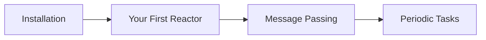

# Tutorials

Tutorials are guided, learning-oriented walkthroughs that take you from zero to a working result. Each tutorial builds on concepts from the previous one, so we recommend following them in order.

!!! tip "Prerequisites"

    Before starting, you should be comfortable with basic C++ (classes, templates, and lambdas). No prior experience with reactive programming is needed.

## Available Tutorials

| Tutorial | Description |
|----------|-------------|
| [Installation](installation.md) | Get NUClear set up on your machine |
| [Your First Reactor](first-reactor.md) | Build your first reactive component |
| [Message Passing](message-passing.md) | Learn how reactors communicate through messages |
| [Periodic Tasks](periodic-tasks.md) | Set up timers and scheduled work |
