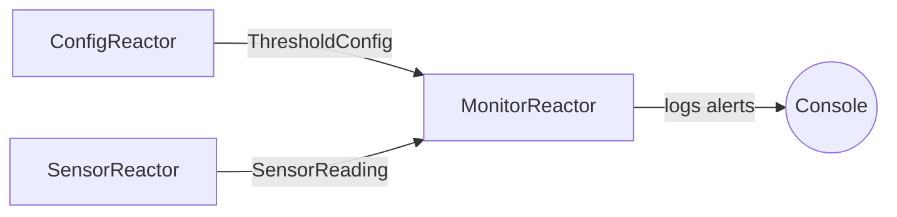
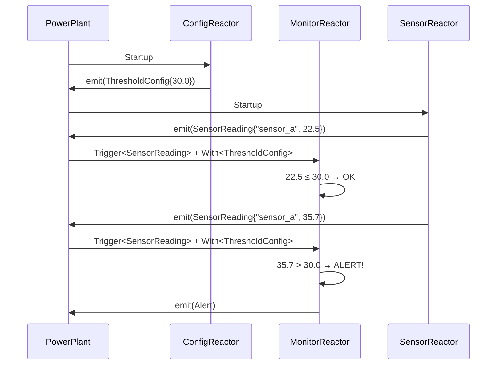

# Message Passing

In this tutorial, you'll build a system where multiple reactors communicate through messages.
You'll learn how to define message types, emit data from one reactor, and consume it in others using [`Trigger`](../reference/dsl/trigger.md), [`With`](../reference/dsl/with.md), and [`Optional`](../reference/dsl/optional.md).

## What You'll Build

A sensor data pipeline with three reactors:

1. **SensorReactor** — Simulates a temperature sensor, periodically emitting readings
1. **ConfigReactor** — Emits a configuration message that sets the temperature threshold
1. **MonitorReactor** — Receives sensor readings, checks them against the threshold, and logs alerts

This mirrors real-world systems: producers generate data, configuration is provided separately, and consumers combine multiple data sources to make decisions.



## Project Setup

Extend the project structure from the [first reactor tutorial](first-reactor.md):

```
sensor_pipeline/
├── CMakeLists.txt
├── src/
│   ├── main.cpp
│   ├── messages.hpp
│   ├── SensorReactor.hpp
│   ├── ConfigReactor.hpp
│   └── MonitorReactor.hpp
```

### CMakeLists.txt

```cmake title="CMakeLists.txt"
cmake_minimum_required(VERSION 3.15)
project(sensor_pipeline LANGUAGES CXX)

find_package(NUClear REQUIRED)

add_executable(sensor_pipeline
    src/main.cpp
)

target_link_libraries(sensor_pipeline PRIVATE NUClear::nuclear)
target_compile_features(sensor_pipeline PUBLIC cxx_std_14)
```

## Defining Messages

Messages in NUClear are plain C++ structs.
They don't need to inherit from anything or use registration macros — any type can be a message.

Define all messages in a shared header:

```cpp title="src/messages.hpp"
#ifndef MESSAGES_HPP
#define MESSAGES_HPP

#include <string>

/// A temperature reading from a sensor
struct SensorReading {
    std::string sensor_id;
    double temperature;
};

/// Configuration specifying the alert threshold
struct ThresholdConfig {
    double max_temperature;
};

/// An alert generated when the threshold is exceeded
struct Alert {
    std::string sensor_id;
    double temperature;
    double threshold;
};

#endif  // MESSAGES_HPP
```

!!! tip "Keep messages simple"

    ```
    Messages should be simple data containers.
    ```

    Avoid putting logic in them — that belongs in reactors.
    This keeps your message types reusable and easy to reason about.

## Creating the Producer (SensorReactor)

The `SensorReactor` simulates sensor readings by emitting `SensorReading` messages at startup.
In a real system, you'd use [`Every`](../reference/dsl/every.md) for periodic emissions, but we'll keep things simple here.

```cpp title="src/SensorReactor.hpp"
#ifndef SENSOR_REACTOR_HPP
#define SENSOR_REACTOR_HPP

#include <memory>
#include <string>
#include <utility>

#include <nuclear>

#include "messages.hpp"

class SensorReactor : public NUClear::Reactor {
public:
    explicit SensorReactor(std::unique_ptr<NUClear::Environment> environment)
        : Reactor(std::move(environment)) {

        on<Startup>().then([this]() {
            log<INFO>("SensorReactor: Starting sensor readings...");

            // Emit several temperature readings
            emit(std::make_unique<SensorReading>(SensorReading{"sensor_a", 22.5}));
            emit(std::make_unique<SensorReading>(SensorReading{"sensor_a", 28.3}));
            emit(std::make_unique<SensorReading>(SensorReading{"sensor_a", 35.7}));
            emit(std::make_unique<SensorReading>(SensorReading{"sensor_a", 41.2}));
        });
    }
};

#endif  // SENSOR_REACTOR_HPP
```

Each call to `emit()` sends a message into the system.
Any reactor with a matching `Trigger` will receive it.

!!! important "Messages are emitted as `std::unique_ptr`"

    ```
    You always emit messages wrapped in `std::make_unique<T>(...)`.
    ```

    This transfers ownership to NUClear, which then shares the data immutably with all interested reactions via `std::shared_ptr<const T>` internally.

## Creating the Consumer (MonitorReactor with Trigger)

The `MonitorReactor` uses `Trigger<SensorReading>` to react every time a new reading arrives:

```cpp title="src/MonitorReactor.hpp" hl_lines="16-19"
#ifndef MONITOR_REACTOR_HPP
#define MONITOR_REACTOR_HPP

#include <memory>
#include <utility>

#include <nuclear>

#include "messages.hpp"

class MonitorReactor : public NUClear::Reactor {
public:
    explicit MonitorReactor(std::unique_ptr<NUClear::Environment> environment)
        : Reactor(std::move(environment)) {

        on<Trigger<SensorReading>>().then([this](const SensorReading& reading) {
            log<INFO>("MonitorReactor: Received reading from", reading.sensor_id,
                      "- temperature:", reading.temperature);
        });
    }
};

#endif  // MONITOR_REACTOR_HPP
```

Every time a `SensorReading` is emitted — regardless of which reactor emits it — this callback fires.
The `const SensorReading&` parameter gives you read-only access to the message data.

!!! tip "Multiple listeners"

    ```
    Any number of reactors can listen to the same message type.
    ```

    If you installed a second reactor with its own `Trigger<SensorReading>`, both would fire independently for every reading emitted.

## Using With for Supplementary Data

Now let's make the monitor check readings against a threshold.
The `ThresholdConfig` is emitted once by the `ConfigReactor`, and the monitor needs it alongside each `SensorReading`.

[`With`](../reference/dsl/with.md)`<T>` provides the **most recent** value of type `T` — known as a **co-message** — without triggering the reaction itself.
The reaction only fires when its `Trigger` type is emitted.
This co-messaging pattern means your reactor doesn't need to manually cache the config — NUClear's internal data store provides it automatically when the reaction fires:

```cpp title="src/MonitorReactor.hpp" hl_lines="16-26"
#ifndef MONITOR_REACTOR_HPP
#define MONITOR_REACTOR_HPP

#include <memory>
#include <utility>

#include <nuclear>

#include "messages.hpp"

class MonitorReactor : public NUClear::Reactor {
public:
    explicit MonitorReactor(std::unique_ptr<NUClear::Environment> environment)
        : Reactor(std::move(environment)) {

        on<Trigger<SensorReading>, With<ThresholdConfig>>().then(
            [this](const SensorReading& reading, const ThresholdConfig& config) {
                log<INFO>("MonitorReactor: Reading", reading.temperature,
                          "/ threshold", config.max_temperature);

                if (reading.temperature > config.max_temperature) {
                    log<WARN>("MonitorReactor: ALERT! Temperature exceeded threshold!");
                    emit(std::make_unique<Alert>(
                        Alert{reading.sensor_id, reading.temperature, config.max_temperature}));
                }
            });
    }
};

#endif  // MONITOR_REACTOR_HPP
```

Key points:

- The reaction fires when `SensorReading` is emitted (the trigger)
- `With<ThresholdConfig>` supplies the **latest** `ThresholdConfig` alongside it
- The callback receives both as `const T&` parameters

!!! warning "With requires prior data"

    ```
    If no `ThresholdConfig` has been emitted yet when a `SensorReading` arrives, the **entire task is dropped** — the callback never fires.
    ```

    This is a common source of confusion!
    If the supplementary data might not exist yet, use `Optional` (covered next).

## Using Optional for Data That May Not Exist

What if you want the reaction to fire even when `ThresholdConfig` hasn't been emitted yet?
Wrap it in `Optional`:

```cpp title="src/MonitorReactor.hpp"
#ifndef MONITOR_REACTOR_HPP
#define MONITOR_REACTOR_HPP

#include <memory>
#include <utility>

#include <nuclear>

#include "messages.hpp"

class MonitorReactor : public NUClear::Reactor {
public:
    explicit MonitorReactor(std::unique_ptr<NUClear::Environment> environment)
        : Reactor(std::move(environment)) {

        on<Trigger<SensorReading>, Optional<With<ThresholdConfig>>>().then(
            [this](const SensorReading& reading,
                   const std::shared_ptr<const ThresholdConfig>& config) {

                if (!config) {
                    log<INFO>("MonitorReactor: Reading", reading.temperature,
                              "(no threshold configured yet)");
                    return;
                }

                log<INFO>("MonitorReactor: Reading", reading.temperature,
                          "/ threshold", config->max_temperature);

                if (reading.temperature > config->max_temperature) {
                    log<WARN>("MonitorReactor: ALERT! Temperature exceeded threshold!");
                    emit(std::make_unique<Alert>(
                        Alert{reading.sensor_id, reading.temperature, config->max_temperature}));
                }
            });
    }
};

#endif  // MONITOR_REACTOR_HPP
```

Notice the change in the callback signature:

| DSL Word            | Callback Parameter Type    |
| ------------------- | -------------------------- |
| `Trigger<T>`        | `const T&`                 |
| `With<T>`           | `const T&`                 |
| `Optional<With<T>>` | `std::shared_ptr<const T>` |

When data is wrapped in `Optional`, you receive a `std::shared_ptr<const T>` that may be `nullptr` if no data has been emitted yet.
Always check before using it.

!!! note "Why `shared_ptr<const T>`?"

    ```
    NUClear shares emitted messages immutably across all reactions that need them.
    ```

    The `const` ensures no reaction can modify a message that others might be reading concurrently.
    The `shared_ptr` manages the lifetime automatically — the message stays alive as long as any reaction is using it.
    For non-optional data (`Trigger<T>` and `With<T>`), NUClear guarantees the data exists and provides a direct `const T&` for convenience.

## The ConfigReactor

The `ConfigReactor` emits the threshold configuration at startup:

```cpp title="src/ConfigReactor.hpp"
#ifndef CONFIG_REACTOR_HPP
#define CONFIG_REACTOR_HPP

#include <memory>
#include <utility>

#include <nuclear>

#include "messages.hpp"

class ConfigReactor : public NUClear::Reactor {
public:
    explicit ConfigReactor(std::unique_ptr<NUClear::Environment> environment)
        : Reactor(std::move(environment)) {

        on<Startup>().then([this]() {
            log<INFO>("ConfigReactor: Setting threshold to 30.0 degrees");
            emit(std::make_unique<ThresholdConfig>(ThresholdConfig{30.0}));
        });
    }
};

#endif  // CONFIG_REACTOR_HPP
```

## Complete Example

### main.cpp

```cpp title="src/main.cpp"
#include <nuclear>

#include "ConfigReactor.hpp"
#include "MonitorReactor.hpp"
#include "SensorReactor.hpp"

int main(int argc, const char* argv[]) {
    NUClear::Configuration config;
    config.default_pool_concurrency = 1;

    NUClear::PowerPlant plant(config, argc, argv);

    // Install reactors — order doesn't affect message delivery
    plant.install<ConfigReactor>();
    plant.install<MonitorReactor>();
    plant.install<SensorReactor>();

    plant.start();

    return 0;
}
```

!!! tip "Installation order"

    ```
    The order you install reactors doesn't matter for message delivery.
    ```

    What matters is timing: a reaction can only trigger if it has been registered (constructed) before the message is emitted.
    Since all reactors are installed before `start()` is called, all reactions are ready before any `Startup` events fire.

### Expected Output

With `default_pool_concurrency = 1`, the output will be deterministic:

```
[INFO] ConfigReactor: Setting threshold to 30.0 degrees
[INFO] MonitorReactor: Reading 22.5 / threshold 30
[INFO] MonitorReactor: Reading 28.3 / threshold 30
[INFO] MonitorReactor: Reading 35.7 / threshold 30
[WARN] MonitorReactor: ALERT! Temperature exceeded threshold!
[INFO] MonitorReactor: Reading 41.2 / threshold 30
[WARN] MonitorReactor: ALERT! Temperature exceeded threshold!
```

The `ConfigReactor`'s `Startup` fires first (reactors fire in installation order for the same event), so the `ThresholdConfig` is available before any `SensorReading` arrives.

## How Message Flow Works

Here's the sequence of events in the system:



The PowerPlant acts as the message broker: it receives emitted messages and dispatches them to all reactions whose trigger conditions are met.

## Multiple Triggers

A reaction can list multiple types in its `Trigger` list.
The reaction fires when **any** of the trigger types is emitted, and provides the latest value of each:

```cpp
on<Trigger<SensorReading>, Trigger<Alert>>().then(
    [this](const SensorReading& reading, const Alert& alert) {
        // Fires when EITHER SensorReading OR Alert is emitted
        // Both parameters provide the most recent value of their type
        log<INFO>("Latest reading:", reading.temperature,
                  "Latest alert threshold:", alert.threshold);
    });
```

!!! warning "Both types must have been emitted"

    ```
    Just like `With`, if one of the trigger types has never been emitted, the task is dropped.
    ```

    The difference from `With` is that either type can **cause** the reaction to fire.

## Key Takeaways

- **Messages are plain structs** — no base class, no macros, no registration
- **`emit(std::make_unique<T>(...))`** sends a message to all interested reactions
- **[`Trigger<T>`](../reference/dsl/trigger.md)** fires the reaction when `T` is emitted; callback receives `const T&`
- **[`With<T>`](../reference/dsl/with.md)** provides the latest `T` without triggering; callback receives `const T&`
- **If `With<T>` data doesn't exist**, the task is silently dropped
- **[`Optional`](../reference/dsl/optional.md)`<With<T>>`** allows missing data; callback receives `std::shared_ptr<const T>` (may be `nullptr`)
- **Messages are immutable** — shared across reactions as `shared_ptr<const T>`
- **Multiple reactors** can listen to the same message type independently
- **Reactor installation order** doesn't affect message delivery, but timing matters

## Next Steps

- [Periodic Tasks](periodic-tasks.md) — Use [`Every`](../reference/dsl/every.md) to emit messages on a timer
