# Periodic Tasks

In this tutorial, you'll build a system that uses timers and periodic execution to generate data at fixed rates, monitor performance, and detect timeouts.
These are essential patterns for any real-time or event-driven application.

## What You'll Build

A monitoring system with three reactors:

1. **DataGenerator** — produces sensor readings at a fixed rate using [`Every`](../reference/dsl/every.md)
1. **RateMonitor** — measures throughput using frequency-based timing and reports statistics
1. **HealthChecker** — detects when the data stream stalls using a [`Watchdog`](../reference/dsl/watchdog.md)

By the end, you'll understand how to schedule work at fixed intervals, run continuous background tasks, and detect when expected events don't arrive.

## Prerequisites

This tutorial assumes you've completed [Your First Reactor](first-reactor.md) and understand how to create reactors, emit messages, and bind reactions.

## Project Setup

```
periodic_tasks/
├── CMakeLists.txt
└── src/
    ├── main.cpp
    ├── DataGenerator.hpp
    ├── RateMonitor.hpp
    └── HealthChecker.hpp
```

```cmake title="CMakeLists.txt"
cmake_minimum_required(VERSION 3.15)
project(periodic_tasks LANGUAGES CXX)

find_package(NUClear REQUIRED)

add_executable(periodic_tasks
    src/main.cpp
)

target_link_libraries(periodic_tasks PRIVATE NUClear::nuclear)
target_compile_features(periodic_tasks PUBLIC cxx_std_14)
```

## Fixed-Rate Timers with Every

The `Every` DSL word triggers a reaction at a fixed interval.
The template parameters specify the number of ticks and the time unit:

```cpp
on<Every<1, std::chrono::seconds>>().then([]() {
    // Runs once per second
});

on<Every<500, std::chrono::milliseconds>>().then([]() {
    // Runs every 500ms
});

on<Every<2, std::chrono::minutes>>().then([]() {
    // Runs every 2 minutes
});
```

Let's use this to build a reactor that generates sensor data at 10Hz:

```cpp title="src/DataGenerator.hpp"
#ifndef DATA_GENERATOR_HPP
#define DATA_GENERATOR_HPP

#include <cmath>
#include <memory>
#include <utility>

#include <nuclear>

struct SensorReading {
    double value;
    NUClear::clock::time_point timestamp;
};

class DataGenerator : public NUClear::Reactor {
public:
    explicit DataGenerator(std::unique_ptr<NUClear::Environment> environment)
        : Reactor(std::move(environment)) {

        // Generate a sensor reading every 100ms (10Hz)
        on<Every<100, std::chrono::milliseconds>>().then([this]() {
            auto now = NUClear::clock::now();
            double elapsed = std::chrono::duration_cast<std::chrono::duration<double>>(
                now.time_since_epoch()).count();

            emit(std::make_unique<SensorReading>(SensorReading{
                std::sin(elapsed),  // Simulate a sine wave sensor
                now
            }));
        });
    }
};

#endif  // DATA_GENERATOR_HPP
```

Every 100 milliseconds, this reactor emits a `SensorReading` with a sine-wave value.
The `Every<100, std::chrono::milliseconds>` ensures the callback runs at a steady 10Hz rate.

## Frequency-Based Timers with Per

Sometimes it's more natural to think in terms of frequency rather than period.
The `Per` wrapper lets you specify how many times per unit of time a reaction should fire:

```cpp
// 30 times per second (30Hz)
on<Every<30, Per<std::chrono::seconds>>>().then([]() {
    // Runs at 30Hz
});

// 60 times per second (60Hz)
on<Every<60, Per<std::chrono::seconds>>>().then([]() {
    // Runs at 60Hz — typical for game loops or display updates
});

// 2 times per minute
on<Every<2, Per<std::chrono::minutes>>>().then([]() {
    // Runs every 30 seconds
});
```

!!! tip "When to use `Per`"

    ```
    Use `Per` when you think of your task in terms of frequency (Hz).
    ```

    `Every<30, Per<std::chrono::seconds>>` reads as "30 per second" which is clearer than calculating that 1/30th of a second is approximately 33.33 milliseconds.

Let's use `Per` to build a rate monitor that reports statistics once per second:

```cpp title="src/RateMonitor.hpp"
#ifndef RATE_MONITOR_HPP
#define RATE_MONITOR_HPP

#include <memory>
#include <mutex>
#include <utility>

#include <nuclear>

#include "DataGenerator.hpp"

class RateMonitor : public NUClear::Reactor {
public:
    explicit RateMonitor(std::unique_ptr<NUClear::Environment> environment)
        : Reactor(std::move(environment)) {

        // Count incoming readings
        on<Trigger<SensorReading>>().then([this](const SensorReading& reading) {
            std::lock_guard<std::mutex> lock(mutex);
            count++;
            last_value = reading.value;
        });

        // Report statistics once per second
        on<Every<1, Per<std::chrono::seconds>>>().then([this]() {
            std::lock_guard<std::mutex> lock(mutex);
            log<INFO>("Rate:", count, "Hz | Last value:", last_value);
            count = 0;
        });
    }

private:
    std::mutex mutex;
    int count = 0;
    double last_value = 0.0;
};

#endif  // RATE_MONITOR_HPP
```

`Every<1, Per<std::chrono::seconds>>` fires once per second — the same as `Every<1, std::chrono::seconds>`, but `Per` becomes more useful at higher frequencies.

## Dynamic Intervals

Sometimes you don't know the timer period at compile time.
The dynamic variant of `Every` accepts a duration as a runtime argument:

```cpp
// Period determined at runtime
on<Every<>>(std::chrono::milliseconds(100)).then([]() {
    // Runs every 100ms
});
```

This is useful when the interval comes from configuration, user input, or is calculated at startup:

```cpp
// Read interval from configuration
int interval_ms = get_config_value("poll_interval_ms");
on<Every<>>(std::chrono::milliseconds(interval_ms)).then([this]() {
    log<INFO>("Polling...");
});
```

!!! note "Dynamic intervals are fixed after binding"

    ```
    The interval is set when the reaction is bound (during reactor construction).
    ```

    It does not change after that.
    If you need an interval that changes over time, unbind and re-bind the reaction, or use a different approach.

## Continuous Execution with Always

The [`Always`](../reference/dsl/always.md) DSL word runs a reaction continuously in its own dedicated thread.
As soon as one execution completes, the next begins immediately:

```cpp
on<Always>().then([]() {
    // This runs continuously in its own thread
    // Do work here...
});
```

`Always` is the replacement for infinite loops.
It allows NUClear to cleanly shut down the task when the system stops, rather than having a `while(true)` that can't be interrupted.
However, the callback must not block indefinitely — it should periodically return or use timeouts on blocking calls so that NUClear can shut down the thread gracefully.

!!! warning "Always gets its own thread"

    ```
    Each `Always` reaction runs in a **dedicated thread** outside the normal thread pool.
    ```

    This means:

    - It does **not** consume a thread pool slot
    - But it **does** consume a system thread
    - Multiple `Always` reactions each get their own thread
    - Use sparingly — prefer `Every` or `IO` when a periodic or event-driven approach works

Here's an example that continuously processes items from a queue:

```cpp
on<Always>().then([this]() {
    auto item = wait_for_item();  // Blocking call
    if (item) {
        process(item);
    }
});
```

!!! tip "When to use Always vs Every"

    - Use **`Every`** when you want work done at a regular interval (e.g., polling at 10Hz)
    - Use **`Always`** when you need continuous execution with no gaps (e.g., blocking on an external queue, tight processing loops)
    - Prefer `Every` in most cases — `Always` is a last resort when no other scheduling word fits

## Timeout Detection with Watchdog

A `Watchdog` fires when an expected event **doesn't** happen within a timeout.
It's the inverse of `Every` — instead of "do this every N seconds", it's "alert me if nothing happens for N seconds."

```cpp
// Define a type to identify this watchdog group
struct DataTimeout {};

// Fire if not serviced within 5 seconds
on<Watchdog<DataTimeout, 5, std::chrono::seconds>>().then([]() {
    // Data hasn't arrived for 5 seconds!
});
```

To prevent the watchdog from firing, you **service** it by emitting a watchdog event:

```cpp
emit<Scope::WATCHDOG>(ServiceWatchdog<DataTimeout>());
```

Each time you service the watchdog, its timer resets.
If the timer reaches the timeout without being serviced, the reaction fires.

Let's build a health checker that detects when sensor data stops flowing:

```cpp title="src/HealthChecker.hpp"
#ifndef HEALTH_CHECKER_HPP
#define HEALTH_CHECKER_HPP

#include <memory>
#include <utility>

#include <nuclear>

#include "DataGenerator.hpp"

/// Type tag identifying our data-flow watchdog
struct DataFlow {};

class HealthChecker : public NUClear::Reactor {
public:
    explicit HealthChecker(std::unique_ptr<NUClear::Environment> environment)
        : Reactor(std::move(environment)) {

        // Every time we receive data, service the watchdog
        on<Trigger<SensorReading>>().then([this]() {
            emit<Scope::WATCHDOG>(ServiceWatchdog<DataFlow>());
        });

        // If no data arrives for 500ms, sound the alarm
        on<Watchdog<DataFlow, 500, std::chrono::milliseconds>>().then([this]() {
            log<WARN>("TIMEOUT: No sensor data received for 500ms!");
        });

        on<Startup>().then([this]() {
            log<INFO>("HealthChecker: monitoring data flow (500ms timeout)");
        });
    }
};

#endif  // HEALTH_CHECKER_HPP
```

The watchdog group type (`DataFlow`) is just an empty struct used as a tag to identify which watchdog you're working with.
You can have multiple watchdogs in a system, each with their own group type.

## Complete Example

Here's everything wired together:

```cpp title="src/main.cpp"
#include <nuclear>

#include "DataGenerator.hpp"
#include "HealthChecker.hpp"
#include "RateMonitor.hpp"

int main(int argc, const char* argv[]) {
    NUClear::Configuration config;
    config.default_pool_concurrency = 4;

    NUClear::PowerPlant plant(config, argc, argv);

    plant.install<DataGenerator>();
    plant.install<RateMonitor>();
    plant.install<HealthChecker>();

    plant.start();

    return 0;
}
```

### Expected Output

```
[INFO] HealthChecker: monitoring data flow (500ms timeout)
[INFO] Rate: 10 Hz | Last value: 0.841471
[INFO] Rate: 10 Hz | Last value: 0.909297
[INFO] Rate: 10 Hz | Last value: 0.141120
...
```

If you were to disable the `DataGenerator` (or it stalled for any reason), you'd see:

```
[WARN] TIMEOUT: No sensor data received for 500ms!
```

## Timing Diagram

Here's how the different periodic mechanisms interact at runtime:

```mermaid
gantt
    title Periodic Task Timing (first 1 second)
    dateFormat X
    axisFormat %L ms

    section DataGenerator (Every 100ms)
    emit Reading  :milestone, 0, 0
    emit Reading  :milestone, 100, 100
    emit Reading  :milestone, 200, 200
    emit Reading  :milestone, 300, 300
    emit Reading  :milestone, 400, 400
    emit Reading  :milestone, 500, 500
    emit Reading  :milestone, 600, 600
    emit Reading  :milestone, 700, 700
    emit Reading  :milestone, 800, 800
    emit Reading  :milestone, 900, 900
    emit Reading  :milestone, 1000, 1000

    section RateMonitor (Every 1s)
    Report stats  :crit, 1000, 1005

    section HealthChecker (Watchdog 500ms)
    Timer active  :active, 0, 500
    Timer active  :active, 500, 1000
```



Each sensor reading resets the watchdog timer.
The DataGenerator emits at 100ms intervals (shown as milestones), so the 500ms watchdog is always serviced well within its deadline.

## Tips and Gotchas

### Timer Drift

`Every` schedules the **next** tick relative to the **previous** scheduled time, not relative to when the callback finishes.
This prevents drift accumulation:

```
Scheduled: 0ms, 100ms, 200ms, 300ms, ...
Actual:    0ms, 102ms, 201ms, 300ms, ...  (execution time doesn't accumulate)
```

If a callback takes longer than the interval, the next invocation is scheduled immediately (it won't skip ticks).

### Thread Pool Considerations

Periodic reactions run in the normal thread pool (except `Always`, which gets its own thread).
If your thread pool is saturated, timer callbacks may be delayed:

!!! warning "Thread pool starvation"

    ```
    If you have more concurrent reactions than thread pool threads, periodic tasks may not fire on time.
    ```

    For example, 4 long-running `Every` callbacks on a pool of 4 threads would block all other timers from firing.
    Note that `Always` is not affected since it runs in its own dedicated thread outside the pool.

    ```
    Mitigations:
    ```

    - Increase `default_pool_concurrency` if you have many periodic tasks
    - Keep periodic callbacks fast — offload heavy work to other reactions via messages
    - Use [`Single`](../reference/dsl/single.md) or [`Buffer`](../reference/dsl/buffer.md) to prevent periodic reactions from queuing up

### Multiple Watchdogs with Runtime Arguments

You can have multiple instances of the same watchdog group, distinguished by a runtime argument:

```cpp
struct ClientTimeout {};

// Create a watchdog for each connected client
void on_client_connect(int client_id) {
    on<Watchdog<ClientTimeout, 30, std::chrono::seconds>>(client_id).then([this, client_id]() {
        log<WARN>("Client", client_id, "timed out!");
        disconnect_client(client_id);
    });
}

// Service a specific client's watchdog when they send data
void on_client_data(int client_id) {
    emit<Scope::WATCHDOG>(ServiceWatchdog<ClientTimeout>(client_id));
}
```

### Combining Timer Words

You can combine `Every` with other DSL words:

```cpp
// Only fire if new data is also available
on<Every<1, std::chrono::seconds>, With<Config>>().then([](const Config& config) {
    // Periodic + access to latest config
});

// Rate-limited with synchronization
on<Every<100, std::chrono::milliseconds>, Sync<DatabaseGroup>>().then([]() {
    // Won't overlap with other DatabaseGroup reactions
});
```

## What's Next?

You now know how to schedule periodic work, run continuous tasks, and detect timeouts in NUClear.
These patterns form the backbone of real-time monitoring systems, game loops, and hardware interfaces.

- **[Custom Thread Pools](../how-to/custom-thread-pool.md)** — Control exactly where your periodic tasks execute
- **[Synchronization](../how-to/synchronization.md)** — Prevent periodic tasks from conflicting with each other
- **[Managing Reactions](../how-to/manage-reactions.md)** — Enable, disable, and unbind periodic reactions at runtime
