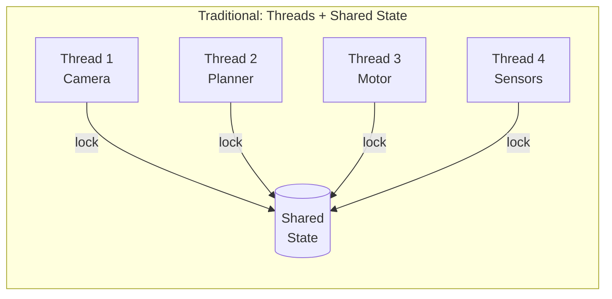
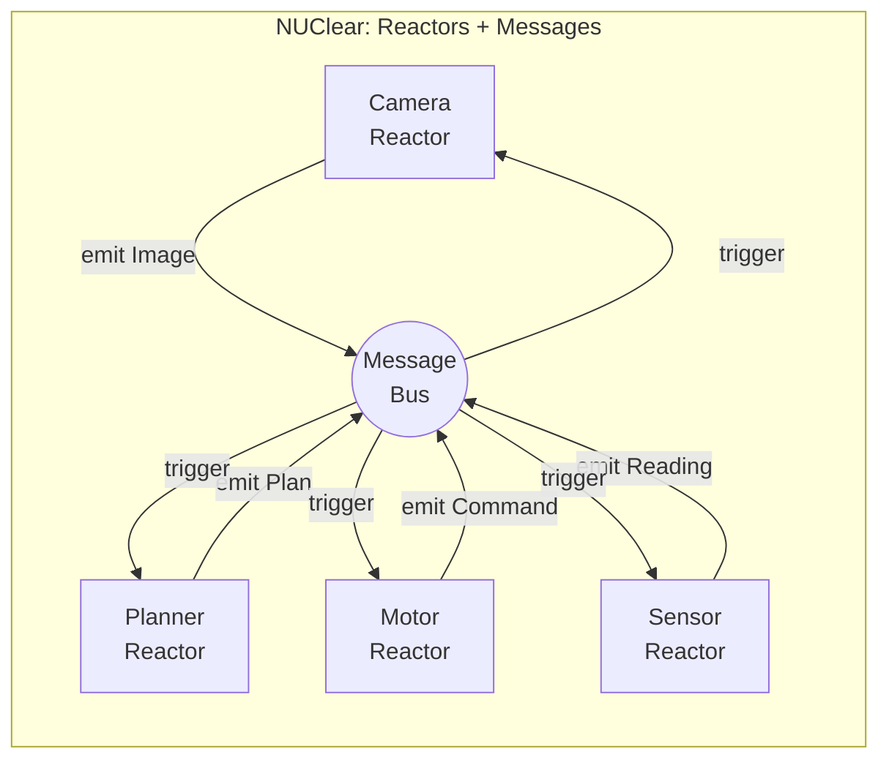
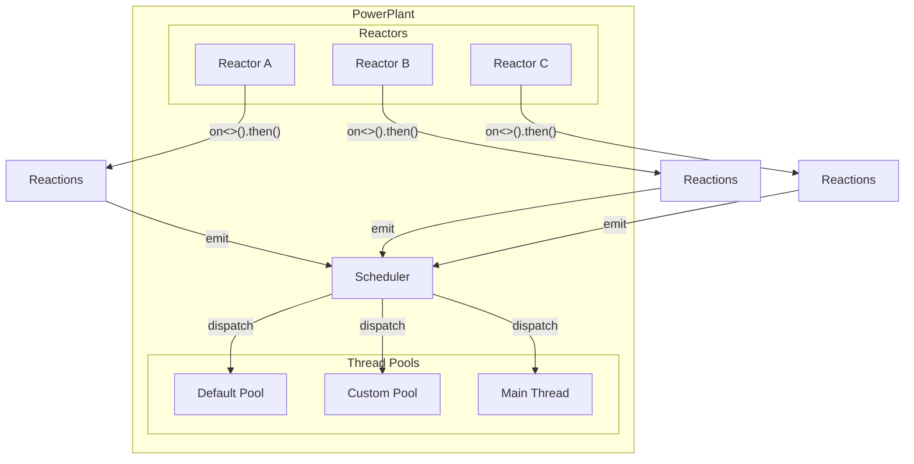

# Architecture

## The Problem

Complex real-time systems — robotics, autonomous vehicles, signal processing pipelines — share a common challenge: many components need to run concurrently, share data, and react to events with minimal latency. As these systems grow, the interconnections between components grow even faster.

Consider a robot that processes camera images, runs sensor fusion, plans paths, and controls actuators. Each of these subsystems needs data from others, often on different timescales. When something changes, downstream components need to react — sometimes in microseconds.

## Traditional Approaches (and Their Pain)

### Threads + Shared State + Locks

The "obvious" approach: give each component a thread, share data with mutexes.



This works for small systems, but quickly becomes unmanageable:

- **Deadlocks** when lock ordering isn't perfect
- **Priority inversion** when high-priority threads wait on low-priority ones
- **Debugging nightmares** — race conditions that appear once every thousand runs
- **Tight coupling** — every component knows about the shared state layout

### Callback Spaghetti

Event loops with registered callbacks avoid locks but create their own problems:

- Deeply nested callbacks are hard to follow
- Error propagation becomes manual
- No natural parallelism — everything runs on one thread unless you manage it yourself

### Actor Frameworks

Actors (Erlang, Akka) get closer to the right answer — isolated components communicating via messages. But most implementations:

- Use dynamic dispatch and runtime type resolution
- Require message serialization between actors even in-process
- Don't give you fine-grained control over scheduling and priorities
- Carry runtime overhead that matters in real-time systems

## NUClear's Approach

NUClear takes the best ideas from reactive programming and actor models, then uses C++ template metaprogramming to eliminate the runtime costs:



The key insight: **components don't call each other — they emit data, and interested parties react to it.**

This means:

- **No locks needed** — messages are immutable (`shared_ptr<const T>`)
- **No coupling** — reactors don't know who consumes their messages
- **Natural parallelism** — the scheduler dispatches reactions to thread pools automatically
- **Type safety** — message routing is resolved at compile time

## The Reactor Pattern

A **Reactor** is a self-contained component that:

1. **Declares its interests** — "When X happens, run this function"
2. **Processes events** — the function runs with the relevant data
3. **Produces outputs** — emits new messages for others to react to

```cpp
class Vision : public NUClear::Reactor {
    Vision(std::unique_ptr<NUClear::Environment> env)
        : Reactor(std::move(env)) {

        // Declare interest: when a new Image arrives, run this
        on<Trigger<Image>>().then([this](const Image& img) {
            auto detections = process(img);
            emit(std::make_unique<Detections>(detections));
        });
    }
};
```

No thread management. No mutexes. No callbacks to wire up. The reactor says what it cares about, and the system handles the rest.

## High-Level Architecture



The **PowerPlant** is the container for the entire system. It:

- Holds all **Reactors** (your components)
- Reactors register **Reactions** (event handlers declared with `on<>().then()`)
- When data is emitted, the **Scheduler** creates tasks and dispatches them to **Thread Pools**

## Design Philosophy

NUClear is built on the principle of **zero-cost abstractions**:

- **Compile-time DSL** — the `on<Trigger<T>, With<U>>` syntax is resolved entirely by the C++ template system. There's no runtime parsing, no string matching, no vtable dispatch for message routing.
- **Type-safe messaging** — if you try to trigger on a type that doesn't match your callback signature, you get a compile error, not a runtime crash.
- **Minimal runtime overhead** — the scheduler uses a priority queue and condition variables. Messages are shared via `shared_ptr<const T>` with no copying.
- **Composable DSL words** — DSL components (Trigger, With, Every, Buffer, etc.) fuse together at compile time into a single optimised handler.

## How NUClear Compares

| Aspect | NUClear | ROS 2 | Akka |
|--------|---------|-------|------|
| Language | C++14+ | C++/Python | Scala/Java |
| Message routing | Compile-time types | Runtime topic strings | Runtime messages |
| Threading | Built-in scheduler with pools | Executor model | Dispatcher model |
| Overhead | Near-zero (templates) | Serialization + IPC | JVM + serialization |
| Scope | In-process (+ network) | Distributed by default | Distributed by default |
| Real-time | Designed for it | Possible (DDS) | Not a focus |

NUClear is intentionally focused on **in-process concurrency** with optional networking, rather than being a distributed middleware. This keeps it lightweight and predictable — exactly what you want when reactions need to complete in microseconds.

## Academic Foundation

NUClear's architecture is formally described in the research paper [*"NUClear: A Loosely Coupled Software Architecture for Humanoid Robot Systems"*](https://doi.org/10.3389/frobt.2016.00020) (Houliston et al., 2016, Frontiers in Robotics and AI 3:20).

The paper introduces several key concepts that underpin the framework:

### Co-Messages

In a traditional message-passing system, if a module needs data from multiple sources, it must subscribe to each type independently and cache values itself. This doubles the number of callbacks and adds cache management code.

NUClear solves this with **co-messages**: supplementary data types that are automatically provided alongside the primary trigger data. When a `Trigger<T>` fires, the most recent values of all `With<U>` types (the co-messages) are bound into the reaction automatically. This eliminates per-module caching and reduces the number of subscription handlers required.

### Virtual Data Store

As a byproduct of the co-messaging system, NUClear maintains the latest value of every emitted message type in an internal data store. This creates a **virtual global store** — modules gain the data availability advantages of a blackboard architecture without the tight coupling. The store is not an explicit design element but an emergent property of retaining data for co-message binding.

### Compile-Time Message Routing

Unlike systems that use runtime topic strings or message brokers (e.g., ROS Master), NUClear resolves all message routes at compile time using C++ template metaprogramming. The result is that emitting a message directly invokes the subscribed reactions with no broker lookup — approaching the performance of a direct function call.

### Transparent Multithreading

Messages in NUClear are immutable after emission (`shared_ptr<const T>`). Since no reaction can modify a message, multiple reactions can safely process the same data in parallel without locks. The thread pool scheduler dispatches reactions automatically, providing transparent parallelism without developer intervention.
