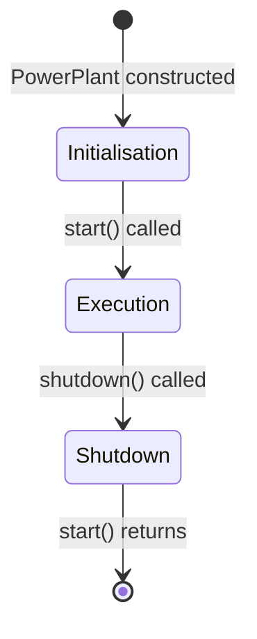
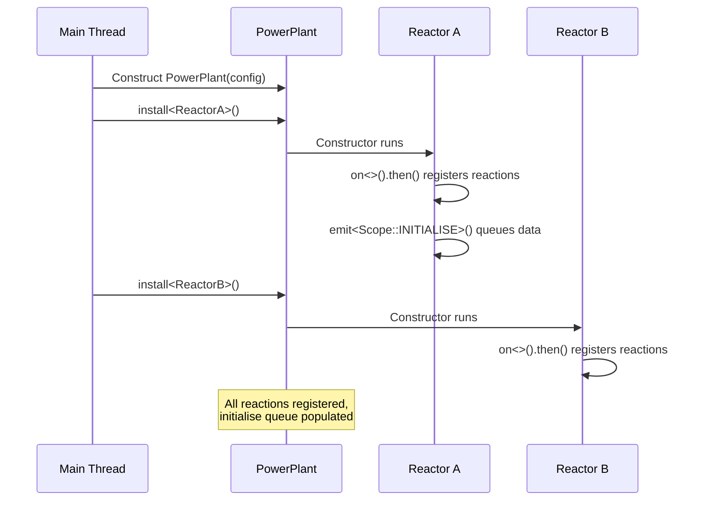
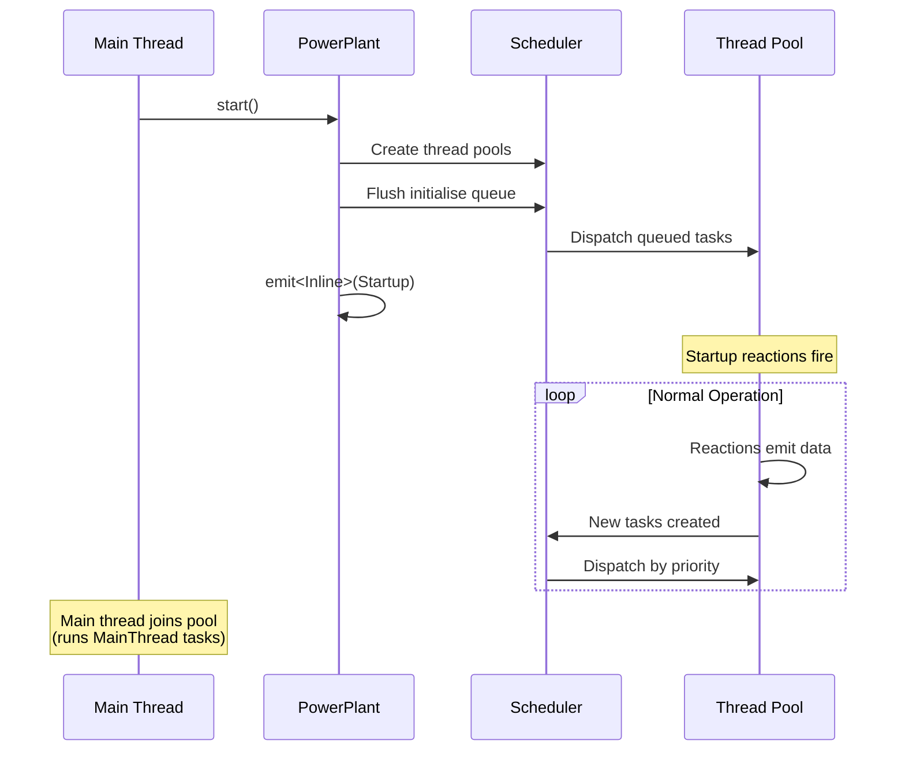
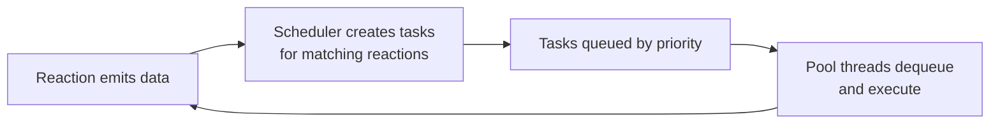
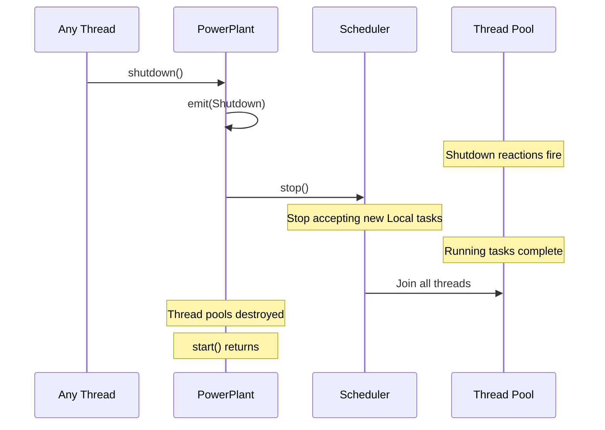

# Lifecycle

A NUClear system goes through three distinct phases. Understanding these phases explains *why* certain operations work in some contexts but not others, and *when* your code actually runs.



## Phase 1: Initialisation

**Single-threaded.** Only the main thread is running.

During initialisation, you're building the system — constructing the PowerPlant, installing reactors, and registering reactions. Nothing executes yet. Think of it as wiring up a circuit board before flipping the power switch.



### What Happens

1. **PowerPlant construction** — creates the scheduler, stores configuration
2. **Reactor installation** — each `install<T>()` call constructs a reactor
3. **Reaction registration** — `on<>().then()` inside constructors registers interest in events
4. **Initialise-scoped emissions** — `emit<Scope::INITIALISE>()` queues data for later (it's not processed immediately)

### Why It Matters

- **Order matters**: reactors are installed sequentially, so a reactor installed first can't trigger reactions in a reactor installed later (because those reactions don't exist yet during the first constructor)
- **No parallelism**: constructors run one at a time on the main thread. This is intentional — it avoids race conditions during setup
- **Emissions are deferred**: `Scope::INITIALISE` emissions are queued, not delivered. This ensures all reactions are registered before any data flows. When `start()` is called, the queued data is flushed and all matching reactions fire

### What You Can Do

| Action | Works? | Notes |
|--------|--------|-------|
| `on<>().then()` | ✅ | Register reactions |
| `emit<Scope::INITIALISE>(data)` | ✅ | Queued until start |
| `emit(data)` (Local scope) | ⚠️ | Submits a task, but no threads to run it yet |
| Access other reactors | ❌ | No guarantee they're installed yet |

## Phase 2: Execution

**Multi-threaded.** The system is alive.



### What Happens

1. **`start()` is called** — this is the transition point
2. **Thread pools are created** — the default pool and any custom pools spawn their threads
3. **Initialise queue is flushed** — all data queued with `Scope::INITIALISE` is now emitted, creating tasks
4. **Startup event fires** — reactions on `Startup` execute
5. **Normal execution begins** — emits create tasks, the scheduler dispatches them across pools
6. **`start()` blocks** — the calling thread becomes the MainThread pool worker, processing tasks until shutdown

### The Execution Loop

During normal execution, the system runs a continuous cycle:



There's no central tick, no frame loop, no polling. Reactions fire in response to data, and their outputs trigger further reactions. The system is entirely event-driven.

### What You Can Do

| Action | Works? | Notes |
|--------|--------|-------|
| `emit(data)` | ✅ | Standard local emission |
| `emit<Scope::NETWORK>(data)` | ✅ | Send to other nodes |
| `emit<Scope::INLINE>(data)` | ✅ | Execute reactions immediately in current thread |
| `on<>().then()` | ✅ | Can register new reactions at runtime |

## Phase 3: Shutdown

**Multi-threaded → Single-threaded.** The system winds down gracefully.



### What Happens

1. **`shutdown()` is called** — can be from any thread (often from within a reaction)
2. **Shutdown event is emitted** — reactions on `Shutdown` fire, giving reactors a chance to clean up
3. **Scheduler stops** — no new tasks are generated from Local emits
4. **In-flight tasks complete** — any currently-executing tasks run to completion
5. **Threads are joined** — pool threads finish and are joined back
6. **`start()` returns** — the main thread is released, and the application can exit

### Graceful vs Forced

```cpp
plant.shutdown();       // Graceful: let running tasks finish
plant.shutdown(true);   // Forced: clear queues, stop immediately
```

A graceful shutdown waits for all running tasks to complete. A forced shutdown clears the task queues and wakes all threads so they exit as quickly as possible.

### What You Can Do

| Action | Works? | Notes |
|--------|--------|-------|
| `emit(data)` | ⚠️ | Tasks created but may not execute |
| `emit<Scope::INLINE>(data)` | ✅ | Executes immediately in current thread |
| Persistent pool tasks | ✅ | Persistent pools keep running until drained |
| New `on<>` registrations | ❌ | System is winding down |

## Emission Scopes Across Phases

Different emission scopes have different behaviour depending on the current phase:

| Scope | Initialisation | Execution | Shutdown |
|-------|---------------|-----------|----------|
| `INITIALISE` | ✅ Queued for later | ❌ Not applicable | ❌ Not applicable |
| Local (default) | ⚠️ Task created, no thread to run it | ✅ Normal dispatch | ⚠️ May not execute |
| `INLINE` | ✅ Runs immediately | ✅ Runs immediately | ✅ Runs immediately |
| `NETWORK` | ❌ Network not started | ✅ Sends to peers | ❌ Network shutting down |

## Why Three Phases?

The phased design exists to solve a fundamental bootstrapping problem: **you can't react to messages if the reactions aren't registered yet**.

By separating initialisation from execution, NUClear guarantees that:

- All reactors are fully constructed before any data flows
- All reactions are registered before any triggers fire
- The system starts from a known, complete state — not a partially-wired one

This eliminates an entire class of startup race conditions that plague systems where components start in arbitrary order.
