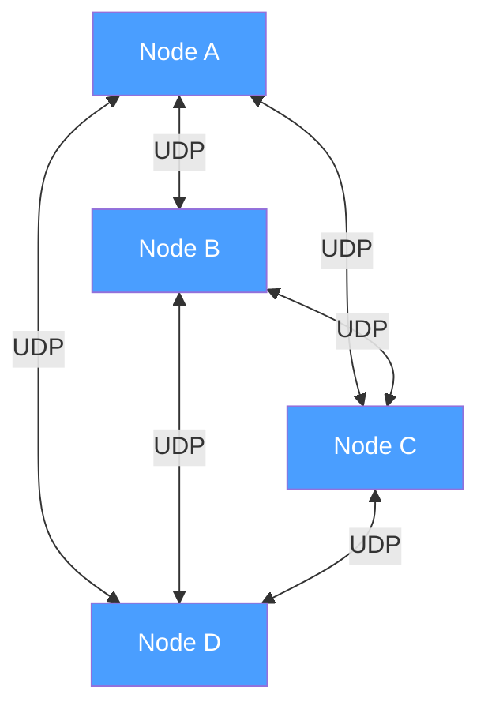
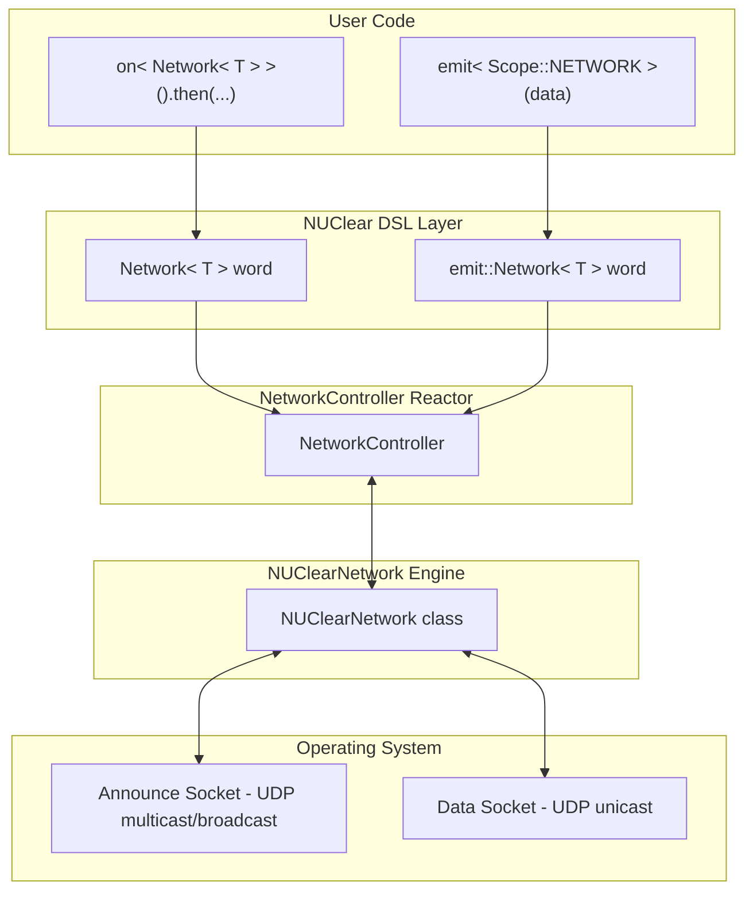
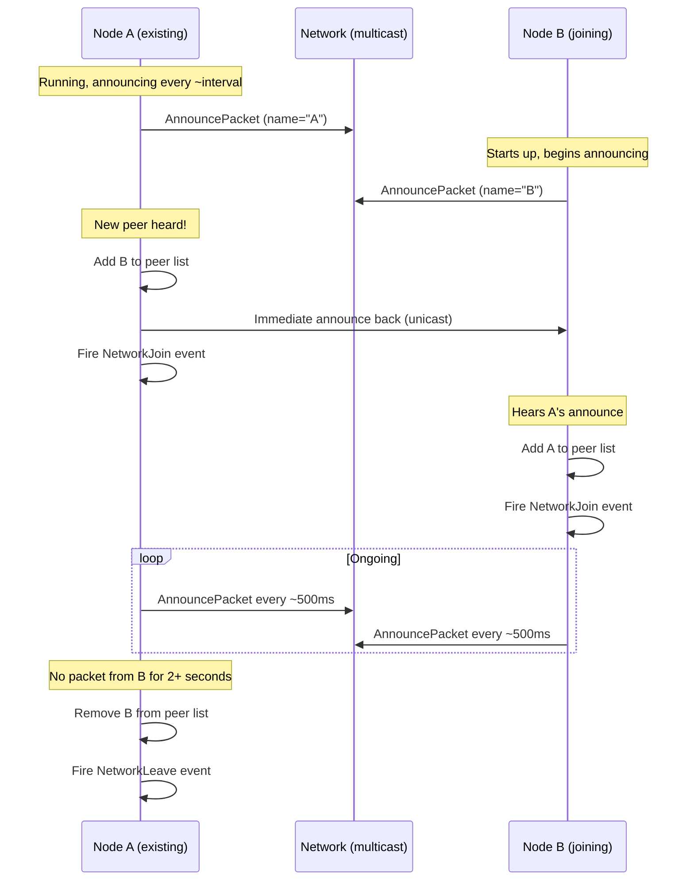
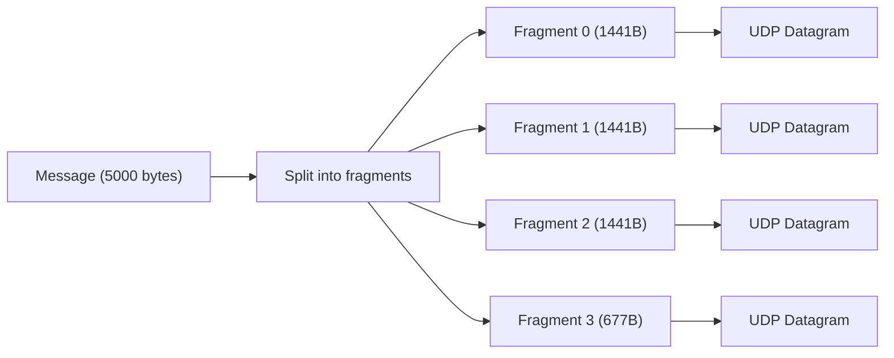
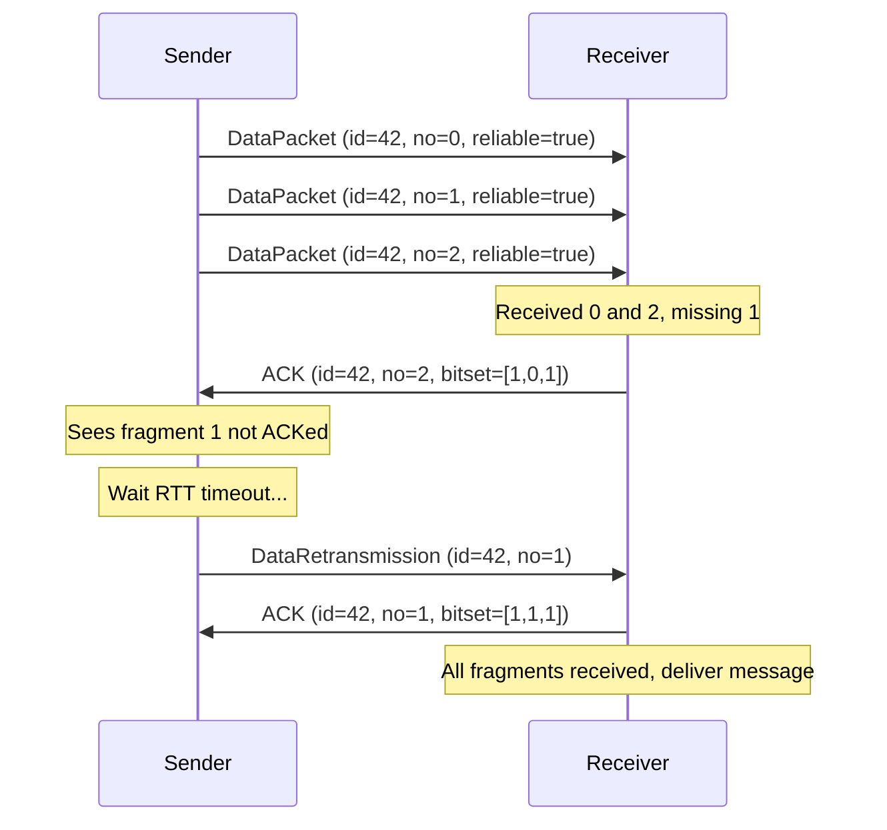
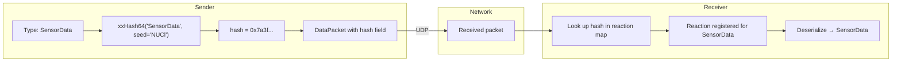
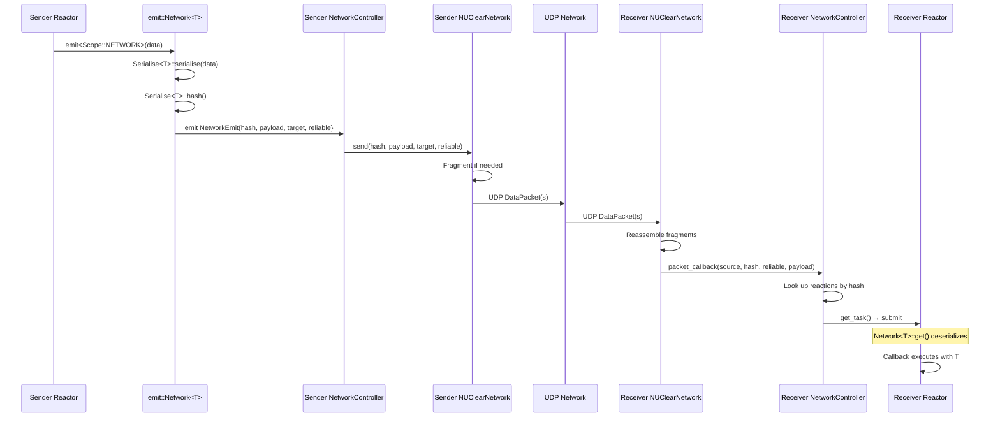

# NUClearNet: Peer-to-Peer Networking

NUClearNet is NUClear's built-in networking layer — a decentralized, peer-to-peer messaging system that lets NUClear nodes communicate transparently across a network. It's designed for robotics and distributed systems where nodes need to discover each other automatically and exchange typed messages with minimal configuration.

## Architecture & Design



Key design principles:

- **Decentralized mesh** — no central server or message broker. Every node is equal.
- **Autonomous discovery** — nodes find each other via periodic announcements, no manual configuration of peer addresses.
- **UDP-only** — both discovery and data transfer use UDP (no TCP). This keeps the implementation simple and avoids head-of-line blocking.
- **Two socket types** — each node has an *announce socket* (for discovery) and a *data socket* (for payload transfer).

The announce socket listens on a shared multicast/broadcast address that all nodes agree on. The data socket uses an ephemeral port unique to each node — peers learn each other's data address through announce packets.

## Component Layers



## Peer Discovery

Every node periodically broadcasts an `AnnouncePacket` on the announce address. This is how nodes find each other.

### Discovery Sequence



### Announce Address Options

The announce address can be:

- **Multicast** (e.g., `239.226.152.162`) — the most common setup. All nodes on the same network join the multicast group and hear each other's announcements.
- **Broadcast** (e.g., `255.255.255.255`) — works on simple LANs without multicast support.
- **Unicast** — for point-to-point setups or testing.

### Peer Timeout

Each peer's `last_update` timestamp is refreshed every time a packet arrives from them. If no packet is received for approximately 2 seconds (configurable), the peer is considered gone — it's removed from the peer list and a `NetworkLeave` event fires.

## Wire Protocol

All NUClearNet packets share a common header format.

### Packet Header


- **Bytes 0-2**: `0xE2 0x98 0xA2` — the ☢ (radioactive) symbol in UTF-8. Acts as a magic number to identify NUClear packets.
- **Byte 3**: Version — currently `0x02`
- **Byte 4**: Packet type

### Packet Types

| Type | Value | Purpose |
|------|-------|---------|
| ANNOUNCE | 1 | Periodic discovery broadcast |
| LEAVE | 2 | Graceful departure notification |
| DATA | 3 | Normal data payload |
| DATA_RETRANSMISSION | 4 | Retransmitted data fragment |
| ACK | 5 | Acknowledgment of received fragments |
| NACK | 6 | Request for specific missing fragments |

### DataPacket Structure


- **packet_id** — a semi-unique identifier for this message (groups fragments together)
- **packet_no** — which fragment this is (0-indexed)
- **packet_count** — total number of fragments in this message
- **reliable** — whether this packet requires acknowledgment
- **hash** — 64-bit type hash identifying what kind of data this is
- **data** — the serialized payload bytes

## Fragmentation & Reassembly

UDP datagrams have a practical size limit (the network MTU). Large messages must be split across multiple packets.

### MTU Calculation

```
fragment_size = network_mtu - IP_header(40) - UDP_header(8) - DataPacket_header
```

With a typical 1500-byte MTU, this gives roughly **1441 bytes per fragment** (accounting for the DataPacket fields).

### Sending Large Messages



### Reassembly on the Receiver

The receiver collects fragments keyed by `(source_address, packet_id)`. Once all `packet_count` fragments arrive, the original message is reassembled and delivered.

**Stale assemblies**: If an incomplete message hasn't received new fragments in `10 × RTT` (round-trip time to that peer), it's discarded. This prevents memory leaks from lost unreliable packets.

## Reliable Delivery

By default, NUClearNet is **unreliable** — packets are fire-and-forget, just like raw UDP. But when you need guaranteed delivery, the reliable mode adds ACK-based retransmission.

### Unreliable (Default)

- Send and forget
- No ACKs, no retransmission
- Fastest possible — zero overhead
- Fine for high-frequency data where missing one update doesn't matter (sensor streams, video frames)

### Reliable Mode



Key mechanisms:

- **ACK per fragment** — when the receiver gets a fragment, it responds with an ACK that includes a bitset of *all* received fragments for that packet_id. This gives the sender full visibility.
- **RTT-based retransmission** — the sender waits one estimated RTT before retransmitting un-ACKed fragments. Retransmitting too early wastes bandwidth; too late adds latency.
- **Adaptive RTT estimation** — each peer's round-trip time is tracked using a Kalman filter. This adapts to changing network conditions smoothly.
- **NACK support** — the receiver can proactively request specific missing fragments via NACK packets.
- **Duplicate detection** — a circular buffer of recent `packet_id` values prevents processing the same message twice.

### RTT Estimation (Kalman Filter)

Rather than using a simple moving average, NUClearNet uses a single-state Kalman filter per peer:

```
K = (P + Q) / (P + Q + R)      // Kalman gain
P = R * (P + Q) / (R + P + Q)  // Update variance
X = X + (measurement - X) * K  // Update estimate
```

Where `Q` is process noise (how much RTT might change), `R` is measurement noise (how noisy individual measurements are), and `X` is the current RTT estimate. This gives smooth, responsive RTT tracking.

## Type Routing

Messages are identified by a **type hash** rather than string names or channel IDs.



The hash is computed as:

```
xxHash64(demangled_type_name, seed = 0x4e55436c)  // "NUCl" in ASCII
```

Both sender and receiver must use **exactly the same type name**. It's not enough to have structurally identical types — the demangled name must match. In practice, this means sharing header files between nodes.

## Serialization

NUClearNet doesn't prescribe a single serialization format. Instead, it uses the `Serialise<T>` template which selects a strategy based on the type:

- **Trivially copyable types** — direct `memcpy` (fast but architecture-dependent)
- **Protobuf messages** — `SerializeToString` / `ParseFromString`
- **Custom types** — user provides a `Serialise<T>` specialization

See [Serialization](serialization.md) for the full details.

## Integration with the NUClear DSL

The networking system integrates with NUClear through the `NetworkController` reactor — a built-in extension that bridges the low-level network engine with the task system.

### Receiving: `Network<T>`

```cpp
on<Network<SensorData>>().then([](const SensorData& data) {
    // data arrived from another node
});
```

When you use `Network<T>`:

1. At bind time, the reaction's type hash is registered with the `NetworkController`
2. The `NetworkController` maps `hash → reaction` in its internal multimap
3. When a packet arrives with that hash, the `NetworkController`:
   - Stores the raw bytes in ThreadStore
   - Calls `get_task()` on the matched reactions
   - The `Network<T>` word's `get()` deserializes the bytes into a `T`

### Sending: `emit<Scope::NETWORK>`

```cpp
emit<Scope::NETWORK>(std::make_unique<SensorData>(reading), "target_name", true);
```

This triggers:

1. `emit::Network<SensorData>` serializes the data and computes the type hash
2. A `NetworkEmit` message is emitted locally
3. `NetworkController` catches it and calls `NUClearNetwork::send(hash, payload, target, reliable)`
4. The network engine fragments and transmits the packet

### Peer Lifecycle Events

```cpp
on<Trigger<NetworkJoin>>().then([](const NetworkJoin& event) {
    log("Peer joined:", event.name);
});

on<Trigger<NetworkLeave>>().then([](const NetworkLeave& event) {
    log("Peer left:", event.name);
});
```

These are emitted by the `NetworkController` when its join/leave callbacks fire from the network engine.

## Data Transmission Flow



## Configuration

The network is configured by emitting a `NetworkConfiguration` message:

```cpp
emit(std::make_unique<NetworkConfiguration>(
    "my_node_name",           // This node's name
    "239.226.152.162",        // Announce address (multicast)
    7447                      // Announce port
));
```

When a new configuration is received, the `NetworkController` tears down existing sockets and reinitializes with the new settings. The node name becomes the identifier that other peers see in `NetworkJoin` events.
