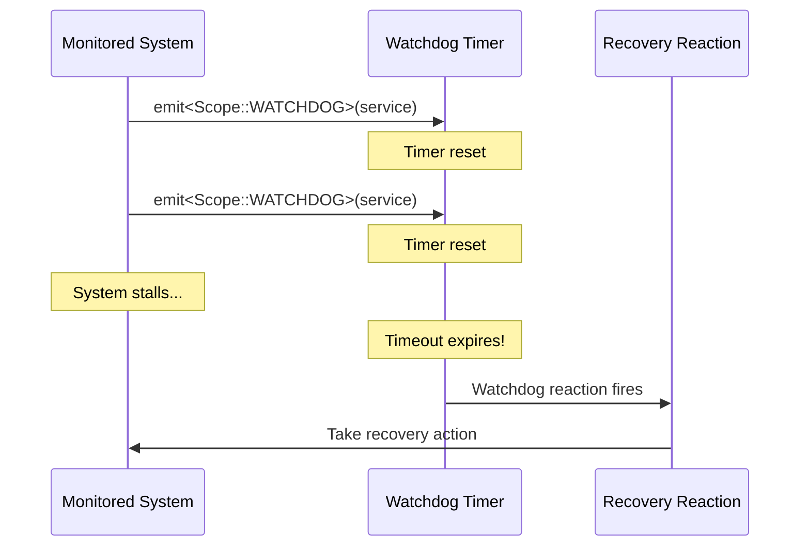

# Detecting Unresponsive Components with Watchdogs

> How to detect when a component stops responding and take recovery action.

## Overview

A watchdog monitors that an expected event keeps happening. If the event doesn't occur within a specified timeout, the watchdog fires a reaction so you can take corrective action.



## 1. Define a Watchdog Group

A watchdog group is any type that identifies what you're monitoring. It's never instantiated — it's just a tag:

```cpp
struct HeartbeatMonitor {};
```

## 2. Set Up the Watchdog Reaction

Use `on<`[`Watchdog`](../reference/dsl/watchdog.md)`<Group, ticks, period>>()` to define what happens when the timeout expires:

```cpp
on<Watchdog<HeartbeatMonitor, 5, std::chrono::seconds>>().then([this] {
    log<NUClear::WARN>("Heartbeat lost! Attempting recovery...");
    emit(std::make_unique<RecoveryCommand>());
});
```

This fires if no service signal is received within 5 seconds.

## 3. Service the Watchdog

Each time the monitored activity occurs, reset the timer:

```cpp
emit<Scope::WATCHDOG>(ServiceWatchdog<HeartbeatMonitor>());
```

Every [`emit<Scope::WATCHDOG>`](../reference/emit/watchdog.md) call resets the countdown. As long as services arrive faster than the timeout, the watchdog never fires.

## 4. Complete Example

```cpp
#include "nuclear"

// Tag types
struct HeartbeatMonitor {};
struct RecoveryCommand {};

class SensorWatchdog : public NUClear::Reactor {
public:
    SensorWatchdog(std::unique_ptr<NUClear::Environment> environment)
        : Reactor(std::move(environment)) {

        // Fire if no heartbeat for 3 seconds
        on<Watchdog<HeartbeatMonitor, 3, std::chrono::seconds>>().then([this] {
            log<NUClear::WARN>("Sensor heartbeat lost!");
            emit(std::make_unique<RecoveryCommand>());
        });

        // When we receive sensor data, service the watchdog
        on<Trigger<SensorData>>().then([this](const SensorData& data) {
            // Process the data...
            process(data);

            // Reset the watchdog timer
            emit<Scope::WATCHDOG>(ServiceWatchdog<HeartbeatMonitor>());
        });

        // Recovery logic
        on<Trigger<RecoveryCommand>>().then([this] {
            log("Restarting sensor connection...");
            reconnect_sensor();
        });
    }
};
```

## Multiple Watchdogs with Runtime Keys

You can monitor multiple instances of the same group using a runtime argument. Each unique key gets its own independent timer:

```cpp
// Monitor each motor independently
on<Watchdog<MotorMonitor, 500, std::chrono::milliseconds>>(motor_id).then([this] {
    log<NUClear::WARN>("Motor", motor_id, "stopped responding");
});

// Service a specific motor's watchdog
emit<Scope::WATCHDOG>(ServiceWatchdog<MotorMonitor>(motor_id));
```

## Timing Diagram

```mermaid
gantt
    title Watchdog Lifecycle (3-second timeout)
    dateFormat X
    axisFormat %s

    section Activity
    Service received     :done, 0, 1
    Service received     :done, 1, 2
    Service received     :done, 2, 3
    No activity          :crit, 3, 6

    section Timer State
    Reset (3s remaining) :active, 0, 1
    Reset (3s remaining) :active, 1, 2
    Reset (3s remaining) :active, 2, 3
    Counting down        :crit, 3, 6

    section Events
    Timeout fires!       :milestone, 6, 6
```



## Parameters

| Parameter       | Description                                                    |
| --------------- | -------------------------------------------------------------- |
| `WatchdogGroup` | A type tag identifying what is being monitored                 |
| `ticks`         | Number of time units before the watchdog fires                 |
| `period`        | A `std::chrono::duration` type defining the tick length        |

Common period types: `std::chrono::milliseconds`, `std::chrono::seconds`, `std::chrono::minutes`

## Tips

- The watchdog starts timing from the moment `bind` is called (when the `on<>` statement runs). Service it early if you need a grace period at startup.
- If the watchdog fires, the timer resets automatically — it will fire again after another timeout unless serviced.
- Use specific group types to avoid accidentally servicing the wrong watchdog.
