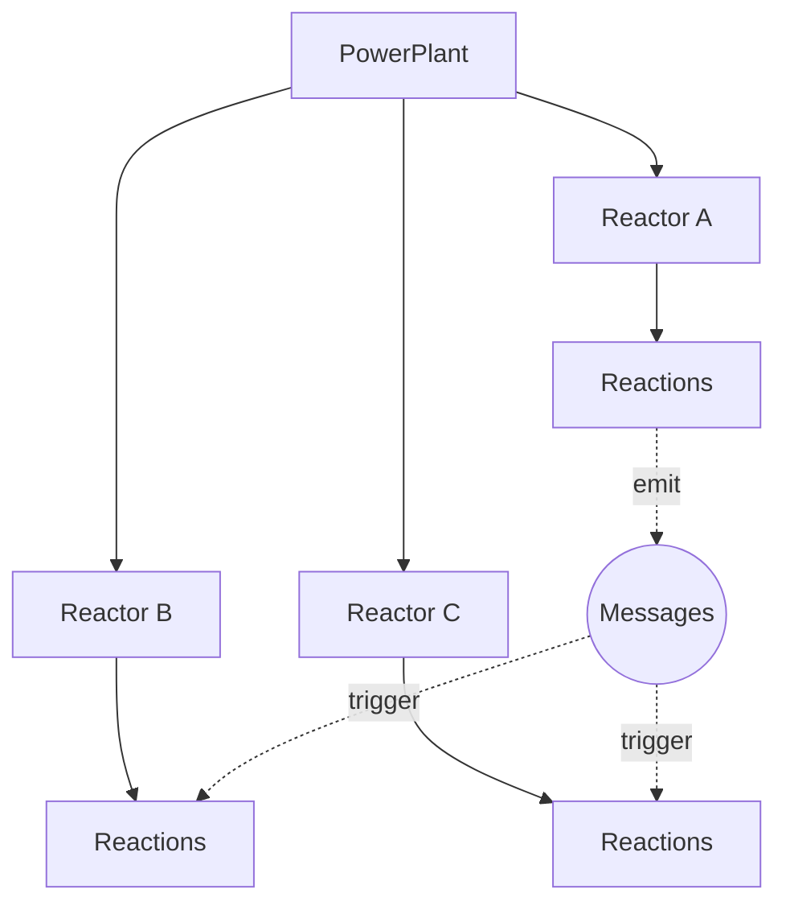

# NUClear

**NUClear** is a C++ reactive framework for building modular, event-driven systems. It provides a compile-time domain-specific language (DSL) that lets you define how your system reacts to data and events, with automatic multithreaded task scheduling, type-safe messaging, and zero-cost abstractions.

## Key Features

- **Event-driven** — React to data, timers, I/O, and network events
- **Type-safe messaging** — Messages are C++ types; the compiler catches errors
- **Compile-time DSL** — Zero runtime overhead for reaction binding
- **Automatic threading** — Tasks are scheduled across thread pools transparently
- **Zero-cost abstractions** — Template metaprogramming eliminates runtime dispatch
- **Extensible** — Add custom DSL words to extend the framework
- **Networking built-in** — UDP, TCP, and serialized network messaging out of the box

## Quick Example

```cpp
#include <nuclear>

struct SensorData {
    double temperature;
};

class SensorMonitor : public NUClear::Reactor {
public:
    explicit SensorMonitor(std::unique_ptr<NUClear::Environment> environment)
        : NUClear::Reactor(std::move(environment)) {

        on<Trigger<SensorData>>().then([this](const SensorData& data) {
            if (data.temperature > 100.0) {
                log<WARN>("Temperature critical:", data.temperature);
            }
        });
    }
};
```

## Architecture



## Documentation

| Section | Purpose |
|---------|---------|
| [Tutorials](tutorials/index.md) | Get started with NUClear step by step |
| [How-to Guides](how-to/index.md) | Solve specific problems |
| [Reference](reference/index.md) | Look up DSL words, API, and emit scopes |
| [Explanation](explanation/index.md) | Understand the architecture and design |

## Research

NUClear's architecture is formally described in the paper [*"NUClear: A Loosely Coupled Software Architecture for Humanoid Robot Systems"*](https://doi.org/10.3389/frobt.2016.00020) (Houliston et al., 2016, Frontiers in Robotics and AI 3:20). The paper introduces the concepts of co-messages, virtual data stores, and compile-time message routing that underpin the framework.

## Requirements

- C++17 compiler (GCC 7+, Clang 5+, MSVC 2017+)
- CMake 3.15+
